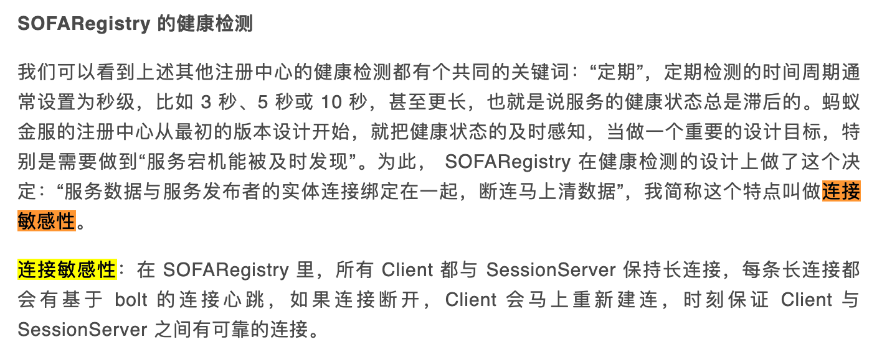

几个月前，我在[《4个实验，彻底搞懂TCP连接的断开》](https://mp.weixin.qq.com/s/7SvkHe3FiljxBWFkm8oAeA)这篇文章中给自己挖了个坑：

文中提到的`实际问题`就是服务探活，今天来填上这个坑。

---

在微服务架构下，服务提供方（Provider）的节点一般不止一个，消费方（Consumer）根据负载均衡算法挑选一个`健康`的节点进行调用。识别Provider节点是否健康，这便是**服务探活** 要讨论的内容。

`健康的节点`可定义为能正常响应Consumer请求的节点，不健康自然是不能正常响应Consumer请求的节点

`不健康`的原因可能是物理上的断电、断网、硬件故障，也可能是网络延迟、进程异常退出或进程无法处理请求。

总之一句话总结起来就是Provider节点没有摘除流量前，就无法处理请求了。可以分为三类：

- 系统异常：如断电、断网、其他硬件故障、或操作系统异常退出
- 进程异常退出：进程异常退出，端口挂掉，如有注销机制但没来得及注销，如执行了kill -9
- 进程无法处理请求：端口还在，但服务无法正常响应，如Full GC期间

一个Provider节点的状态只有健康和不健康，由健康到不健康称之为`探死`，由不健康到健康称之为`探活`，一般我们不分这么细，统一叫`探活`。

至于是谁来探，可能是Consumer，也可能是注册中心，甚至是某个单独的探活组件。我们就从探活的发起者来列举目前主流的探活方式。

---
### Consumer被动探活

最简单的是在Consumer侧进行探活，如果Consumer调用Provider报错，则Consumer将该Provider剔掉，为了防止偶发的网络抖动或其他干扰，可设置一个时间窗口，窗口内失败达N 次则剔除，当过了这段时间，再把这个Provider重置为正常。

这种方式的典型代表是Nginx，Nginx可配置多长时间内，失败多少次则认为该Provider不可用，其失败可以是连接失败、也可以是某些http状态码（如4xx，5xx）

这种方案的缺点很明显，需要真实流量去检测，如果配置了失败继续转发给下一个Provider，则时间窗口的开始的一段时间内耗时上升，未配置则直接报错，所以无论怎么配置，对服务都是有影响的。

### Consumer主动探活

Consumer被动健康检查的主要问题在于使用了真实流量检测，其实只要稍微改一改，使用旁路的方式去检测即可避免。

阿里的Tengine开源了一个`nginx_upstream_check_module`模块来做主动健康检查。

这个旁路可以一直去探测Provider，当检测到异常时，将其标记为不可用状态，请求不再发往该Provider，若检测到Provider 健康时，再将其标记为健康。 

Consumer侧的探活在RPC框架实现的比较少，不知道是基于怎样的一种考虑，其实有些企业内会在Consumer侧已经加入了探活机制，比如`爱奇艺`在Dubbo的Consumer侧增加了探活机制，其实我所在的公司内部RPC框架也是有Consumer侧的服务探活。

> 参考《爱奇艺在 Dubbo 生态下的微服务架构实践》https://developer.aliyun.com/article/771495

但Dubbo官方没有集成，至于为什么，我也去github上问过，不过没人回复~

### Provider上报心跳

当有一个注册中心时，探活这项任务就可以交给注册中心了。

最简单的，我们想到了心跳保持这个策略，Provider注册成功后，一直向注册中心发送心跳包，注册中心定时检查Provider，如果长时间未发送心跳包，就将其置为不可用，并告知Consumer，如果心跳恢复，则将其恢复并通知。

某些组件也支持这种`续约`的特性，如etcd、redis等都可以构建类似的系统。

这种方式的代表是Nacos 1.x 版本中的`临时实例`。

慢慢你会发现这种方式摘除故障节点的时效性和资源的使用成正相关，如果你想要更好的时效性，就必须缩短心跳间隔，从而会增加心跳请求量，每次心跳得更新每个节点的`上次心跳时间`，占用了大量资源。

### Provider与注册中心会话保持

为了解决心跳请求占用大量资源的问题，我们想到了TCP 连接不是一个天然的健康检查机制吗？如果仅仅依靠TCP连接可以吗？

这就是之前文章埋下的坑，再次总结一下这篇文章[《4个实验，彻底搞懂TCP连接的断开》](https://mp.weixin.qq.com/s/7SvkHe3FiljxBWFkm8oAeA)中关于TCP连接断开的场景：

- 如果是进程终止、无论是正常或者是异常，只要操作系统还在，TCP连接就会正确断开
- 如果是断电、断网或其他因素导致操作系统挂掉，则网络不一定能正确断开，还得分情况
  - 如果此时注册中心有往Provider发送数据，那么是能及时感知到Provider的异常，并断开连接的
  - 如果注册中心没有往Provider发送数据，是不能及时感知连接的断开，即使配置了TCP的KeepAlive，也需要大概2小时才能感知到

2小时肯定不能接受，为了防止这种情况，光靠TCP是不够的，还得在应用层实现一个心跳检测，为了节省资源，可以将心跳包设计的很小，发送频率不需要那么高，通常1分钟内能感知即可。

因为只有断电、断网或硬件故障才会导致无法感知连接的断开，这个比例很小。

可以参考下图，虽然图中的数据是我杜撰的，但八九不离十吧，可以看到系统异常只占1%，这1%中未发数据可能更少，所以可以认为这个概率很小。

这种方式比较常见，像Dubbo使用的Zookeeper，Nacos 2.x版本（gRPC）的临时实例，SOFARegistry等等都用了这这种方式。

其中SOFARegistry比较有意思，它提出了一种`连接敏感`的长连接，乍一看以为用了什么黑科技，后来看了代码发现就是TCP连接加应用层的心跳检测，这些被他们封装在`SOFABolt`通信框架中。

> 参考《海量数据下的注册中心 - SOFARegistry 架构介绍》https://mp.weixin.qq.com/s/mZo7Dg6gfNqXoetaqgwMww

但这个方式也有一个明显的缺点，如果网络状况不好的情况下，TCP连接比较容易断开，会导致节点频繁上下线。

### 注册中心主动探测

除了上述的方式，还有一种注册中心（甚至是一个单独的组件）主动探测Provider的方式，与Consumer主动探测类似，只不过把探测任务移交给了注册中心或一个单独的组件。

主动探测有个最大的优势是可以扩展非常丰富的探测方式，比如最常见的探测端口是否存活，又或者探测Provider的一个http接口返回是否符合预期，甚至可以扩展为MySQL、Redis等等协议的探测。

这也是种能解决服务假死的探活方式，Nacos中的`永久实例`探活就是采用的这种方式。

但这种方式在实际使用的时候要考虑主动探测组件的高可用，高可用就得存在副本，可采取主备方式。

如果单机存在性能瓶颈，还得分布式探活，主备可能就不适合，得有一个分布式协调者，这要说又得长篇大论。但这里你知道有这么个事儿就可以了。

---

考量探活的指标有三个：
- 能不能探出来？——功能性
- 什么时候探出来？——时效性
- 会不会探错了？——稳定性

功能上最强的是带语义的主动探测，时效性最强的要属长连接会话保持。

稳定性不好说谁强谁弱，但一般会给一个集群设置一个探活摘除的比例，比如最多摘除50%机器，防止探活错误导致节点全部下线，这也算是一种兜底策略吧。