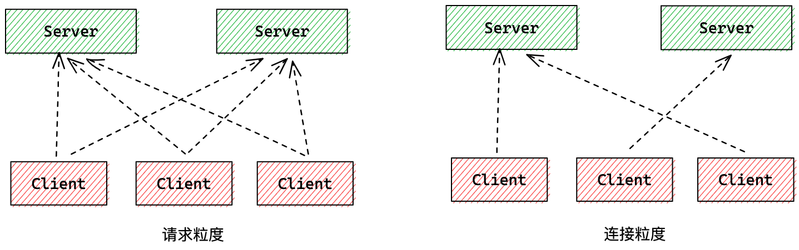
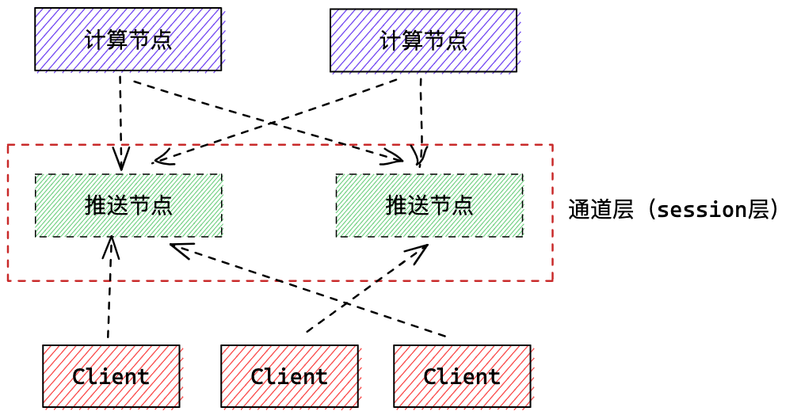

hello，大家好，我是小楼，终于忙完了一阵，今天来更新一篇长连接的负载均衡问题。

首先说明下，长连接我不是专业的，只是在工作上有一点点的接触，分享也是基于一点点的经验和一些思考，如有出入，欢迎私聊。

# 长连接介绍

说长连接，与之对应的是短连接，关于这两个的介绍网上比较多，这里只用一个表格来总结下他们的工作流程、优缺点、适用场景等：

|          | 短连接                                        | 长连接                                             |
| -------- | --------------------------------------------- | -------------------------------------------------- |
| 流程 | 建立连接 -> 传输数据 -> 关闭连接              | 建立连接 -> 传输数据 -> 传输数据 ->... -> 关闭连接 |
| 优点     | 实现简单                                      | 耗时（DNS解析、TCP 握、挥手）少；能实现服务端推送  |
| 缺点     | 耗时（DNS解析、TCP 握、挥手）多               | 需要管理连接，实现复杂；连接多时服务端消耗大       |
| 场景 | 单客户端不频繁操作但客户端数量多；如 Web 服务 | 单客户端频繁操作；如数据库、需要推送能力的服务     |

# 长连接负载均衡

### 长连接为什么需要负载均衡

长连接单机的连接数是存在上限的。

存在上限的原因，可能有同学认为是单机的端口数限制，也就是经常听到的问题「一台服务器最多能支撑多少个 TCP 连接？」

有人回答「65535」，其实不然，如果硬件限制不考虑，单机能撑200多万亿个 TCP 连接，但这太理想，现实是撑个百万连接还是可以的。具体怎么回事，可以戳飞哥这篇文章[《漫画 | 一台Linux服务器最多能支撑多少个TCP连接？》](https://mp.weixin.qq.com/s/Lkyj42NtvqEj63DoCY5btQ)了解详细。

从经验来看，CPU 和 内存是限制连接数的主要原因。

内存不必多说，每个连接的保持都要占用一点内存，一条空连接，也要占用几 KB 的内存，如果再塞点数据，几百 KB 到几 MB 也是常有的事，按一条连接 1MB 算，一台 128GB 内存的物理机能撑十几万的连接。

其次是 CPU，我们上面说了长连接的场景一般是单个客户端操作频繁，这就会导致每增加一条连接，CPU 消耗就增加一些，一般单机能撑十万的连接，已经算是可以了。

基于单机性能和高可用容灾的考虑，生产环境长连接服务通常会部署多个节点，为此，我们需要考虑长连接服务的负载均衡问题。

### 长连接负载均衡粒度

与短连接每次请求都做负载均衡策略不同，长连接不光有**请求粒度**的负载均衡，还有**连接粒度**的负载均衡。

请求粒度负载均衡的实现方式是一个客户端与每个服务端都建立连接，发送请求时按照某种负载均衡策略选择一个服务端进行请求；连接粒度的负载均衡则是客户端在建立连接时按照某种负载均衡策略挑选一个节点进行建连，后续请求都发往这个节点。

如何选择主要是考量单个服务端可能的连接数量，如果连接数远不是瓶颈的时候（个人认为万级以下），可考虑请求粒度，否则连接粒度的负载均衡策略更佳。

举个例子，Dubbo 一个 Provider 节点和来自订阅 Consumer 的所有节点都建立了连接，前提是 Dubbo 一个 Provider 基本不太会可能被几万个节点消费，所以 Dubbo 可以做请求粒度的长连接负载均衡。但如果是 Nacos，所有需要服务发现的机器都要和 Nacos 服务端建立连接，长连接数量就和公司服务器数量级相关，规模大的情况，几万、上十万、百万也是有可能的，所以如果 Nacos 也像 Dubbo 那样设计，就无法支撑大规模服务发现了。

# 连接粒度的负载均衡

对于长连接，连接粒度的负载均衡问题遇到的更多，所以这里着重说明下。

### 连接数均衡

由于连接建立之后，除非异常不会断开，所以问题就来了，如果某一个节点的连接数相比较其他节点要多出很多，这种就属于不均衡了。出现这种问题的情况最常见的就是服务端发布（重启）。重启时服务不可用，该节点原先的连接会断开，找到存活的节点进行连接，当这台服务起来时，它的连接数将非常少。如果是一轮发布，最先发布的机器最后连接数最多，最后发布的连接数最少。

这种情况下，我们可以调整建连的负载均衡算法为**最小连接数模式**，当服务重启完成后，后续的连接就能全部连接到此节点。

但这个方法并不总是奏效，因为服务在重启时，断开的连接已经和其他节点建立了连接。

这时我们可能需要额外的均衡手段，如定时从全局视角看各个节点的连接数是否均衡，如果不均衡则要断开最多连接的节点，直到平衡。

这里我们的客户端需要对连接的断开处理特别小心，当然我觉得这是必须的。

但也要说明一点，如果连接不是长时间保持的，额外的均衡手段可能就不需要了，等一会就自然平衡了。这种发生在什么情况呢？比如公网的长连接，客户端的网络情况没内网那么好，经常断开连接，这就相当于帮我们自动平滑连接了。

如果是内网服务，连接能一直保持，额外的平衡手段就显得有必要了。

### 服务器规格不同

我们通常为了单机能保持更多的长连接，一般会选用物理机部署服务，有时候各个物理机规格不统一，如果我们的均衡手段一视同仁，每个节点连接数差不多，规格差的服务器可能压力就比其他机器大。

所以建连的负载均衡算法和额外的均衡手段也要考虑服务器规格，可以简单地把服务器规格与当前的连接数抽象为一个权重，客户端建连时加权再选择。

### 扩容无效问题

我们的长连接服务理应是可水平扩容的，连接数变多，加机器就可以，我们的设计大多也是如此。

但有时候可能不小心，导致水平扩容无效。

举个例子，还是注册中心，假设有3个节点的注册中心集群，此时有 1w 个客户端连上来，订阅了各种各样的服务，由于客户端的数量远远大于注册中心节点，所以基本可以认为每个注册中心节点订阅的服务是差不多的，近似每个服务的变更，每个注册中心节点都要处理，CPU 消耗自然就多了。如果把注册中心节点扩容为5台，其实每台服务只是少了一点连接，但依然每个注册中心节点还是近乎要处理所有的服务变更。

这种情况下就要审视长连接服务设计的是否合理，一般采取分层的思想，长连接这层服务只专注推送，一般称为通道层或者 session 层，它并不复杂复杂的计算逻辑。

如果设计有问题，短时间又没法修改，可以试试按照服务订阅者的名字路由到特定的服务端节点，保证同一个 Conusmer 只连同一个注册中心节点，这样某服务变更时，该节点只需要计算一次，就可以推送给所有 Conusmer，运气好的话，其他节点都不用计算。

# 结语

本文介绍了长连接与短连接的特点，为什么需要做长连接负载均衡，以及几个长连接负载均衡的问题和解法，相对来说还是比较通俗易懂，希望对大家有所帮助。