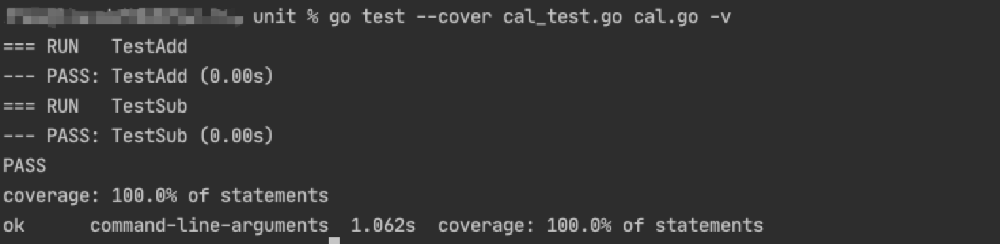
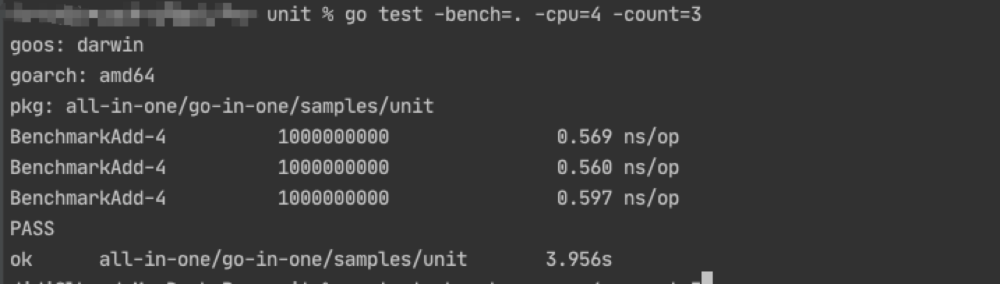
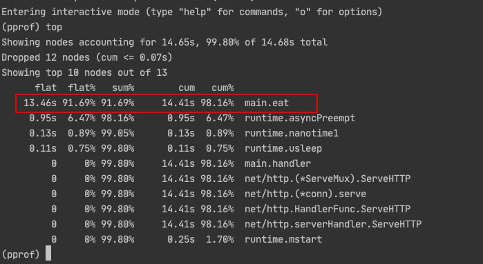
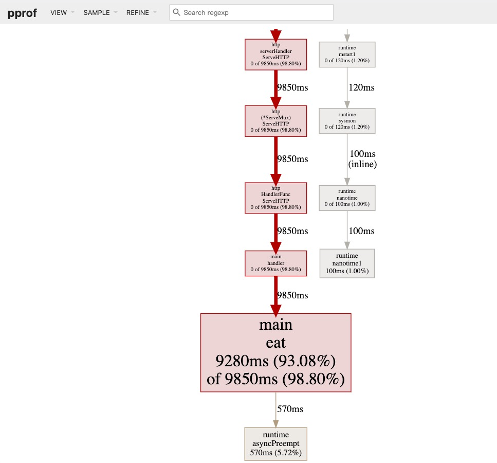
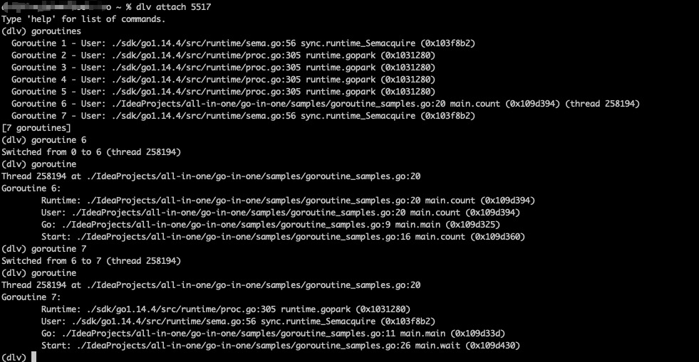

在Java中，我们用Junit做单元测试，用JMH做性能基准测试（benchmark），用async-profiler剖析cpu性能，用jstack、jmap、arthas等来排查问题。
作为一名比较新的编程语言，golang的这些工具是否更加好用呢？

# 单元测试
Java的单元测试需要使用第三方库，一般是Junit，配置起来比较复杂。在使用了golang之后发现golang自带的单元测试真的非常简单。
如果我们有一个cal.go文件，那么其对应的单元测试文件为cal_test.go，其中的方法命名必须为TestXxx，这种按照命名进行单元测试的方式简单有效，也正是通常所说的“约定大于配置”。
来看一个简单的例子：

```go
package unit

func add(a int, b int) int {
   return a + b
}

func sub(a int, b int) int {
   return a - b
}
```

```go
package unit

import (
    "github.com/stretchr/testify/assert"
    "testing"
)

func TestAdd(t *testing.T) {
    assert.Equal(t, 10, add(5, 5))
}

func TestSub(t *testing.T) {
    assert.Equal(t, 0, sub(5, 5))
}
```
执行单元测试只需要运行（更多用法参考go help test）

```
go test --cover cal_test.go cal.go -v
```


# benchmark
和单元测试类似，golang的benchmark也是开箱即用。在cal_test.go基础上增加一个BenchmarkAdd方法
```go
package unit

import (
   "github.com/stretchr/testify/assert"
   "testing"
)

func TestAdd(t *testing.T) {
   assert.Equal(t, 10, add(5, 5))
}

func TestSub(t *testing.T) {
   assert.Equal(t, 0, sub(5, 5))
}

func BenchmarkAdd(b *testing.B) {
   for i:= 0; i < b.N; i++ {
      add(5, 5)
   }
}
```
执行即可（更多用法参考go help test）

```
go test -bench=. -cpu=4 -count=3
```


# pprof
pprof是golang自带的可以用来做cpu、内存、锁分析的工具，非常类似java的async-profiler。
pprof的使用非常简单，只需要在代码中引入net/http/pprof包，然后监听一个端口即可。
一个简单的例子如下：
```go
package main

import (
    "fmt"
    "log"
    "net/http"
    "time"
    _ "net/http/pprof"
)

func main() {
    go func() {
        //example: visit http://127.0.0.1:6060/debug/pprof in browser.
        err := http.ListenAndServe("0.0.0.0:6060", nil)
        if err != nil {
            fmt.Println("failed to start pprof goroutine:", err)
        }
    }()

    http.HandleFunc("/", handler)
    log.Fatal(http.ListenAndServe("localhost:8000", nil))
}

func handler(w http.ResponseWriter, r *http.Request) {
    time.Sleep(1 * time.Second)
    eat()
    time := time.Now().Unix() * 2 + 1000000
    fmt.Fprintf(w, "URL.Path = %q; time = %d\n", r.URL.Path, time)
}

func eat() {
    loop := 10000000000
    for i := 0; i < loop; i++ {
        // do nothing
    }
}
```
在命令行中输入
```
go tool pprof http://127.0.0.1:6060/debug/pprof/profile
```
同时不停的请求，让pprof能采集到数据，这里我的请求是
```
curl http://127.0.0.1:8000/hello
```
等待30秒后，采集结束会显示采集文件的地址
```
Saved profile in /Users/roshi/pprof/pprof.samples.cpu.003.pb.gz
```
此时可以使用top等命令直接查看cpu消耗过高的函数，更多命令可以使用help查看。

或者把文件下载下来用可视化的界面来分析，可以使用
```
go tool pprof -http=":8080" /User/roshi/pprof/pprof.samples.cpu.003.pb.gz
```
来开启一个可视化的页面，查看，如果报错需要安装graphviz，安装文档在这里可以查找：`https://graphviz.gitlab.io/download/`

访问 `http://localhost:8080/ui/` 可以看到下图，其中面积最大的块表示消耗cpu最多


这里有一篇文章对pprof介绍的很仔细，可以参考：`https://blog.wolfogre.com/posts/go-ppof-practice/`

# dlv
pprof很好用，但有一个缺点是必须事先在代码中开启，如果线上出问题且没有开启pprof，可能就需要类似jstack、jmap、arthas等这类工具来排查。这里推荐一个最近使用过非常好用的golang问题排查利器——dlv，项目地址见

`https://github.com/go-delve/delve`

它很有用的一个功能是attach，可以attach到正在运行的golang程序，查看goroutine。这点可以很好的排查线上问题。
各个平台的安装在github上写的很清楚，需要说明的是安装dlv的golang版本和要排查进程的golang版本需要保持一致。
先写一个测试程序，起两个goroutine，一个运行，一个阻塞

```go
package main

import (
   "fmt"
   "sync"
)

func main()  {
   go count()
   go wait()
   wait()
}

func count()  {
   count := 0
   for {
      count = count + 1
      if count % 1000000000 == 0 {
         fmt.Println("I'm a running routine")
      }
   }
}

func wait()  {
   wg := sync.WaitGroup{}
   wg.Add(1)
   wg.Wait()
}
```
运行起来，然后使用dlv进行attach，如下图（具体命令可以attach后使用help查看）



这样很方便地看到了各个goroutine在干啥

# 写在最后
作为一门比较新的编程语言，golang对现有语言取其精华，自带必要的工具，进一步降低门槛，对新手学习来说非常友好。

---

> 关于作者：专注后端的中间件开发，公众号"捉虫大师"作者，关注我，给你朴实无华的技术干货


- 原文链接: https://mp.weixin.qq.com/s/CF5GJOu0D4mi7QYC-XfMKg
- 发布时间: 2020.11.27


