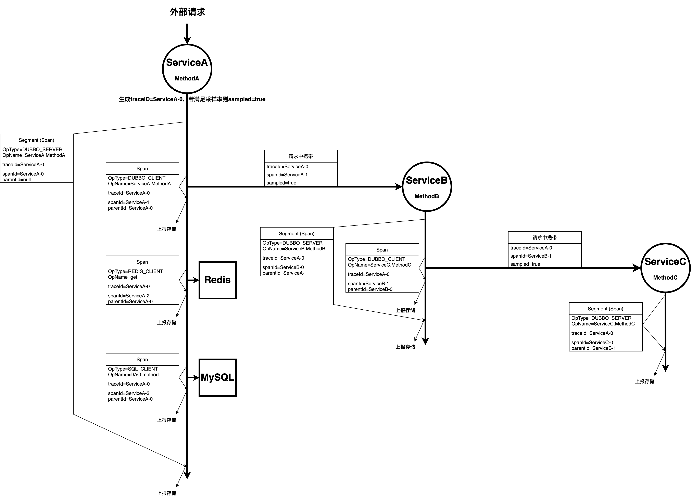
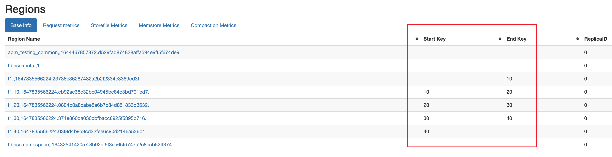
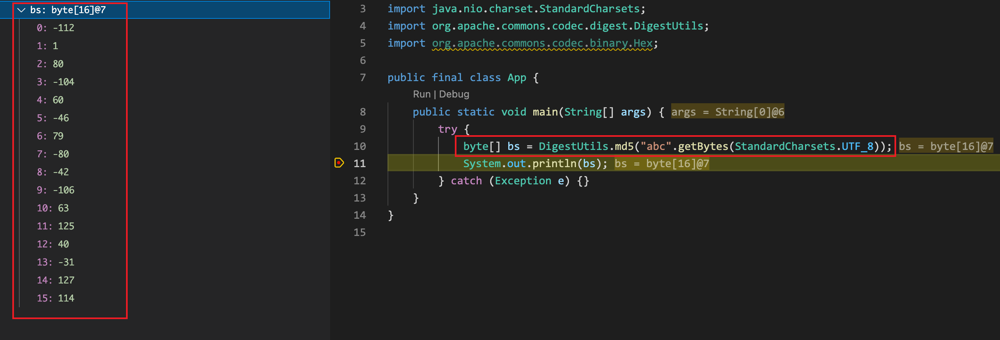
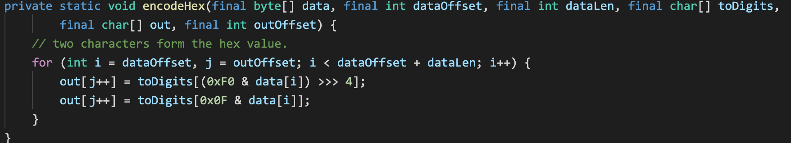
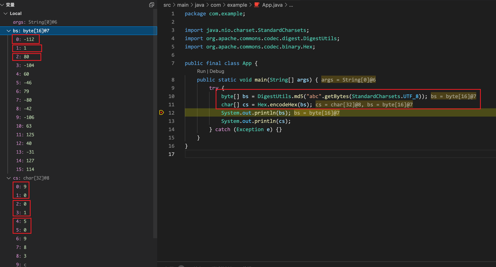

hello，大家好，我是小楼。

今天给大家分享一个关于HBase数据倾斜的排查案例，不懂调用链？不懂HBase？没关系，看完包懂~

## 背景

最近HBase负责人反馈HBase存储的调用链数据偶尔出现极其严重的倾斜情况，并且日常的倾斜情况也比较大，讲的通俗点就是出现了热点机器。

举个例子，有三台HBase机器存储调用链数据，其中大部分数据读写都在一台机器上，导致机器负载特别大，经常告警，这就是HBase倾斜，也叫热点现象。本文主要讲述了治理倾斜情况的过程，以及踩的几个坑。

## 知识铺垫

为什么会出现HBase倾斜的情况呢？既然是调用链数据HBase倾斜，那么首先简单介绍下几个调用链和HBase的背景知识。

### 全链路追踪

`全链路追踪`可能是一个比较统一的叫法，平常最多的叫法叫`调用链`，也可能有其他的叫法，不过说的都是同一个东西，本文全都用`调用链`来指代。

调用链是分布式服务化场景下，**跨应用**的**问题排查**和**性能分析**的工具。

说的直白点，就是可以让你看到你的代码逻辑在哪个地方调用了什么东西，比如在serviceA的methodA的逻辑里，依次调用了redis、mysql、serviceB等，可以看到每个调用的耗时、报错、出入参、ip地址等信息，这就是调用链。

目前调用链有一个统一的标准，以前叫`OpenTracing`，现在与其他的一些标准整合进了`OpenTelemetry`，不过调用链的标准基本没变。

调用链标准的最核心的概念如下，只列出了一些最核心的元素，不代表全部:

* Span：调用链最基本的元素就是Span，一次 Dubbo Server 请求处理，一次 HTTP 客户端请求，乃至一次线程池异步调用都可以作为一个 Span。
  * SpanID：一个Span的唯一标识，需要保证全局唯一
  * TraceID：一条调用链的唯一标识，会在整个调用链路中传递
  * ParentID：父 Span 的 SpanID。当存在 A -> B 这样的调用关系时，B Span 的 ParentID 是 A Span 的 SpanID。ParentID 用来构造整个调用链路的树形结构。每次发起新的请求时，都要把当前的 SpanID 作为 ParentID 传递给下一个 Span。
* Segment：Segment是特殊的Span，一般表示这是一个应用的边界 Span。如作为 Dubbo Server 的一次请求处理；作为 HTTP Server 的一次请求处理；作为 NSQ Consumer 的一次消息处理等。
* Trace：一条调用链就是一条Trace，Trace是一堆Span的集合，每一个Trace理论上来说是一颗树

下面用一张图来演示一次简单的三个服务间的Dubbo调用来展示调用链的数据是如何、何时产生的，以及各Span之间是通过什么关联起来的，用于深入理解上面的核心概念。



文字描述：外部请求调用了ServiceA.MethodA， SA.MA依次调用了SB.MB、Redis、MySQL， SB.MB调用了SC.MC， SC.MC内部只有计算逻辑。

> 注意：
> - 图里Span内容只包含了一部分，不代表全部内容。
> - 可能不同的调用链系统上报存储的方式不一样，有的是每个Segment上报一次，有的是每个Span上报一次，图中表示的是每个Span上报一次

### HBase

网上关于HBase介绍的文章很多，这里不做详细的介绍，只是列出来一些基本的概念用于理解。

HBase是一个可以存储海量数据的数据库，既然是数据库，那么最基本的操作就是添加和查询

* RowKey

HBase基本的数据操作都是通过RowKey这个东西，RowKey是HBase的一个核心概念，如何设计Rowkey是使用HBase最关键的部分。

RowKey在HBase里的作用是什么？一个是数据的操作要通过rowkey，可以把rowkey理解为mysql的主键，有索引的作用，另一个是用来做负载均衡。Rowkey的数据格式是字节流，也就是byte数组，这个概念很重要。

什么是byte？就是一个8位字符，值在-128到127之间，所以即使你的rowkey不是那128个ascii码，也是可以存的，例如你的rowkey有三个字节，十进制表示分别是-56、-110、-27，发送到HBase也是可以存储的，不过你要展示出来给人看，可能就不太好展示这个RowKey了。

* Region

Region是HBase数据分片的基本单位，可以把Region理解为HBase的数据分片。

HBase是按什么来做分片的？如果你有搭建过HBase的话，并且看过HBase的web界面，可以看到Region部分有两个属性，Start Key和End Key。

这两个属性代表什么意思？举个例子，现在有两个Region，RegionA的StartKey和EndKey是00和01，RegionB的StartKey和EndKey是01和02，你要存两条数据，RowKey分别是0000ABC和0100DEF，第一条数据就会落到RegionA里，第二条数据就会落到RegionB里，简单来讲就是根据RowKey的前缀来决定这条RowKey落到哪个Region里，如果Rowkey匹配不到任何一个Region，那么会新建一个Region存储数据。

当Region的数据量到达某个阈值后，Region会自动分裂为两个Region，避免性能降低，HBase还有一个功能是预分区，比如在新建Table后，可以在Table里预先指定256个分区，StartKey和EndKey依次是00-01、01-02一直到FE-FF（前提是你的所有的RowKey的前缀都在00-FF区间内），预分区的好处是避免HBase最开始过多的自动分裂，因为分裂时数据是不可用的，过多的分裂会导致性能降低。  



## 问题分析

介绍完了调用链和HBase的基本概念，这里介绍下我们调用链系统的存储架构，以及为什么会产生倾斜问题。

首先是调用链TraceID的设计，格式是 service_name-xx-yy-zz，也就是应用名+时间戳+IP+随机数。

调用链数据存储有两部分，一部分在ES，一部分在HBase，为什么不直接把原始数据存到ES里？因为ES机器比较贵，用的固态盘，为了节省成本。

ES里存储的是索引数据，也就是一些筛选条件，例如根据appName、startTime、耗时、是否有报错这些属性筛选调用链，这些可以用来筛选调用链的属性是存储在ES里的，并且为了节省空间，除了TraceID和SpanID这两个属性，其他属性的doc_value是关掉的，也就是只存了索引，没有存数据，因为要筛选出来TraceID和SpanID，然后根据这两个ID去HBase里取原始数据。

HBase里存储的是HBase的原始数据，除了TraceID和SpanID，因为这两个属性的数据在ES里已经有了。HBase里的每条数据是一个Span，每条数据的RowKey是xx-TraceID-SpanID，最开始的两个字符是TraceID做hash取前两位，为什么要做个hash？因为我们TraceID的开头是应用名，如果不加前面两位hash值的话，根据HBase存储数据的策略，前缀一样的会存储到一起，也就是同一个应用的Trace会存储到一起，那么流量大的应用Trace会很多，这样就会导致倾斜问题，加两位hash值可以让数据分散开，并且同一个TraceID的数据会存储到一起，可以一次性Scan出来。

既然RowKey的设计已经考虑到了倾斜问题，已经做了hash分散数据，那为什么日常会存在倾斜问题？而且偶尔会出现很严重的倾斜问题？原因是每个Trace的Span数量是不一样的，有的Trace可能就几个Span，有的Trace有几万个Span，还会出现一种极端情况，一个MQ消费者消费消息后又向好几个Topic里发送了消息，后续的消费者重复这样的操作，导致一条消息最终放大了几万甚至几十万倍，导致一个Trace里有几十万甚至几千万个Span，这只是其中一种场景，也可能业务开发做了什么骚操作，也会导致一个Trace包含的Span数量非常多，那么根据现在的存储架构，同一个Trace的数据会存储到一起，这就导致了倾斜问题。

## 方案设计

在定位到问题后，最直接的想法就是彻底打散RowKey，也就是把SpanID的MD5当作RowKey，因为SpanID是全局唯一的，所以MD5必然是彻底打散的，不过这样做有一个坏处，就是数据彻底打散后，要查出一整个Trace的话，就得一个Span一个Span去查，不像之前的RowKey设计可以一次性Scan出来。

为了知道这样查询性能有多慢，特意做了一次性能测试，结果如下：

|span数量(个)|scan(ms)|search_es(ms)|gets(ms)|gets_parallel_batch100(ms)|gets_parallel_batch200(ms)|gets_parallel_batch300(ms)|gets_parallel_batch500(ms)|
| --------------| ----------| ---------------| ----------| ----------------------------| ----------------------------| ----------------------------| ----------------------------|
|100|5|12|12+10|||||
|265|10|20|20+25|20+10|20+15|||
|336|10|20|20+28|20+10|20+15|||
|562|10|25|25+45|25+15|25+15|25+23||
|1759|30|57|57+130|57+38|57+40|57+45|57+45|
|2812|70|85|85+210|85+70|85+70|85+70|85+70|
|8000|170|210|210+700|210+180|210+180|210+180|210+200|

之前的设计查询一整个Trace的步骤就是直接用TraceID去HBase里scan，不用查询ES，也就是第二列的耗时。

如果改成一个Span一个Span去查的话，查询步骤变成了两步，第一步先用TraceID从ES里查询出这个Trace所有的SpanID，然后再根据SpanID去HBase里批量gets，表格里的后5列就是两步查询的耗时，加号前面是查询ES的耗时，加号后面是HBase批量gets的耗时。第四列表示串行gets，后四列表示并行gets，并对不同batch的大小做了测试。

根据测试结果，串行gets的性能要比并行gets的性能低3-4倍，所以不考虑串行gets。并行batch的大小对性能影响不大，并且最终耗时相比只scan的耗时也就增大一倍，例如查询8000个Span，前后方案查询耗时对比为170ms:390ms，实际上用户感知不到，所以方案就定为用MD5彻底打散数据。

## 踩的坑

在开发完成后，在测试环境测试无误后就直接发了线上，由于最开始不太了解HBase的Region相关的概念，所以误以为RowKey改成MD5后倾斜情况会直接消失，就直接发布了HBase数据写入的服务，发布后HBase那边立刻出现了非常严重的倾斜情况，导致HBase写入超时，kafka堆积，赶紧回滚了，HBase负责人查看监控发现大部分数据写入到了一台机器上。

为什么会出现这种情况？测试环境为什么没有出现这个问题？

根据上面介绍的HBase的Region相关的概念，出现这种情况的原因可能是RowKey没有匹配到任何一个Region，所以数据写入到了新建的Region上，也就是一台机器上。

但是代码里写的明明就是MD5，并且在测试环境测试无误，之前的RowKey方案的前两位hash在00-FF之间，MD5的前缀肯定也在00-FF之间啊，按理说肯定可以匹配到一个Region的，为什么还会写到新的Region里？直接上代码

```java
import org.apache.commons.codec.digest.DigestUtils;

// 用spanId的MD5值当作RowKey，写入到HBase里
public static byte[] rowKeyMD5(String spanId) {
    // DigestUtils只是JDK加密包的封装，底层还是调用JDK本身的MD5加密
    return DigestUtils.md5(spanId);
}
```

DigestUtils是org.apache.commons.codec.digest.DigestUtils包里带的，实际还是调用的JDK自带的MD5库，等同于如下的写法

```java
import java.security.MessageDigest;
// MessageDigest是JDK自带的加密包，里面有MD5加密算法
MessageDigest.getInstance("md5").digest(spanId.getBytes(StandardCharsets.UTF_8));
```

调试一波，发现了问题，这里用一个简单的demo演示下，逻辑就是用md5加密"abc"这个字符串



一般我们`看到的`加密后的MD5是16个或者32个0-F之间的字符，0-F的ASCII码是48-57和97-102，但是加密后的byte数组有的byte是负的，那加密出来的这16个byte是什么玩意？虽然继续看了MD5加密的源码，但是水平不足，看不懂加密原理。。。

看到加密后的byte数组应该就可以知道了为什么一发布就严重热点了，因为byte数组里面的东西根本不是正常的0-F之间的字符，虽然hbase的rowkey是只要是byte(-127~128)就行，但是现在MD5加密出的byte数组匹配不到原有的Region的StartKey和EndKey，全都写到新建的Region里了，那么我只需要把RowKey搞成MD5的16进制字符不就可以匹配到原有的Region了么？

那么Java怎么MD5加密出一般我们**看到的**那种16进制字符的呢？比较方便的写法是

```java
import org.apache.commons.codec.binary.Hex;

Hex.encodeHex(DigestUtils.md5(str));
```

那么看下encodeHex里是怎么把md5byte数组转成十六进制字符串的



每个byte是8位，但是每个16进制字符，也就是0-F只需要四位bit就可以表示，所以一个byte可以表示两个16进制字符，也就是我们日常写的0xFF表示一个byte，上面的逻辑就是把一个byte的前四位和后四位分开，分别表示一个16进制字符，那么16个byte就可以拆成32个16进制字符，这就对上了，接下来看下encodeHex的输出



abc经过MD5加密后的16进制字符串是900150983cd24fb0d6963f7d28e17f72，我们按照encodeHex的逻辑来手动拆下byte看看对不对的上

首先看bs[0]，也就是-112，用二进制表示就是10010000，注意，这是个补码，简单解释下原码和补码，计算机中的数值都是用二进制补码来存储的，正数的补码是它本身，也就是它的原码，负数的补码是它的原码除了符号位取反加1，详细的可以去看看计算机基础的书籍。

那么-112的原码就是11110000，补码就是10010000，拆成两部分也就是1001和0000，也就是9和0，跟16进制字符串的前两位，也就是90，对上了。

再拆下bs[1]，也就是1，用二进制表示就是00000001，拆成两部分也就是0000和0001，也就是0和1，跟16进制字符串的三四位，也就是01，对上了

再拆下bs[2]，也就是80，用二进制表示就是01010000，拆成两部分也就是0101和0000，也就是5和0，跟16进制字符串的五六位，也就是50，对上了

后面的同理，就不写了，看到这里我们就知道了那个16长度的byte数组到底是什么玩意，就是把每两个16进制字符合并成了一个byte

**所以，我们经常以为或经常看到Java中的MD5每一位都是0-F的字符串是经过了encodeHex处理，但RowKey实际上用的是处理之前的byte[]，它并不在0-F这个范围**

## 改进

知道原因后，把RowKey的MD5改成十六进制字符，重新发布，果然没有出现严重热点问题，监控曲线跟之前一样，说明复用了已有的Region，日常倾斜情况需要跑一段时间才可以解决。

## 总结

1. HBase的RowKey设计是使用HBase最最重要的地方
2. 注意Java的MD5加密出来的东西不一定是你想要的
3. 其实直接使用那个16长度的byte数组当作RowKey也可以，虽然基本不会复用已有的Region，不过要一点一点的灰度发布才可以