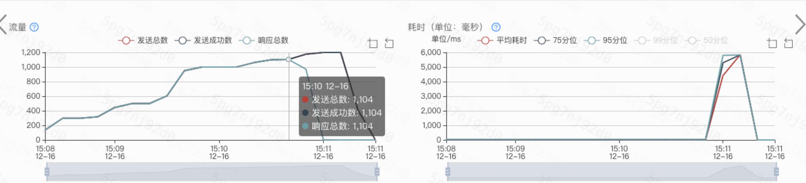

hello大家好呀，我是小楼~

今天又带来一次性能优化的分享，这是我刚进公司时接手的祖传（坏笑）项目，这个项目在我的文章中屡次被提及，我在它上面做了很多的性能优化，比如[《记一次提升18倍的性能优化》](https://mp.weixin.qq.com/s/N1M_zv4EjB3aKme2UpDeYg)这篇文章，比较偏向某个细节的优化，本文更偏向宏观上的性能优化，可以说是个老演员了。


### 背景
为了新朋友能快速进入场景，再描述一遍这个项目的背景，这个项目是一个自研的Dubbo注册中心，上一张架构图


- Consumer 和 Provider 的服务发现请求（注册、注销、订阅）都发给 Agent，由它全权代理
- Registry 和 Agent 保持 Grpc 长链接，长链接的目的主要是 Provider 方有变更时，能及时推送给相应的 Consumer。为了保证数据的正确性，做了推拉结合的机制，Agent 会每隔一段时间去 Registry 拉取订阅的服务列表
- Agent 和业务服务部署在同一台机器上，类似 Service Mesh 的思路，尽量减少对业务的入侵，这样就能快速的迭代了

这里的`Registry`就是今天的主角，熟悉Dubbo的朋友可以把它当做是一个zookeeper，不熟悉的朋友可以就把它当做是一个Web应用，提供了注册、注销、订阅接口，虽然它是用Go写的，但本文和Go本身关系不大，也用用一些伪代码来示意，所以也可以放心大胆地看下去。

### 一定要做性能优化吗
在做性能优化之前，我们得回答几个问题，性能优化带来的收益是什么？为什么一定要做优化性能？不优化行不行？

性能优化无非有两个目的：
- 减少资源消耗，降低成本
- 提高系统稳定性

如果只是为了降低成本，最好做之前估算一下大概能降低多少成本，如果吭哧吭哧干了大半个月，结果只省下了一丁点的资源，那是得不偿失的。

回到这个注册中心，为什么要做性能优化呢？

Dubbo应用启动时，会向注册中心发起注册，如果注册失败，则会阻塞应用的启动。

起初这个项目问题并不大，因为接入的应用并不多，而当我接手项目时，接入的应用越来越多。

话分两头，另一边集团也在逐渐使用容器替代虚拟机和物理机，在高峰期会用扩容的方式来抗住流量高峰，快速扩容就要求服务能在短时间内大量启动，无疑对注册中心是一个大的考验。

而导致这次优化的直接导火索是集团内的一次演练，他们发现一个配置中心的启动依赖，性能达不到标准而导致扩容失败，于是复盘下来，所有的启动依赖必须达到一定的性能要求，而这个标准被定为1000qps。

于是就有了本文。

### 指标度量
如果不能度量，就没法优化。

首先是把几个核心接口加上metric，主要是请求量、耗时（p99 / p95 / p90）、错误请求量，无论是哪个项目，这点算是基本的了，如果没加，得好好反思了。

其次对项目进行一次压测，不知道现在的性能，后面的优化也无法证明其效果了。

以注册接口为例，当时注册的性能大概是40qps，记住这个值，看我们是如何一步一步达到1000qps的。

压测成功的请求标准是：p99耗时在1秒以内，且无报错。

### 瓶颈在哪里
性能优化的最关键之处在于找到瓶颈在哪，否则就是无头苍蝇，到处瞎碰。

注册接口到底干了什么呢？我这里画个简图


- 整个流程加锁，防止并发操作
- Create App和Create Cluster是创建应用和集群，只会在应用第一次创建，如果创建过就直接跳过
- Insert Endpoint是插入注册数据，即ip和port
- 系统的底层存储是基于MySQL，Lock和UnLock也是基于MySQL实现的悲观锁

从这个流程图就能看出来，瓶颈大概率在锁上，这是个悲观锁，而且粒度是App，把整个流程锁住，同一时刻相同应用的请只允许一个通过，可想而知性能有多差。

至于MySQL如何实现一个悲观锁，我相信你会的，所以我就不展开。

为了证明猜想，我用了一个非常笨但很有效的方法，在每一个关键节点执行之后，记录下耗时，最后打印到日志里，这样就能一眼看出到底哪里慢，果然最慢的就是加锁。

### 锁优化

在优化锁之前，我们先搞清楚为什么要加锁，在我反复测试，读代码，看文档之后，发现事情其实很简单，这个锁是为了防止App、Cluster、Endpoint重复写入。

为什么防止重复写入要这么折腾呢？一个数据库的唯一索引不就搞定了？这无法考证，但现状就是这样，如何破解呢？

- 首先是看这些表能否加唯一索引，有则尽量加上
- 其次数据库悲观锁能否换成Redis的乐观锁？

这个其实是可以的，原因在于客户端具有重试机制，如果并发冲突了，则发起重试，我们堵这个概率很小。

上面两条优化下来只解决了部分问题，还有的表实在无法添加唯一索引，比如这里App、Cluster由于一些特殊原因无法添加唯一索引，他们发生冲突的概率很高，同一个集群发布时，很可能是100台机器同时拉起，只有一台成功，剩余99台在创建App或者Cluster时被锁挡住了，发起重试，重试又可能冲突，大家都陷入了无限重试，最终超时，我们的服务也可能被重试流量打垮。

这该怎么办？这时我想起了刚学Java时练习写单例模式中，有个叫「双重校验锁」的东西，我们看代码

```java
public class Singleton {
    private static volatile Singleton instance = null;
    private Singleton() {
    }
    private static Singleton getInstance() {
        if (instance == null) {
            synchronized (Singleton.class) {
                if (instance == null) {
                    instance = new Singleton();
                }
            }
        }
        
        return instance;
    }
}
```

再结合我们的场景，App和Cluster只在创建时需要保证唯一性，后续都是先查询，如果存在就不需要再执行插入，我们写出伪代码

```
app = DB.get("app_name")
if app == null {
    redis.lock()
    app = DB.get("app_name")
    if app == null {
        app = DB.instert("app_name")
    }
    redis.unlock()
}
```

是不是和双重校验锁一模一样？为什么这样会性能更高呢？因为App和Cluster的特性是只在第一次时插入，真正需要锁住的概率很小，就拿扩容的场景来说，必然不会走到锁的逻辑，只有应用初次创建时才会真正被Lock。

性能优化有一点是很重要的，就是我们要去优化执行频率非常高的场景，这样收益才高，如果执行的频率很低，那么我们是可以选择性放弃的。

经过这轮优化，注册的性能从40qps提升到了430qps，10倍的提升。

### 读走缓存

经过上一轮的优化，我们还有个结论能得出来，一个应用或集群的基本信息基本不会变化，于是我在想，是否可以读取这些信息时直接走Redis缓存呢？

于是将信息基本不变的对象加上了缓存，再测试，发现qps从430提升到了440，提升不是很多，但苍蝇再小，好歹是块肉。

### CPU优化

上一轮的优化效果不理想，但在压测时注意到了一个问题，我发现Registry的CPU降低的很厉害，感觉瓶颈从锁转移到了CPU。说到CPU，这好办啊，上火焰图，Go自带的pprof就能干。


可以清楚地看到是ParseUrl占用了太多的CPU，这里简单科普下，Dubbo传参很多是靠URL传参的，注册中心拿到Dubbo的URL，需要去解析其中的参数，比如ip、port等信息就存在于URL之中。

一开始拿到这个CPU profile的结果是有点难受的，因为ParseUrl是封装的标准包里的URL解析方法，想要写一个比它还高效的，基本可以劝退。

但还是顺腾摸瓜，看看哪里调用了这个方法。不看不知道，一看吓一跳，原来一个请求里的URL，会执行过程中多次解析URL，为啥代码会这么写？可能是其中逻辑太复杂，一层一层的嵌套，但各个方法之间的传参又不统一，所以带来了这么糟糕的写法，

这种情况怎么办呢？

- 重构，把URL的解析统一放在一个地方，后续传参就传解析后的结果，不需要重复解析
- 对URL解析的方法，以每次请求的会话为粒度加一层缓存，保证只解析一次

我选择了第二种方式，因为这样对代码的改动小，毕竟我刚接手这么庞大、混乱的代码，最好能不动就不动，能少动就少动。

而且这种方式我很熟悉，在Dubbo的源码中就有这样的处理，Dubbo在反序列化时，如果是重复的对象，则直接走缓存而不是再去构造一遍，代码位于`org.apache.dubbo.common.utils.PojoUtils#generalize`

截取一点感受下
```java
private static Object generalize(Object pojo, Map<Object, Object> history) {
    ...
    Object o = history.get(pojo);
    if (o != null) {
        return o;
    }
    history.put(pojo, pojo);
    ...
}
```
根据这个思路，把ParseUrl改成带cache的模式
```
func parseUrl(url, cache) {
    if cache.get(url) != null {
        return cache.get(url)
    }
    u = parseUrl0(url)
    cache.put(url, u)
    return u
}
```
因为是会话级别的缓存，所以每个会话会new一个cache，这样能保证一个会话中对相同的url只解析一次。

可以看下这次优化的成果，qps直接到1100，达到目标~



### 最后说两句
可能有人看完就要喷了，这哪是性能优化？这分明是填坑！对，你说的没错，只不过这坑是别人挖的。

本文就以一种最小的代价来搞定对祖传代码的性能优化，当然并不是鼓励大家都去取巧，这项目我也正在重构，只是每个阶段都有不同的解法，比如老板要求你2周内接手一个新项目，并完成性能优化上线，重构是不可能的。

希望通过本文你能学到一些性能优化的基本知识，从为什么要做的拷问出发，建立度量体系，找出瓶颈，一步一步进行优化，根据数据反馈及时调整优化方向。

今天到此为止，我们下期再见。