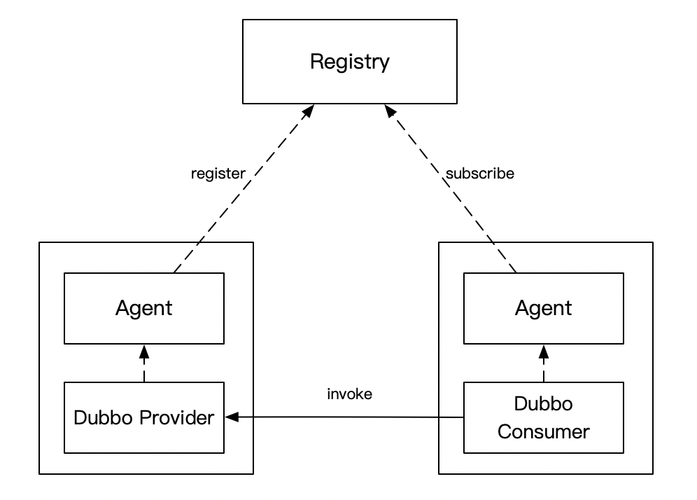
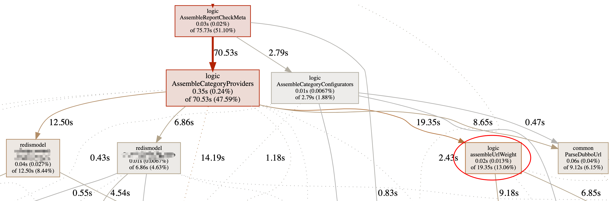
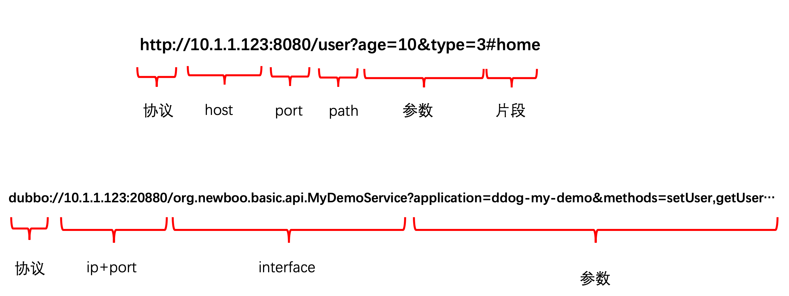
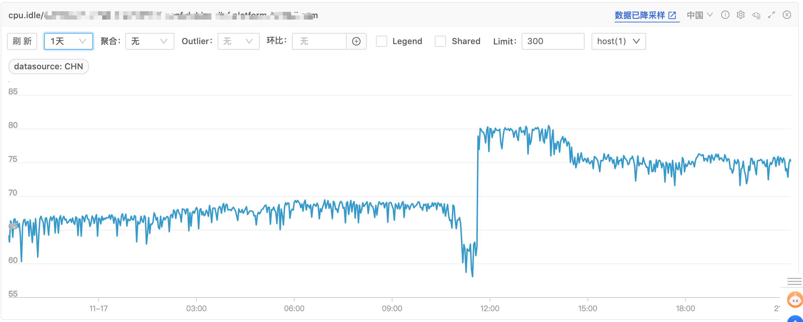

### 背景

最近负责的一个自研的 Dubbo 注册中心经常收到 CPU 使用率的告警，于是进行了一波优化，效果还不错，于是打算分享下思考、优化过程，希望对大家有一些帮助。

自研 Dubbo 注册中心是个什么东西，我画个简图大家稍微感受一下就好，看不懂也没关系，不影响后续的理解。



- Consumer 和 Provider 的服务发现请求（注册、注销、订阅）都发给 Agent，由它全权代理
- Registry 和 Agent 保持 Grpc 长链接，长链接的目的主要是 Provider 方有变更时，能及时推送给相应的 Consumer。为了保证数据的正确性，做了推拉结合的机制，Agent 会每隔一段时间去 Registry 拉取订阅的服务列表
- Agent 和业务服务部署在同一台机器上，类似 Service Mesh 的思路，尽量减少对业务的入侵，这样就能快速的迭代了

回到今天的重点，这个注册中心最近 CPU 使用率长期处于中高水位，偶尔有应用发布，推送量大时，CPU 甚至会被打满。

以前没感觉到，是因为接入的应用不多，最近几个月应用越接越多，慢慢就达到了告警阈值。

### 寻找优化点

由于这项目是 Go 写的（不懂 Go 的朋友也没关系，本文重点在算法的优化，不在工具的使用上）， 找到哪里耗 CPU 还是挺简单的：打开 pprof 即可，去线上采集一段时间即可。

具体怎么操作可以参考我之前的[这篇文章](https://mp.weixin.qq.com/s/CF5GJOu0D4mi7QYC-XfMKg)，今天文章中用到的知识和工具，这篇文章都能找到。



CPU profile 截了部分图，其他的不太重要，可以看到消耗 CPU 多的是 `AssembleCategoryProviders`方法，与其直接关联的是

- 2个 redis 相关的方法
- 1个叫`assembleUrlWeight`的方法

稍微解释下，AssembleCategoryProviders 方法是构造返回 Dubbo provider 的 url，由于会在返回 url 时对其做一些处理（比如调整权重等），会涉及到对这个 Dubbo url 的解析。又由于推拉结合的模式，线上服务使用方越多，这个处理的 QPS 就越大，所以它占用了大部分 CPU 一点也不奇怪。

这两个 redis 操作可能是序列化占用了 CPU，更大头在 assembleUrlWeight，有点琢磨不透。

接下来我们就分析下 assembleUrlWeight 如何优化，因为他占用 CPU 最多，优化效果肯定最好。

下面是 assembleUrlWeight 的伪代码：

```go
func AssembleUrlWeight(rawurl string, lidcWeight int) string {
	u, err := url.Parse(rawurl)
	if err != nil {
		return rawurl
	}

	values, err := url.ParseQuery(u.RawQuery)
	if err != nil {
		return rawurl
	}

	if values.Get("lidc_weight") != "" {
		return rawurl
	}

	endpointWeight := 100
	if values.Get("weight") != "" {
		endpointWeight, err = strconv.Atoi(values.Get("weight"))
		if err != nil {
			endpointWeight = 100
		}
	}

	values.Set("weight", strconv.Itoa(lidcWeight*endpointWeight))

	u.RawQuery = values.Encode()
	return u.String()
}
```

传参 rawurl 是 Dubbo provider 的url，lidcWeight 是机房权重。根据配置的机房权重，将 url 中的 weight 进行重新计算，实现多机房流量按权重的分配。

这个过程涉及到 url 参数的解析，再进行 weight 的计算，最后再还原为一个 url

Dubbo 的 url 结构和普通 url 结构一致，其特点是参数可能比较多，没有 `#`后面的片段部分。



CPU 主要就消耗在这两次解析和最后的还原中，我们看这两次解析的目的就是为了拿到 url 中的 `lidc_weight` 和 `weight` 参数。

url.Parse 和 url.ParseQuery 都是 Go 官方提供的库，各个语言也都有实现，其核心是解析 url 为一个对象，方便地获取 url 的各个部分。

如果了解信息熵这个概念，其实你就大概知道这里面一定是可以优化的。`Shannon（香农）` 借鉴了热力学的概念，把信息中排除了冗余后的平均信息量称为`信息熵`。


url.Parse 和 url.ParseQuery 在这个场景下解析肯定存在冗余，冗余意味着 CPU 在做多余的事情。

因为一个 Dubbo url 参数通常是很多的，我们只需要拿这两个参数，而 url.Parse 解析了所有的参数。

举个例子，给定一个数组，求其中的最大值，如果先对数组进行排序，再取最大值显然是存在冗余操作的。

排序后的数组不仅能取最大值，还能取第二大值、第三大值...最小值，信息存在冗余了，所以先排序肯定不是求最大值的最优解。

### 优化

#### 优化获取 url 参数性能

第一想法是，不要解析全部 url，只拿相应的参数，这就很像我们写的算法题，比如获取 weight 参数，它只可能是这两种情况（不存在 #，所以简单很多）：

- dubbo://127.0.0.1:20880/org.newboo.basic.MyDemoService?weight=100&...
- dubbo://127.0.0.1:20880/org.newboo.basic.MyDemoService?xx=yy&weight=100&...

要么是 `&weight=`，要么是 `?weight=`，结束要么是`&`，要么直接到字符串尾，代码就很好写了，先手写个解析参数的算法：

```go
func GetUrlQueryParam(u string, key string) (string, error) {
	sb := strings.Builder{}
	sb.WriteString(key)
	sb.WriteString("=")
	index := strings.Index(u, sb.String())
	if (index == -1) || (index+len(key)+1 > len(u)) {
		return "", UrlParamNotExist
	}

	var value = strings.Builder{}
	for i := index + len(key) + 1; i < len(u); i++ {
		if i+1 > len(u) {
			break
		}
		if u[i:i+1] == "&" {
			break
		}
		value.WriteString(u[i : i+1])
	}
	return value.String(), nil
}
```

原先获取参数的方法可以摘出来：

```go
func getParamByUrlParse(ur string, key string) string {
	u, err := url.Parse(ur)
	if err != nil {
		return ""
	}

	values, err := url.ParseQuery(u.RawQuery)
	if err != nil {
		return ""
	}

	return values.Get(key)
}
```

先对这两个函数进行 benchmark：

```go
func BenchmarkGetQueryParam(b *testing.B) {
	for i := 0; i < b.N; i++ {
		getParamByUrlParse(u, "anyhost")
		getParamByUrlParse(u, "version")
		getParamByUrlParse(u, "not_exist")
	}
}

func BenchmarkGetQueryParamNew(b *testing.B) {
	for i := 0; i < b.N; i++ {
		GetUrlQueryParam(u, "anyhost")
		GetUrlQueryParam(u, "version")
		GetUrlQueryParam(u, "not_exist")
	}
}
```

Benchmark 结果如下：

```
BenchmarkGetQueryParam-4          103412              9708 ns/op
BenchmarkGetQueryParam-4          111794              9685 ns/op
BenchmarkGetQueryParam-4          115699              9818 ns/op
BenchmarkGetQueryParamNew-4      2961254               409 ns/op
BenchmarkGetQueryParamNew-4      2944274               406 ns/op
BenchmarkGetQueryParamNew-4      2895690               405 ns/op
```

可以看到性能大概提升了20多倍

新写的这个方法，有两个小细节，第一是返回值中区分了参数是否存在，这个后面会用到；第二是字符串的操作用到了 `strings.Builder`，这也是实际测试的结果，使用 `+`或者 `fmt.Springf` 性能都没这个好，感兴趣可以测试下看看。

#### 优化 url 写入参数性能

计算出 weight 后再把 weight 写入 url 中，这里直接给出优化后的代码：

```go
func AssembleUrlWeightNew(rawurl string, lidcWeight int) string {
	if lidcWeight == 1 {
		return rawurl
	}

	lidcWeightStr, err1 := GetUrlQueryParam(rawurl, "lidc_weight")
	if err1 == nil && lidcWeightStr != "" {
		return rawurl
	}

	var err error
	endpointWeight := 100
	weightStr, err2 := GetUrlQueryParam(rawurl, "weight")
	if weightStr != "" {
		endpointWeight, err = strconv.Atoi(weightStr)
		if err != nil {
			endpointWeight = 100
		}
	}

	if err2 != nil { // url中不存在weight
		finUrl := strings.Builder{}
		finUrl.WriteString(rawurl)
		if strings.Contains(rawurl, "?") {
			finUrl.WriteString("&weight=")
			finUrl.WriteString(strconv.Itoa(lidcWeight * endpointWeight))
			return finUrl.String()
		} else {
			finUrl.WriteString("?weight=")
			finUrl.WriteString(strconv.Itoa(lidcWeight * endpointWeight))
			return finUrl.String()
		}
	} else { // url中存在weight
		oldWeightStr := strings.Builder{}
		oldWeightStr.WriteString("weight=")
		oldWeightStr.WriteString(weightStr)

		newWeightStr := strings.Builder{}
		newWeightStr.WriteString("weight=")
		newWeightStr.WriteString(strconv.Itoa(lidcWeight * endpointWeight))
		return strings.ReplaceAll(rawurl, oldWeightStr.String(), newWeightStr.String())
	}
}
```

主要就是分为 url 中是否存在 weight 两种情况来讨论：

- url 本身不存在 weight 参数，则直接在 url 后拼接一个 weight 参数，当然要注意是否存在 `?`
- url 本身存在 weight 参数，则直接进行字符串替换

细心的你肯定又发现了，当 `lidcWeight = 1` 时，直接返回，因为 `lidcWeight = 1` 时，后面的计算其实都不起作用（Dubbo 权重默认为100），索性别操作，省点 CPU。

全部优化完，总体做一下 benchmark：

```go
func BenchmarkAssembleUrlWeight(b *testing.B) {
	for i := 0; i < b.N; i++ {
		for _, ut := range []string{u, u1, u2, u3} {
			AssembleUrlWeight(ut, 60)
		}
	}
}

func BenchmarkAssembleUrlWeightNew(b *testing.B) {
	for i := 0; i < b.N; i++ {
		for _, ut := range []string{u, u1, u2, u3} {
			AssembleUrlWeightNew(ut, 60)
		}
	}
}
```

结果如下：

```
BenchmarkAssembleUrlWeight-4               34275             33289 ns/op
BenchmarkAssembleUrlWeight-4               36646             32432 ns/op
BenchmarkAssembleUrlWeight-4               36702             32740 ns/op
BenchmarkAssembleUrlWeightNew-4           573684              1851 ns/op
BenchmarkAssembleUrlWeightNew-4           646952              1832 ns/op
BenchmarkAssembleUrlWeightNew-4           563392              1896 ns/op
```

 大概提升 18 倍性能，而且这可能还是比较差的情况，如果传入 lidcWeight = 1，效果更好。

### 效果

优化完，对改动方法写了相应的单元测试，确认没问题后，上线进行观察，CPU Idle（空闲率） 提升了10%以上



### 最后

其实本文展示的是一个 Go 程序非常常规的性能优化，也是相对来说比较简单，看完后，大家可能还有疑问：

- 为什么要在推送和拉取的时候去解析 url 呢？不能事先算好存起来吗？
- 为什么只优化了这点，其他的点是否也可以优化呢？

针对第一个问题，其实这是个历史问题，当你接手系统时他就是这样，如果程序出问题，你去改整个机制，可能周期比较长，而且容易出问题


第二个问题，其实刚也顺带回答了，这样优化，改动最小，收益最大，别的点没这么好改，短期来说，拿收益最重要。当然我们后续也打算对这个系统进行重构，但重构之前，这样优化，足以解决问题。