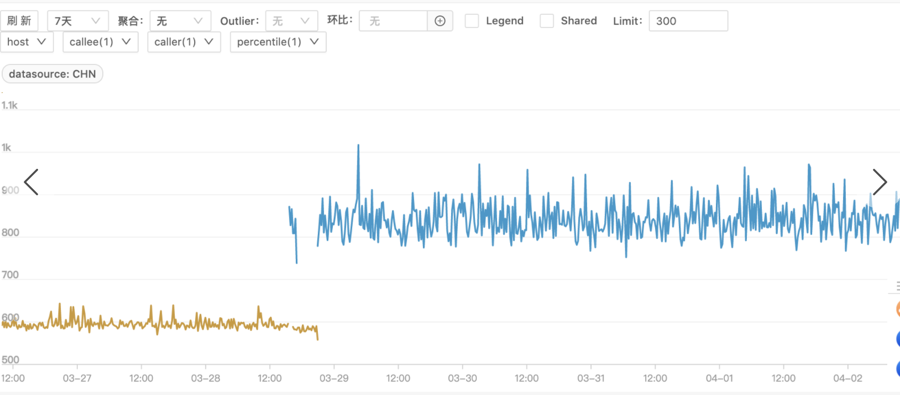
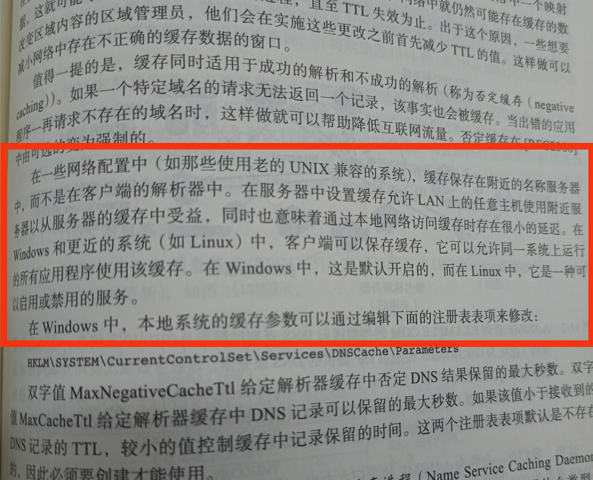

hello大家好，我是小楼。

最近踩了个DNS解析的小坑，虽然问题解决了，但排查过程比较曲折，最后还是有一点没有想通，整个过程分享给大家。

### 背景

最近负责的服务要置换机器。置换机器可能很多小伙伴不知道是干啥，因为大家平时接触不到，我简单解释一下什么是机器置换以及为什么需要机器置换。

机器置换通俗地讲就是更换机器，把服务从一台机器迁移到另一台上去。

为什么要机器置换呢？ 表面原因可能是机器硬件故障、或者机器过了保修期。

有些小伙伴可能就想问，我在公司也负责了很多服务，为啥从来没有置换过机器呢？原因可能是用了容器，没有直接部署在物理机上，置换机器的任务被转移给了云平台的运维人员；还可能是你们有专门的运维帮忙做了这件事，对开发人员来说几乎是透明的。

我负责的服务为啥要置换呢？因为机器过保了。服务为啥部署在物理机上呢？因为它是个基础服务，和一般服务不太一样，有一些限制，只能在物理机上部署。为啥没有运维人员帮忙呢？因为公司很多基础服务是自运维，开发者既做开发又是运维。


说完机器置换，再来聊聊这个基础服务，它是一个Go写的服务，不停地发送HTTP请求，记住这点就好，其他不重要。

这个服务在置换机器后，**HTTP请求的耗时慢了不少**，如下图，黄色为老机器，蓝色为新机器，指标的值就是HTTP请求的耗时（毫秒），大概1.5倍的差距。这就是今天要分享的问题，接下来说说我的排查过程。



### 问题排查

这种情况，先去看了机器的各项指标，如CPU、网络情况等等，看看是否有异常，确认是否被其他指标影响了。但看了一圈下来，发现新机器的各项指标甚至还优于老机器。

接着去询问了提供机器的同学，看看机器是否有异常，结果也是没有。

既然HTTP请求变慢，就想到看看是请求的哪个环节变慢了，用如下的命令来测试下，域名我用百度的域名来代替：

> curl  -o /dev/null -s -w %{time_namelookup}::%{time_connect}::%{time_total}"\n" http://www.baidu.com

这里的各个参数代表含义（还有一些其他参数也可用）：

- time_total 总时间，按秒计。精确到小数点后三位。 
- time_namelookup DNS解析时间,从请求开始到DNS解析完毕所用时间。
- time_connect 连接时间,从开始到建立TCP连接完成所用时间,包括前边DNS解析时间，如果需要单纯的得到连接时间，用这个time_connect时间减去前边time_namelookup时间。以下同理，不再赘述。
- time_appconnect 连接建立完成时间，如SSL/SSH等建立连接或者完成三次握手时间。
- time_pretransfer 从开始到准备传输的时间。
- time_redirect 重定向时间，包括到最后一次传输前的几次重定向的DNS解析，连接，预传输，传输时间。
- time_starttransfer 开始传输时间。在client发出请求之后，Web 服务器返回数据的第一个字节所用的时间

这样能看到域名解析、连接、传输各个阶段的耗时情况，新老机器对比，如果有一项特别高，那么这项肯定有问题

- 新机器：0.001484::0.001743::0.007489
- 老机器：0.000681::0.000912::0.002475

简单计算一下：

- 新机器：DNS解析耗时0.001484秒，连接建立耗时0.000258秒，总耗时0.007489秒
- 老机器：DNS解析耗时0.000681秒，连接建立耗时0.000231秒，总耗时0.002475秒

虽然从这次的测试数据来看，新机器DNS解析似乎慢了一点，但你仔细看这个数值，几乎对请求的总体耗时没啥影响，而且多测试几次，发现这两台机器的DNS解析其实差不多。

但还是不放心，验证DNS是否存在问题，再用dig命令去试一下

> dig www.baidu.com

执行时，明显感觉到了卡顿，确定是DNS有问题了。


### 问题解决

一开始，我去网上搜索了一下DNS慢的相关文章，找到了一篇文章《记一次Go net库DNS问题排查》，但稍微验证了下，和我的case没啥关系，文章是好文章，所以也贴个链接，感兴趣可以读读。

> 《记一次Go net库DNS问题排查》https://juejin.cn/post/6948469896007122974

接着就去找了网络组的同学，网络组的同学稍微看了一眼就知道原因了，说新机器没有安装DNSmasq，这又是个啥？不要慌，先去网上查下再接话。


> DNSmasq 提供 DNS 缓存和 DHCP 服务功能。作为域名解析服务器(DNS)，DNSmasq可以通过缓存 DNS 请求来提高对访问过的网址的连接速度。作为DHCP 服务器，DNSmasq 可以用于为局域网电脑分配内网ip地址和提供路由。DNS和DHCP两个功能可以同时或分别单独实现。DNSmasq轻量且易配置，适用于个人用户或少于50台主机的网络。此外它还自带了一个 PXE 服务器。

简单来说，这里它扮演的是一个DNS缓存的角色，提高DNS的查询速度。

说到这里，插播一个小知识，我一直以为DNS会被操作系统缓存，不知道你们有没有这样的错觉，但实际上，Linux下如果没有特殊处理，每一次DNS解析都要查询DNS服务器。很好证明，可以用tcpdump抓DNS的包试试，我当时也试了下，每次都会去远程拿DNS解析结果。这个结论在《TCP/IP详解卷1》中也能找到相关的描述：



只有Windows和比较新的Linux系统可以在客户端缓存DNS，而且Linux系统是需要手动开启的，所以默认情况下都要去远程获取DNS缓存。

言归正传，网络组同学说要么装一个DNSmasq，要么改下DNS服务器的配置，也就是`/etc/resolv.conf`文件，由于机器上已经有服务了，所以选择了改配置这种比较安全的方式。

没改之前，/etc/resolv.conf 的第一行是127.0.0.1，也就是将本地也作为DNS服务器，但实际上本地没有开启DNS服务，网络组同学说，去掉第一行配置或者安装DNSmasq都可以。

先是去掉了127.0.0.1的配置，结果耗时不变！


随后加上127.0.0.1的配置，又安装了DNSmasq后，耗时就降下去了。


整个解决的过程，程序没有重启，唯一的变量是安装了DNSmasq，所以这一定是DNS的锅了。

### 问题反思

虽然问题解决了，但我还有几个疑问：

1. 为什么配置了127.0.0.1的DNS server，但没有开启DNSmasq呢？
2. 为什么去掉127.0.0.1配置会无效呢？

第1个问题比较好搞清楚，问了下系统部的同学，他说本来是应该开启DNSmasq的，但出了一点点小差错，结果只配置了127.0.0.1。


再看第2个问题，DNS本地缓存和远程查询差距这么大吗？据网络组同学说DNS server是公司内自建的，内网传输，实际并不慢，用dig也好测试，使用第2、3行的DNS server测试下，发现dig的速度都很快。

> dig www.baidu.com @host

为什么有了127.0.0.1的配置就变得很慢呢？下面就从我的几个猜测入手，一个个证明，但在猜测之前，我们先了解一下Go程序解析DNS的流程。

### Go的DNS解析流程

Go的DNS解析分为两种：

- cgo方式，调用c语言标准库的实现
- 纯Go代码实现

由于要适配各个平台，所以又有了各个平台的实现。

这部分代码位于`net`包下，想要跟踪也很简单，写个建立连接的代码，一步步debug，找到域名解析的地方。

我直接告诉你从`lookup_unix.go`文件的`lookupIP`方法看起，当然这只是Unix系统，包括Mac和Linux，不过Mac不走纯Go的代码，它被强制走到cgo了，在Linux上没有特殊配置是走纯Go实现的DNS解析，以下代码以Linux为例：

```go
func (r *Resolver) lookupIP(ctx context.Context, network, host string) (addrs []IPAddr, err error) {
	// ①强制走纯Go的DNS解析器
	if r.preferGo() {
		return r.goLookupIP(ctx, host)
	}
	// ②根据解析顺序解析
	order := systemConf().hostLookupOrder(r, host)
	if order == hostLookupCgo {
		if addrs, err, ok := cgoLookupIP(ctx, network, host); ok {
			return addrs, err
		}
		// cgo not available (or netgo); fall back to Go's DNS resolver
		// ③如果cgo搞不定，降级到先文件再DNS
		order = hostLookupFilesDNS
	}
	ips, _, err := r.goLookupIPCNAMEOrder(ctx, host, order)
	return ips, err
}
```

这里order有如下几种

```go
hostLookupCgo      hostLookupOrder = iota // cgo
hostLookupFilesDNS                 // 文件优先
hostLookupDNSFiles                 // DNS优先
hostLookupFiles                    // 只查文件
hostLookupDNS                      // 只查DNS
```

这里的文件也就是`/etc/hosts`，goLookupIP 最终也调用了 goLookupIPCNAMEOrder，但goLookupIPCNAMEOrder这个方法的代码太长，所以我这里只讲一下大致的流程：

1. 如果需要先查询hosts文件，则先查，查到直接返回
2. 读取/etc/resolv.conf文件，拿出DNS server的配置，并且每5秒更新一次
3. 构造DNS请求并向服务器发送，UDP读取的超时时间默认为5秒，可在/etc/resolv.conf文件中配置，同一个域名的不同类型（如ipv4和ipv6）的查询可配置为并行或串行
4. 向DNS server发送请求采用的是轮询机制，如果其中一个server请求出错，则顺延至下一个，重试次数默认为2，可在/etc/resolv.conf文件中配置
5. 最后解析查询结果并返回，如果结果为空，且配置了hosts文件兜底，则查询一次文件

好了，流程简单介绍到这里，接下来验证我的几个猜想。

### 猜想一：Go是否只在程序启动时读取一次/etc/resolv.conf文件

这个猜想的依据是，如果查询DNS时拿到了127.0.0.1的DNS server，且本地未开启DNS服务时，可能会慢，且配置文件如果修改了，Go程序如果只在初始化时读一次文件，那自然改配置文件无效。

但事实并非如此，上面也说了，Go在读取DNS配置文件时是惰性地每隔5秒更新一次

```go
func (conf *resolverConfig) tryUpdate(name string) {
	// 初始化，只做一次
  conf.initOnce.Do(conf.init)
  // ...
	now := time.Now()
	if conf.lastChecked.After(now.Add(-5 * time.Second)) {
		return
	}
	conf.lastChecked = now
  // ... 
	dnsConf := dnsReadConfig(name)
	conf.mu.Lock()
	conf.dnsConfig = dnsConf
	conf.mu.Unlock()
}
```

而且我做了个实验，写了个DNS解析的测试代码，放在有127.0.0.1配置但未开启DNSmasq的服务器上跑，抓127.0.0.1 53端口（DNS默认端口）的包，发现是有流量的，然后修改/etc/resolv.conf配置，去掉127.0.0.1，发现抓不到127.0.0.1 53端口的流量了，这证明和代码逻辑一致，本猜想不成立。

### 猜想二：DNS查询远程比本地慢很多

这个很好证明，还是用上面的程序

1. 放在无127.0.0.1配置的服务器上跑
2. 放在有127.0.0.1配置且开启DNSmasq的服务器上跑

结果两者耗时差不多，甚至他们和在有127.0.0.1配置但未开启DNSmasq的服务器上的耗时也基本一致。

这说明无论怎样查询DNS都不慢。

### 猜想三：是否是并发太高导致

为什么我会有这个猜想呢，一是线上的QPS大概是50左右，和上面测试的场景不太一样，二是我在上面的代码中看到了锁，是不是并发高了之后，锁带来的开销变大导致？

我写了个100并发的代码，去查询DNS，结果发现这段代码在如下三种场景，耗时都差不多

1. 无127.0.0.1配置的服务器
2. 有127.0.0.1配置且开启DNSmasq的服务器
3. 有127.0.0.1配置且未开启DNSmasq的服务器

同时我也去问了网络组的同学，他说DNS server能抗住百万QPS，服务端没有压力。


### 最后

写到最后，我emo了~虽然问题解决了，但为什么当时DNS查询慢还是不知道，如果你看了文章知道其中哪里有问题，或者有什么比较好的排查方法，欢迎来探讨，反正我是查不下去了。

最后再说一句，写文章很辛苦，需要点鼓励，来个`点赞`、`在看`、`关注`吧，我们下期再见。