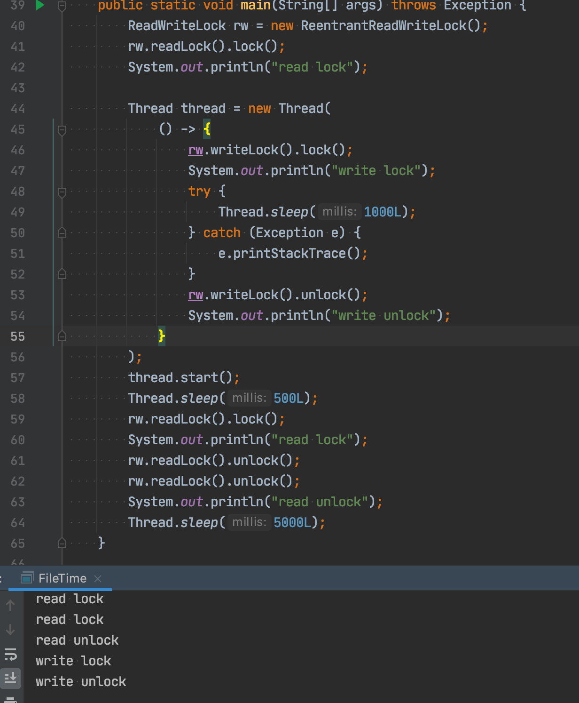

hello，大家好呀，我是小楼。

最近我又双叒叕写了个BUG，一个线上服务死锁了，不过幸亏是个新服务，没有什么大影响。

出问题的是Go的读写锁，如果你是写Java的，不必划走，更要看看本文，本文的重点在于Java和Go的读写锁对比，甚至看完后你会有一个隐隐的感觉：Go的读写锁是不是有BUG？

## 故障回放

背景简单抽象一下：一个server服务（Go语言实现），提供了一个http接口，另有一个client服务来调用这个接口，整体架构非常简单，甚至都不用画架构图你也能够理解。

这两个服务上线运行了一段时间都没什么问题，突然有一天client调用这个server的接口全都超时了。

碰到这种问题，第一时间去查看日志和监控，client端全是超时日志，server端日志没有异常，甚至连请求的监控都没有上报，仿佛client端的请求没有到达server端一样。

于是去server服务器上手动请求了一下接口，结果卡主不动，这下排除了client，一定是server端出了问题。

这种卡死的问题其实很好查，直接用pprof看协程卡在哪里基本就能得出结论（和Java的jstack类似的工具），但这个服务没有开启pprof，只能改了代码打开pprof重新发布，等待下次问题复现。

好在运气不错，2天后问题就出来了，用pprof看下程序卡在了哪里：

原来卡在了一个判断集群或服务是否是小流量的地方，该接口会接受一个集群名或服务名的参数，然后判断该集群或服务是否是小流量集群，进而做一系列事，至于做了啥不重要。小流量集群是配置在配置中心中。

我把这段代码摘出来（图中是走的判断集群分支，下面代码以更简单的服务分支讲解，底层一致）。为了避免空洞，这里我先简单讲解一下程序的逻辑：

- 首先小流量的配置定义了一个读写锁（sync.RWMutex），以及在内存中保持了哪些服务需要灰度的规则（scopesMap）

- 配置变更时调用reset刷新这个scopesMap，用写锁，后续逻辑省略

- 判断是否为灰度服务，先加读锁看看规则是否存在：

- 再加锁判断服务是否命中规则：

这样圈出重点，你可能一眼就看出问题了，读锁加了两次，第二次没有必要，属于手误了。确实，删除第二个加读锁的代码就没问题了。如果事情到这就结束了，那这篇文章也没有必要写了，下面我们分析下为什么会死锁。

## 为什么会死锁

看到这个结果，我第一反应是Go的锁的`重入性`问题。

熟悉Java的同学对锁的重入并不陌生，以防有读者不明白锁的重入性，我用一句话来概括：

`可重入锁`就是可以重复进入的锁，也叫`递归锁`。

Java中有一个`ReentrantLock`，比如这样，重复加锁是没有问题的：

但Go里面的锁是不可重入的：

这个坑我也踩过，这是Go的实现问题。只要你愿意，用Java也能实现不可重入锁，但Java中大多数使用的还是可重入锁，因为用起来比较方便。

至于Go为什么不实现一个可重入的锁，可以参考煎鱼大佬的这篇文章[《Go 为什么不支持可重入锁？》](https://mp.weixin.qq.com/s/pQBsAxnaBXkk7G1cdUgsww) ，其原因总结起来就是Go的设计者觉得重入锁是个不好的设计，所以没有采纳。不过我觉得这篇文章的评论更精彩：

说到这，你可能会说，上面出问题的明明是读写锁（`sync.RWMutex`），读写锁的特点是什么？

- 读与读之间不互斥
- 读与写、写与写之间互斥

既然读锁之间是不互斥，也就是可加两次读锁，那么读锁必然是`可重入`的。我们写个demo测试下：

果然如我们所想，顺便看一下加读锁的逻辑：

看我框出的代码，如果有写锁在等待，读锁需要等写锁！

这是什么逻辑？

如果一个协程已经拿到了读锁，另一个协程尝试加写锁，这时应该加不了，没什么问题。如果这个读锁的协程再去拿读锁，需要等写锁，这就死锁了啊！

为了验证，我构造了一个demo：

这段代码按①、②、③顺序执行，第②段写锁需要等第①个读锁释放，第③段读锁需要等第②段写锁释放，最终就是一个死锁的逻辑。

仔细想，这里面最有争议的要属`已经拿到读锁再次进入读锁需要等写锁`这个逻辑。

Java中是这样的吗？写个demo试试：

Java一点事都没有，这是为啥？遇事不决，看源码！但Java的源码太长，又不是本文重点，所以就只说几点重要的结论：

1. Java的ReentrantReadWriteLock支持锁`降级`，但不能`升级`，即获取了写锁的线程，可以继续获取读锁，但获取读锁的线程无法再获取写锁；
2. ReentrantReadWriteLock实现了公平和非公平两种锁，公平锁的情况下，获取读锁、写锁前需要看同步队列中是否先线程在我之前排队；非公平锁的情况下：写锁可以直接抢占锁，但是读锁获取有一个让步条件，如果当前同步队列head.next是一个写锁在等待，并且自己不是重入的，就要让步等待。

在Java的实现下，如果一个线程持有了读锁，写锁自然是需要等待的，但是持有读锁的线程也可以再次重入该读锁。

我们发现Java和Go的读写锁实现不一致，这个不一致也就是导致我们写出BUG的原因。

## 这合理吗

抛开实现，我们思考一下这样合理吗？

- 一个协程（或线程）已经获取到了读锁，别的协程（线程）获取写锁时必然需要等待读锁的释放
- 既然这个协程（或线程）已经拥有了这个读锁，那么为什么再次获取读锁时需要管别的写锁是否等待呢？

可以想象病人排队看医生，前面一个病人向医生问诊，进去后把门关上，在里面无论问多长时间（理论上）是他的权利，后面的病人在他没出来前是不能打开门的。

但Go的实现却是，前一个病人每问完一句话得看一眼门外是否有人在等，如果有人在等，那他就要等门外的人问完才能问，但门外的人又在等他问，所以大家死锁了，谁都别想看完病。

是不是细思下来，感觉这是不是Go的一个BUG？

## Go为什么这么实现

我尝试去github上搜索了一下，发现了这个issue：

> https://github.com/golang/go/issues/30657

从标题就能看出他遇到了和我一样的问题：

> Read-locking shouldn't hang if thread has already a write-lock? #30657

看看里面有人是怎么回答的：

这位大佬说，这不符合Go锁的原理，Go的锁是不知道协程或者线程信息的，只知道代码调用先后顺序，即读写锁无法升级或降级。

Java中的锁记录了持有者（线程id），但Go的锁是不知道持有者是谁，所以获取了读锁之后再次获取读锁，这里的逻辑是区分不了是持有者还是其他的协程，所以就统一处理。

这点其实在Go源码的注释中体现了，我也是后来才注意到：

翻译一下是：

> 如果一个协程持有读锁，另一个协程可能会调用Lock加写锁，那么再也没有一个协程可以获得读锁，直到前一个读锁释放，这是为了禁止读锁递归。也确保了锁最终可用，一个阻塞的写锁调用会将新的读锁排除在外。

不过这个警示实在是太不起眼了，大概就是这个效果：

这一幕像极了产品和程序员：

- 产品经理：我要实现这个功能，怎么实现我不管
- Go：这破坏了我的设计原则，不接受这个功能
- 产品经理：大家都退一步，你换个代价小的方法解决吧

于是，程序员在读写锁上写下了一段注释：

## 最后

这个死锁的坑确实很容易踩，尤其是Java程序员来写Go，所以我们写Go代码时还是得写得更Go一点才行。

Go的设计者比较「偏执」，认为「不好」的设计坚决不去实现，就如锁的实现不应该依赖线程、协程信息；可重入（递归）锁是一种不好的设计。**所以这种看似有BUG的设计，也存在一定的道理**。

当然每个人都有自己的想法，你觉得Go的读写锁这样实现合理吗？

如果你看完觉得有点收获，给个`赞`、`在看`吧，你的支持是我持续创作的动力~