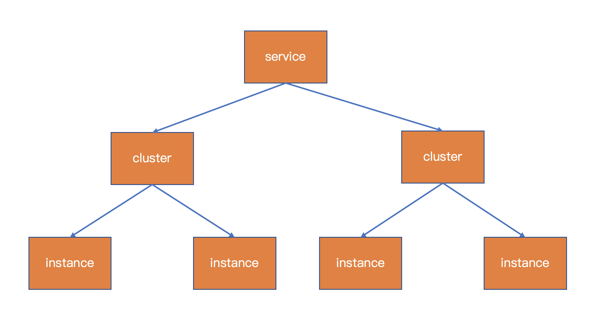
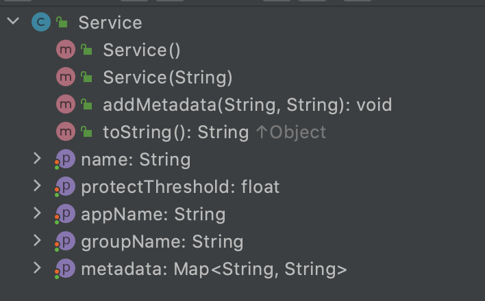
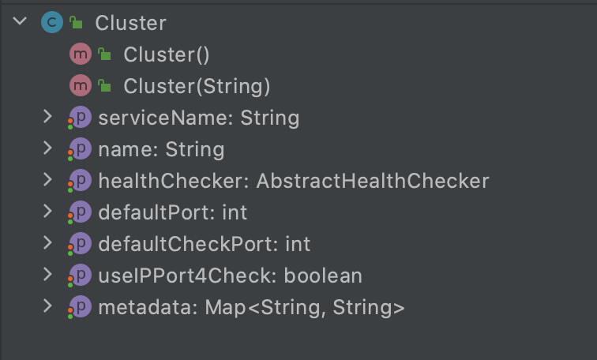
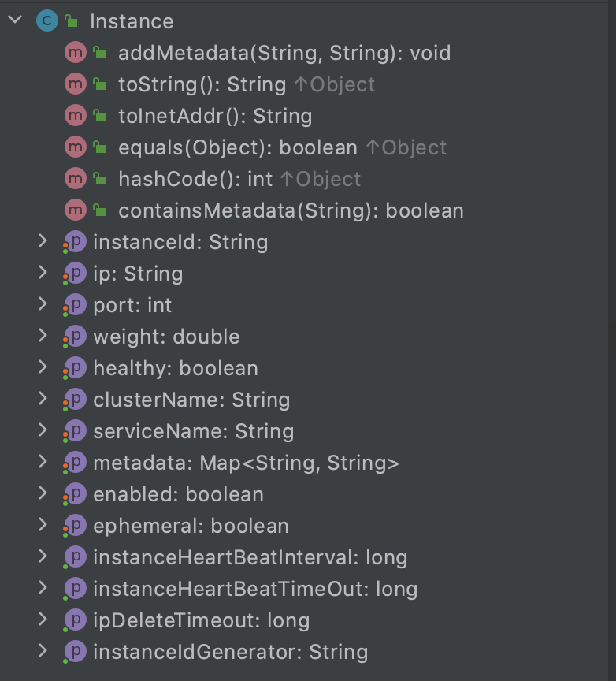

# 前言

在之前的文章中分析了Nacos配置中心，配置中心的核心是配置的创建、读取、推送。

注册中心的核心比配置中心多一个`服务探活`模块，他俩的相似度非常高，甚至阿里内部的注册中心就叫`ConfigServer`。

Nacos注册中心打算分成几个模块来分析，本文重点在于`概要设计`，基于2.0.0版本。

## 环境搭建

用Nacos的源码来搭建源码阅读和调试环境，可参考[《Nacos配置中心模块详解》](https://mp.weixin.qq.com/s/kjkXGWQA6pA6UTJakhFmrw) `Nacos调试环境搭建`部分。

其中 JVM参数可以指定只启动Naming模块，也可以不指定，默认全都启动。

example模块下将NamingExample复制一份进行测试。

# 设计概要

## 服务发现模型

客户端视角的服务发现模型（注意：服务端视角的模型定义与客户端视角有区别）包含以下几点内容：
- Service：服务
- Cluster：集群
- Instance：实例

> 代码注释：We introduce a 'service --> cluster --> instance' model, in which service stores a list of clusters, which contains a list of instances

他们的关系如下

### Service

- name：服务名
- protectThreshold：保护阈值，限制了实例被探活摘除的最大比例
- appName：服务的应用名，暂无实际用处
- groupName：分组名
- metadata：元数据

### Cluster

- serviceName：所属服务名
- name：集群名
- healthChecker：服务探活配置，此处仅对服务端主动探活生效，有TCP、HTTP、MySQL、None几种方式，默认TCP
- defaultPort：默认端口
- defaultCheckPort：默认探活端口
- useIPPort4Check：是否使用port进行探活
- metadata：元数据

### Instance

- instanceId：实例id，唯一标志，Nacos提供了`simple`和`snowflake`两种算法来生成，默认是`simple`，其生成方式为`ip#port#clusterName#serviceName`
- ip：实例ip
- port：实例port
- weight：实例权重
- healthy：实例健康状态
- clusterName：所属集群名
- serviceName：所属服务名
- metadata：元数据
- enabled：是否接收请求，可用于临时禁用或摘流等场景
- ephemeral：是否为临时实例，后文会介绍该参数
---
- getInstanceHeartBeatInterval：获取实例心跳上报间隔时间，默认5秒，可配置
- getInstanceHeartBeatTimeOut：获取心跳超时时间，15秒，配置
- getIpDeleteTimeout：获取ip被删除的超时时间，默认30秒，可配置
- getInstanceIdGenerator：获取id生成器

除了上述的三层模型外，Nacos注册中心和配置中心有着一样的namespace设计，与client绑定，可隔离环境，租户。

## 接口设计

- registerInstance：注册实例
- deregisterInstance：注销实例
- getAllInstances：获取一个服务的所有实例（包括不健康）
- selectInstances：根据条件获取一个服务的实例
- selectOneHealthyInstance：根据负载均衡策略获取服务的一个健康的实例
- subscribe：订阅服务
- unsubscribe：取消订阅服务
- getServicesOfServer：根据条件分页获取所有服务

## 交互流程

Nacos 2.0 为ephemeral不同的实例提供了两套流程：

- ephemeral=false，永久实例，与server端的交互采用http请求，server节点间数据同步采用了raft协议，健康检查采用了server端主动探活的机制
- ephemeral=true，临时实例，与server端的交互采用grpc请求，server节点间数据同步采用了distro协议，健康检查采用了TCP连接的KeepAlive模式

### 临时实例的交互流程

- client初始化，与server建立连接
  - 只与其中一台server节点建立长连接

- client 注册服务，将serviceName+ip+port+clusterName等数据打包发送grpc请求
  - 同时客户端缓存已注册过的服务，当client与server连接断开重连时，client重新将这些数据注册到server端

- server端接收到client的注册请求，将注册信息存入client对象（用于保存client的所有数据）中，并触发ClientChangedEvent、ClientRegisterServiceEvent、InstanceMetadataEvent
  - ClientChangedEvent触发server节点之间的数据同步（distro协议）
  - ClientRegisterServiceEvent触发更新publisherIndexes（保存service => clientId的Map<Service, Set<String>>，即哪些客户端注册了这个服务的索引），同时也触发一个ServiceChangedEvent，该事件负责向监听该服务的客户端进行推送
  - InstanceMetadataEvent，处理元数据，Nacos在2.0中将元数据与基础数据拆分开，分为不同的处理流程

- client订阅服务
  - 根据serviceName、groupName、clusters信息生成key，创建eventListener，同时向server端发送订阅请求，并缓存订阅信息，用于连接断开重连后再次向server端发送信息
- server端接收到client的订阅请求
  - 将订阅信息打包为subscribers，并存入client对象中，触发ClientSubscribeServiceEvent事件
  - ClientSubscribeServiceEvent事件更新subscriberIndexes（保存service => clientId的Map<Service, Set<String>>，即哪些客户端订阅了这个服务的索引），同时触发ServiceSubscribedEvent事件
  - ServiceSubscribedEvent事件会延时500ms向该client推送该服务的最新数据
- 反向的操作如注销、取消订阅与正向操作类似，不再赘述

# 最后

本文从总体上分析了Nacos 2.0的模型设计、接口设计以及交互流程，读完后对Nacos的服务发现有一个整体上的认识。
后续篇幅会从细节入手，如dubbo Nacos扩展、一致性协议、探活、CMDB扩展等逐一进行分析。
  

---
> 搜索关注微信公众号"捉虫大师"，后端技术分享，架构设计、性能优化、源码阅读、问题排查、踩坑实践。

