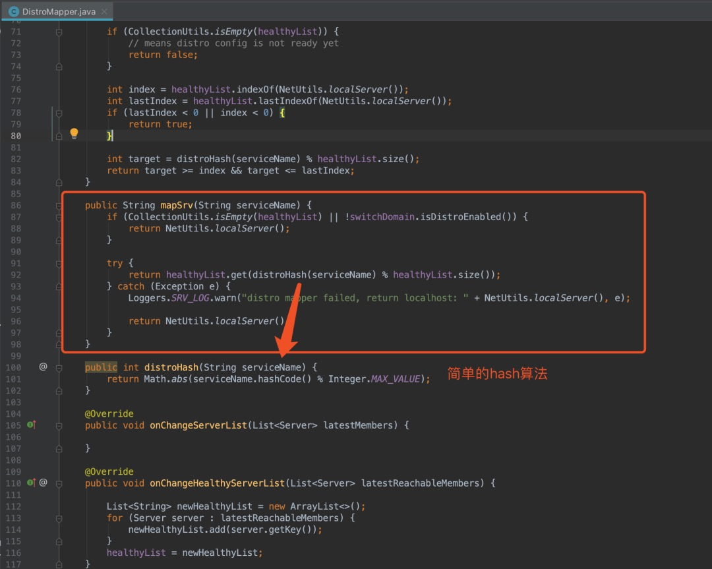

# nacos介绍
nacos在它的官网上是这样介绍自己的
> 一个更易于构建云原生应用的动态服务发现、配置管理和服务管理平台

它可作为服务的注册中心，也可用于配置的管理。作为注册中心强调了“更易于构建云原生应用”。注册中心我们可能更加熟悉zookeeper，这里做一个简单的对比

|特性|zookeeper|nacos|
|---|---|---|
|一致性协议|CP|AP|
|健康检查|Keep Alive|tcp/http/mysql/client beat|
|负载均衡|无|权重/selector/metadata|
|多数据中心|不支持|支持|
|跨注册中心同步|不支持|支持|
|雪崩保护|无|有|
|访问协议|tcp|http/dns|
|k8s集成|不支持|支持|
|dubbo集成|支持|支持|
# 一致性协议
在介绍一致性协议前先了解一下CAP理论

- Consistency 一致性，在分布式系统中的所有数据备份，在同一时刻是否同样的值；
- Availability 可用性，只要收到用户的请求，服务器就必须给出回应；
- Partition tolerance 分区容错性，以实际效果而言，分区相当于对通信的时限要求。系统如果不能在时限内达成数据一致性，就意味着发生了分区的情况，必须就当前操作在C和A之间做出选择

分布式系统必须具有分区容错性，一致性与可用性只能选择其一，如果选择一致性，必须在某节点写入时，数据同步到其他节点完成后才可以响应下一个请求，这段时间内服务是不可用的；反之选择可用性，则一致性无法保证，这就是CAP理论

作为注册中心，P要保证，C和A需要权衡；常见的一致性协议有paxos、raft，他们都是强一致性协议（CP），然而今天要介绍的nacos的distro协议是弱一致协议（AP），即最终一致性协议。注册中心到底该是AP还是CP，推荐阅读阿里中间件的博客[《阿里巴巴为什么不用zookeeper?》](https://mp.weixin.qq.com/s?__biz=MjM5MDE0Mjc4MA==&mid=2651007830&idx=1&sn=7382412cd4a2243b34f69c3cf4aa5a20&scene=21)

# distro协议介绍
distro协议网上的资料比较少，因为它是阿里“自创的协议“，通过源码总结一下distro协议的关键点：

- distro协议是为了注册中心而创造出的协议；
- 客户端与服务端有两个重要的交互，服务注册与心跳发送；
- 客户端以服务为维度向服务端注册，注册后每隔一段时间向服务端发送一次心跳，心跳包需要带上注册服务的全部信息，在客户端看来，服务端节点对等，所以请求的节点是随机的；
- 客户端请求失败则换一个节点重新发送请求；
- 服务端节点都存储所有数据，但每个节点只负责其中一部分服务，在接收到客户端的“写“（注册、心跳、下线等）请求后，服务端节点判断请求的服务是否为自己负责，如果是，则处理，否则交由负责的节点处理；
- 每个服务端节点主动发送健康检查到其他节点，响应的节点被该节点视为健康节点；
- 服务端在接收到客户端的服务心跳后，如果该服务不存在，则将该心跳请求当做注册请求来处理；
- 服务端如果长时间未收到客户端心跳，则下线该服务；
- 负责的节点在接收到服务注册、服务心跳等写请求后将数据写入后即返回，后台异步地将数据同步给其他节点；
- 节点在收到读请求后直接从本机获取后返回，无论数据是否为最新。

通过几个特殊场景来加深一下理解

- 某服务一段时间未发生心跳，被服务端摘除，该服务恢复后继续发送心跳，重新被注册；
- 服务端某节点宕机，不回复其他服务端节点的健康检查请求，则会被其他节点从健康节点列表中剔除，其他节点重新分配负责节点，依靠客户端的心跳重新建立完整的服务数据；
- A机房部署2节点，B机房部署3节点，组成一个集群，5个节点分别负责相应的服务，某时刻，两机房网络不通，导致A机房两个节点组成一个集群，B机房三个节点组成一个集群，即“脑裂问题”，在强一致性协议中，此时只可能A机房可用，B机房不可用，distro协议不处理脑裂问题，这种情况需要再细分两种：（1）客户端与A、B机房都联通，则一段时间随机请求的心跳之后，A、B集群中仍然有全量的服务，A、B正常（2）部分客户端与A联通，部分客户端与B联通，则部分服务注册到A，部分注册到B，A内部可以调用，B内部也可以调用，AB不可相互调用，这种极端情况比起强一致的情况要好一些，强一致协议会导致与A连通的服务可用，与B联通的服务不可用，A也调用不了B。

# nacos简单评测

- 目前版本（1.2.0）的实现，无论是客户端与服务端或是服务端之间的通信都是采用http协议，数据格式为json，在服务数量多的情况下非常消耗cpu资源，如果改为长连接，数据格式再高效一点就更好；
- 服务的心跳是以instance纬度，即ip + port + service，这会导致心跳请求非常多，结合第一点，不改造的情况下，几乎无法用于生产；
- distro协议判断服务的负责节点采用简单的hash算法，如果nacos某节点宕机，则所有的服务都会重新计算映射到新的节点，变动较多，如果能采用一致性hash算法，则单节点宕机，只转移该故障节点负责的服务。

---

> 关于作者：专注后端的中间件开发，公众号"捉虫大师"作者，关注我，给你朴实无华的技术干货

- 原文链接: https://mp.weixin.qq.com/s/2Q_voaW8v0WSOqlSwF2G7A
- 发布时间: 2020.04.19