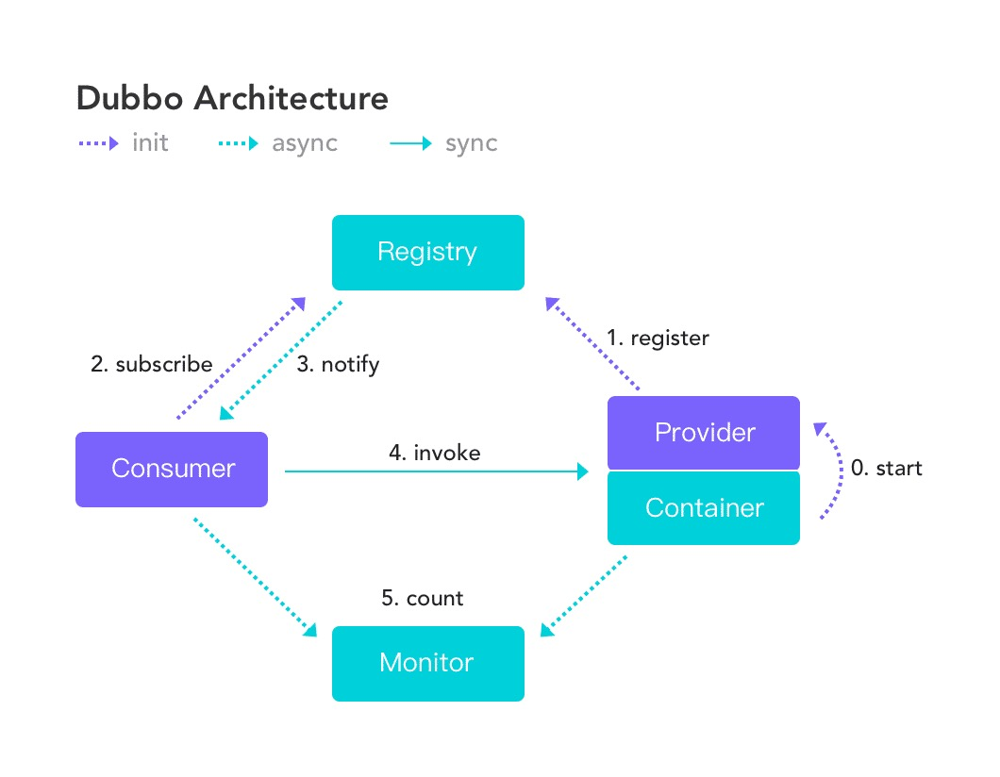
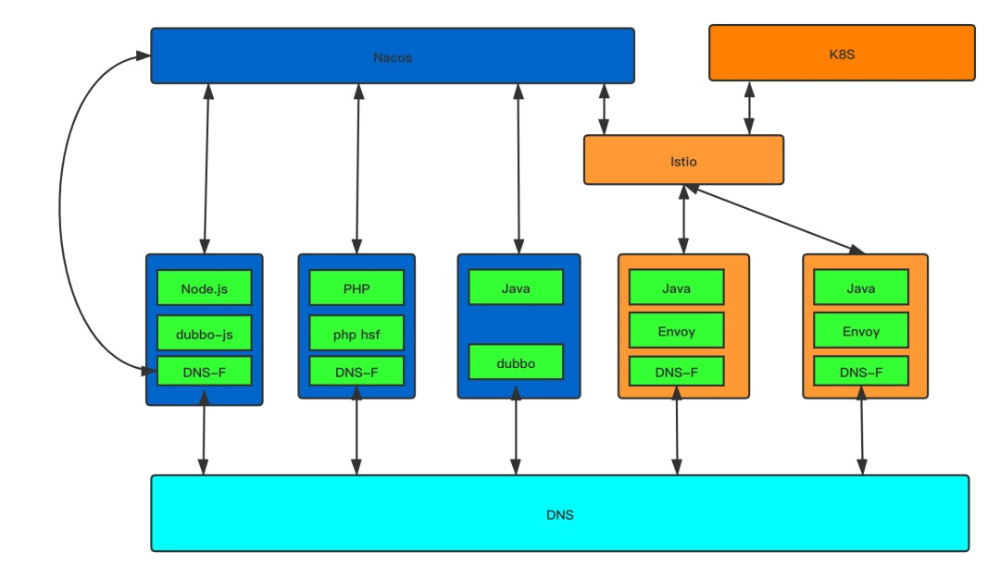
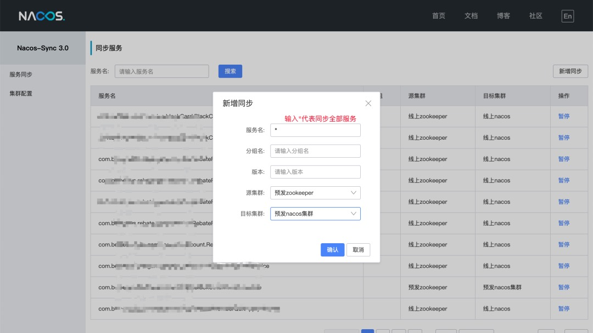
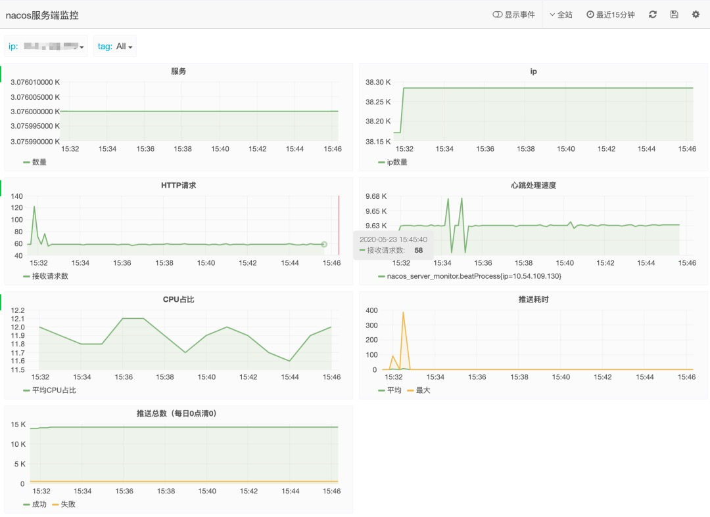
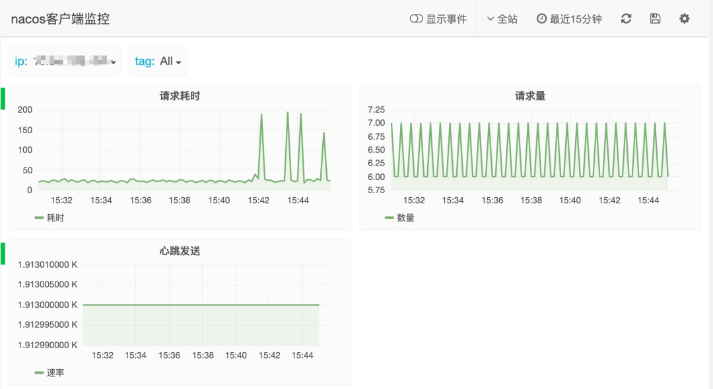
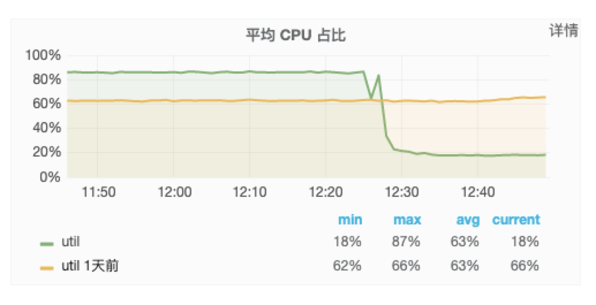

# 技术选型
公司的RPC框架是`dubbo`，配合使用的服务发现组件一直是`zookeeper`，长久以来也没什么大问题。至于为什么要考虑换掉zookeeper，并不是因为它的性能瓶颈，而是考虑往`云原生`方向演进。

云原生计算基金会（CNCF）对云原生的定义是：

> 云原生技术有利于各组织在公有云、私有云和混合云等新型动态环境中，构建和运行可弹性扩展的应用。云原生的代表技术包括容器、服务网格、微服务、不可变基础设施和声明式API。这些技术能够构建容错性好、易于管理和便于观察的松耦合系统。结合可靠的自动化手段，云原生技术使工程师能够轻松地对系统作出频繁和可预测的重大变更。

想要落地云原生，关键步骤就是`mesh化`，当前主要讨论`service mesh`（服务网格），一句话形象描述service mesh

> service mesh是微服务时代的TCP协议

服务网格相对于当前的微服务最明显的优势是下沉基础设置，让服务治理和业务开发分离。

举个简单的例子，如果在微服务架构中想要做好服务治理，不得不引入大量的第三方组件，如限流、熔断，监控，服务发现，负载均衡、链路追踪等等一系列组件，而这些组件大概率需要以jar包的形式被业务代码依赖，甚至不同的开发语言还得维护不同的组件，业务和基础设施耦合让服务治理变得异常困难。

service mesh处理服务间的通信，通常由一系列网格代理组成，对应用程序透明。服务治理中的一切（包括但不限于上述的限流、熔断、监控、服务发现等）都可以下沉到网格代理中。

说了这么多，跟替换zookeeper有什么关系呢？

dubbo的设计中有三大组件：服务提供者（provider），服务消费者（consumer），注册中心（registry）。

provider启动后往registry注册它提供的ip、端口、服务名、方法名等信息，consumer发起调用时通过服务名、方法名从registry查找到对应的ip和端口发起远程调用。



而在云原生体系下的服务注册与发现机制与dubbo的服务注册发现机制有很大区别，云原生是基于容器编排，主流的`k8s`服务注册发现是基于`DNS`，也就是通过一个域名查找到一个对应的ip。

这样一来，如果要迁移dubbo服务到云原生体系中就很艰难，有没有一款兼容两种服务注册发现的组件？经过调研nacos就是。

首先nacos和zookeeper一样，提供了传统微服务的注册与发现方式，其次nacos还提供了基于coreDNS的插件DNS-F（DNS filter），DNS-F作为一个代理拦截主机上的DNS请求，如果该服务在nacos上能找到则直接返回注册的ip，否则继续查找DNS。

完成后，我们的service mesh架构大致如下



网格内外的访问策略如下：

- 网格外dubbo -> 网格内dubbo：注册中心
- 网格外dubbo -> 网格外dubbo：注册中心
- 网格内dubbo -> 网格外dubbo：域名 => dns-f => 注册中心
- 网格内dubbo -> 网格内dubbo：域名 => dns-f => dns
- 异构语言（PHP、Node）可通过服务名直接发起调用，由DNS-F拦截，解析为正确IP地址，且负载均衡策略可调整

同时nacosAP模式的高可用与写的可扩展性、可对接CMDB等等特性也是选择的考虑因素之一。

# 迁移方案
如果要从zookeeper平滑地迁移到nacos上，可选的方案有两个：

- 改造dubbo应用，将服务注册改为双注册（同时注册到zookeeper与nacos），等所有应用改造完成后再统一切换到nacos
- 使用迁移工具，将zookeeper上注册的服务统一迁移到nacos，这时再慢慢修改应用，不必等完全迁移完即可享受nacos带来的新特性

方案1实现上来说简单，但改造成本较大，一些老旧无人维护的服务迁移起来困难，甚至公司层面还有PHP，node等服务也依赖了zookeeper，不可能一次性迁移完成。

方案2需要一款强大的迁移工具，增加了技术的复杂度，好在nacos提供了`nacosSync`。

当然，我们选择了方案2，同时做了一点点优化。为了降低迁移风险，基于dubbo优秀的扩展性，定制了一套`动态注册中心`，动态注册中心在服务启动时从配置中心读取配置，选择是往zookeeper还是nacos注册（或者都注册），服务消费时是选择nacos还是zookeeper，消费只能指定一个注册中心。

默认情况下会往两个注册中心同时注册，消费zookeeper，引入jar包后业务方无感知，切换时只需要变更配置，下次发布即可改变注册和消费的注册中心，支持针对单个应用进行配置，便于灰度。

# 迁移工具优化
nacosSync的原理很简单，如果是zookeeper同步数据到nacos，启动时nacosSync作为一个zookeeper客户端，将zookeeper上的所有服务拉下来，解析为nacos的服务格式，注册到nacos上，同时监听每个服务节点，有变化时对nacos数据进行更新。

## 单向同步策略

nacosSync可实现从zookeeper到nacos的双向同步功能，但我们觉得双向同步有风险，毕竟nacos是个新东西，稳定性不敢保证，如果nacos中的数据有误，同步到zookeeper上就会带来生产上的故障。于是采取了比较保守的zookeeper到nacos的单向同步策略。

## 高可用
作为需要长期在线的迁移工具，需要保证它本身的稳定性和高可用，试想如果如果迁移工具宕机，导致所有的服务都将从nacos上掉线，这将是一个毁灭性的打击。nacosSync将数据存储下沉到数据库，组件本身是无状态的，可部署多台，防止单点故障。但也带来另外的问题，部署N台对nacos服务端的压力为N倍，因为一个服务会被注册N次，修改后也会被更新N次，这块的优化后面会说。

## 全量同步支持

nacosSync不支持全量的同步，只能单个服务单个服务地配置，对于有3k+服务来说，不可能一个服务一个服务地手动配置。于是开发一个全量的配置，这个倒是不难，但很有用。



## zookeeper事件乱序处理

nacosSync在监听zookeeper的节点后，当zookeeper节点发生变更，nacosSync将变更后的数据同步到nacos。

但在测试过程中我们发现一个问题，dubbo服务下线后，如果是没有优雅地下线（如进程被kill -9），会在几秒至几分钟内（取决于配置）被zookeeper踢掉节点，如果这时服务重新注册，可能会存在节点remove事件较新节点add事件后到达，这会导致一个很重要的问题，新注册上来的服务，被旧的remove事件下线。

解决方案也比较简单，dubbo注册节点的信息中存有毫秒级的timestamp信息，每次处理事件时将比较`timestamp`，如果大于等于当前值，则认为此次事件有效，否则认为此次事件是旧事件，丢弃不处理。

通过这样的逻辑判断后就再也没有出现此类问题。

## 主动心跳检测

由于nacosSync部署两台，万一某服务下线时，其中一台nacosSync发生了未知异常，会导致该服务不可用，但一直在nacos上存在，这时发起调用将会报错。

为了避免这种情况，在nacosSync中新增了对机器端口的检测，每隔一段时间对所有机器进行建连接，如果失败，再去看zookeeper中该节点是否存在，不存在再剔除该机器。

为什么不能在心跳检测失败后直接剔除？因为有时候服务器会拒绝连接或者超时，但这时服务还在线，所以还是以zookeeper中为准。至于为什么不直接扫描zookeeper，也是出于对zookeeper性能的担心，万一扫挂了zookeeper，可是个大故障。

# nacos优化

迁移工具优化的差不多了，就开始将所有线上服务同步到nacos中。

起初我们搭建了包含3个节点的nacos集群，结果由于服务数量太多，导致nacos机器的cpu长期处于非常高的值，超过50%。这里给出一组数据作为参考：

- 服务数：3k+
- 服务实例数：30k+
- nacosSync节点数：2
- nacos节点数：3（50%~80%cpu利用率）

## 监控完善

如何优化？首先找出性能瓶颈，nacos原生基于spring-boot做了监控，但是很鸡肋，没有想要的数据，于是从客户端和服务端两个维度对监控做了完善，这里列出我认为比较重要的几个监控指标

- nacos服务端：cpu占比，服务数，实例数，接受请求数量（区分api），请求响应时间（区分api），心跳处理速度，推送耗时（原生），推送量（原生）



- nacos客户端：请求量（区分api），请求耗时（区分api），心跳发送速度



## 心跳优化

在上述监控完善之后，一眼就能看出瓶颈，心跳请求实在是太多了，99%的请求都是心跳请求。

这与nacos和dubbo的设计有关，dubbo注册是服务维度，一个ip注册了很多服务实例，而nacos的心跳以实例为纬度，而且默认的是一个实例5秒一个心跳。

接近40k的实例，每5秒就有40k的心跳请求，换算成qps就是8k/s，而且使用了两台nacosSync，也就是双倍的心跳请求16k/s，而且是http请求，节点内部还有数据同步的任务，cpu不高才怪。

于是我们想了一系列办法来优化：

### 调整心跳间隔
心跳时间调整为默认的两倍，即10秒，同时也调整了节点无心跳下线时间（30s调整为60s）牺牲了实例下线检测的实时性。

### 扩容
将nacos服务端从3台扩容到5台，效果有，但不明显。

### 减少心跳

由于我们是需要逐步迁移服务，迁移后的服务，如果服务本身发送心跳，2台nacosSync也发送心跳，迁移后的服务就有三倍的心跳请求了，同时这样也导致了服务下线后万一有一方未剔除，服务仍在线的风险。

于是在前文提到的动态注册中心中对往nacos上注册的服务，增加了一条元数据信息`withNacos=true`，再修改nacosSync的逻辑，忽略zookeeper同步过来的带withNacos=true的服务。这样只要迁移过的服务只会由服务本身发送心跳，减少心跳请求。

### 合并心跳

nacosSync中注册了大量的服务，通过前面的计算得知每秒约发送8k左右心跳，这部分心跳如果可以合并，将大量减少心跳的网络消耗，服务端批处理也能加快速度。

在实现合并心跳前需要理解nacos AP模式下的distro协议，这部分可以参考[《nacos的一致性协议distro介绍 》](../../服务发现/nacos的一致性协议distro介绍/nacos的一致性协议distro介绍.md)

简单概括一下单条心跳的处理路径：

客户端随机找一台nacos节点对某一个服务实例发生心跳，由于每个nacos服务端节点只负责部分服务，当它收到请求后判断是否为自己负责的服务，如果是则处理，如果不是则转交给负责的节点。

单条心跳路由比较好处理，如果合并服务发送心跳，就需要在服务端将收到的请求按负责的节点进行分类，分类完只处理属于自己的服务，对于不是自己的服务则批量转交给其他节点。需要注意处理来自客户端还是服务端的请求。

客户端是将需要心跳的对象缓冲到队列中，每秒钟从队列中读取出一批进行批量发送，需要注意算好这个缓冲的大小设置，如果太小，可能会丢失心跳，太大就太消耗内存。

合并后的效果立竿见影，不仅服务端的cpu由50%+下降到10%以内，nacosSync的cpu消耗也下降了一半。



只保存了这张图，当时cpu还在20%左右是因为有个bug，解决后cpu就到10%以内了。

### 长连接

到这里其实心跳问题只解决了一半，因为在nacosSync中有大量服务时，批量心跳才效果比较明显。如果是迁移后的服务，单机只有10个实例，一秒内也攒不了几个心跳请求，所以效果肯定大打折扣。于是分析了可能是http请求的建立连接，以及每个请求都要走很长的web filter比较消耗性能，于是想看看修改为长连接之后的效果。

为了快速验证猜想，只修改心跳接口，这个接口量最大，搞定它能解决80%的问题。

长连接使用什么来实现，当初考虑的有netty和grpc两个方案。为了快速验证，锁定了`grpc`，同时上文中提到的DNS-F其实也是一个nacos的客户端，它是go语言实现，刚好原生支持grpc，所以毫不犹豫就用grpc实现了一版。

使用配置来选择使用原生心跳、批量心跳、grpc心跳。

实现长连接中遇到了一个问题是distro协议中将心跳转发给负责的节点，原生是内部中转，如果长连接也这样实现就比较复杂，需要维持集群内部的长连接。考虑逻辑写进客户端，和redis一样，当不是自己负责的服务时，将请求`redirect`给负责的节点，客户端重新发起请求。

初始时客户端随机挑一个节点发送，如果收到redirect，则缓存住该服务的目标节点，下次遇到redirect或者报错时再清空缓存，这样就能保证选择节点的正确性，只要服务端节点没有变化，客户端就能一次命中节点，简单高效，同时这个逻辑也不是很复杂，在DNS-F中实现也比较简单。

最后的测量结果是，如果nacosSync全量使用grpc心跳，会比批量心跳cpu稍微高一点，没有很多。这可是单个心跳发送，能这样已经很不错了，这样就说明就算服务全部迁移，也可以接近批量发送的效率。

### 关键接口长连接

在尝到了长连接优化心跳的甜头后，针对几个重要的接口，如服务注册，服务拉取等都改为了长连接，而且针对DNS-F也适配了长连接，效果很好，达到我们对nacos性能的预期。

### 优雅上下线
    
nacos提供了优雅下线的接口，即下线某个服务，但是是针对实例纬度的，对于公司内部的发布系统不是很友好，发布系统不知道机器中有什么服务，于是需要提供一个ip纬度的下线接口，也可以理解为一个批量下线接口，实现时同批量心跳接口，也需要注意处理distro协议。

## DNS-F改进

### 长连接
这块上面已经提到，不再赘述。

### dubbo服务域名不合法
    
dubbo注册到nacos上的服务为：

```
providers:com.xx.yy.zz
```
通常我们将该服务名作为域名发起dubbo调用，但引号在域名中是不合法的，通过这个域名直接访问会报错，于是修改了DNS-F的代码，调用时使用

```
providers.com.xx.yy.zz
```
DNS-F内部将该域名的providers.替换为providers:，这样改动点最小。

### 高可用
    
因为DNS-F本身作为一个agent进程运行在机器上，所以高可用通过两个手段来保证。

- 监控DNS-F进程，挂掉后及时拉起
- 搭建一个集中式的DNS-F集群，在本地DNS-F不可用时DNS解析先过一遍DNS-F集群，再走正常DNS集群

# 最后

nacos作为一个比较新的开源组件，使用时必然会遇到各种各样的问题，本文重点介绍了笔者在迁移zookeeper到nacos中遇到的比较重要的坑点，希望对大家有所帮助，当然还有更多的细节限于篇幅未能罗列。

---

> 关于作者：专注后端的中间件开发，公众号"捉虫大师"作者，关注我，给你最纯粹的技术干货

