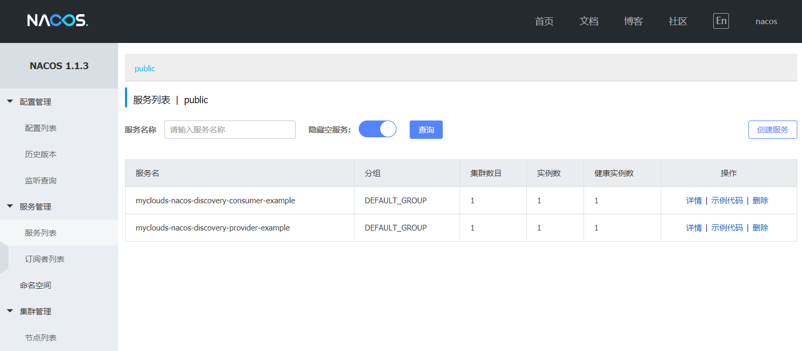
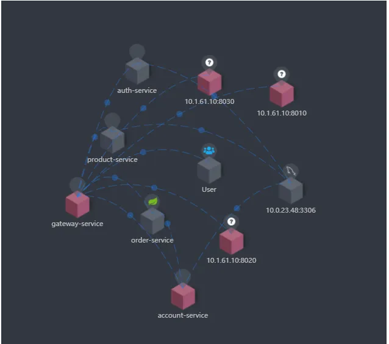
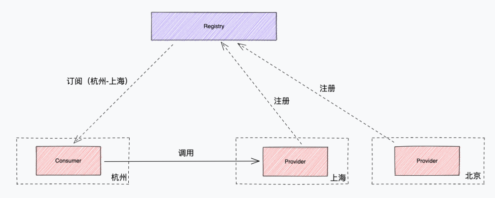

hello，大家好，我是小楼。

在上一篇文章[《如何组装一个注册中心》](https://mp.weixin.qq.com/s/qGZona_9HTi8yZzCCvd3RQ)中，我们看到了如何利用一些现有的技术方案来组装出一个生产可用的注册中心最小集。

有的同学看完表示学到了，也有同学直呼不过瘾，能不能手写一个注册中心？能不能继续展开说说？

由于精力有限，手写一个注册中心暂时还不行，展开说说倒是可以满足。

于是本期打算以注册中心的周边能力展开说说，这些能力属于锦上添花，没有它们注册中心可以正常运行，有了它们也不一定变得更强，但一定会更加花里胡哨。

那可能有读者会问，花里胡哨的有什么用呢？我觉得主要是了解一些新的、奇怪的知识，说不定哪天能用上呢，是吧？

# 控制台

如果想让注册中心变得花里胡哨，首先肯定是开发一个控制台，控制台的基本功能就是展示服务的消费者与提供者，展示的用处有查找服务，排查问题等等，下图是Nacos的控制台

除了基本的展示功能，我们还可以在控制台上搞些别的事情，比如下面这些。

#### 服务配置

配置本不是注册中心必备的功能，配置一般由配置中心管理，但配置中心似乎又和注册中心脱不了干系，Nacos就是一个集注册中心和配置中心于一体的组件。

注册中心也可以做一点和服务相关配置的事情，比如服务的超时时间、熔断降级等等元数据，不过要注意的是注册中心本身只能保存、修改，至于这些配置真正起作用的还是得和RPC框架配合。

可能你会问，为什么注册中心要去做配置中心的事儿呢？这不是职责不清？

可以这么理解，服务发现基本是个服务都要接入，但配置中心可不一定要接，如果只想做点简单的服务相关的动态配置，引入一个配置中心是有点重。

如果是公司生产级的服务配置，最好再附带上一个灰度的能力，如果一次下发配置到全部机器，可能会出现故障，所以需要一种灰度下发的机制，分批下发，控制风险。

#### 事件追踪

说到问题排查，光展示提供者、消费者可能还不够，有时候启动一个提供者，消费者就是没感知到，或者很久之后才感知到，这时有点摸不着头脑，如果我们拿出这个事件的时间线，哪个环节出问题便一目了然。

在Nacos的企业版中就支持了类似的**推送轨迹**功能，当然这么好的功能，肯定是收费项。

#### 拓扑关系

可能我们忽略了注册中心的绘制服务之间的拓扑关系的能力，开源注册中心基本没提到这个，一般来说拓扑关系是链路追踪的活。

注册中心其实也大致可以干这个活，不过注册中心是按照服务的订阅关系绘制出来，并不是按照真实的调用关系，但这几乎也近似调用关系了，有了这个，我们就可以去做一些服务治理相关的事了，比如循环依赖、依赖层级太深等问题都可以看出来。

# 流量控制

流量控制也不一定非要在注册中心上做，比如Dubbo就是在RPC框架上做了很多流量相关的事情，像集群的选择、路由、负载均衡等。

如果RPC框架没这么强大的能力，或者RPC框架是多语言的实现，能力尚未打平，那么在注册中心上实现也是一个不错的选择。

#### 路由偏好

路由偏好简单来说，如果提供者有多个集群，挑选一个**更适合**的集群来提供服务，这就叫**路由偏好**。

举个例子，例如消费者在杭州，提供者有两个集群，一个在上海，一个在北京，这两个机房提供的服务完全对等，这时消费者更适合调用本地的集群，这样时延更小。

当然我们还可以根据服务器的性能、甚至自定义的规则来做路由偏好。

#### 动态切流

有了上面路由偏好的铺垫，相必你也能想到一个场景，万一有一天上海的提供者不可用了，我们可以通过对注册中心的干预，手动把北京的提供者下发给消费者，实现一个客户端无侵入的**动态切流**。

#### 流量劫持

流量劫持和动态切流的原理一样，实现也基本差不多，只不过下发的数据不太一样，原先的提供者列表，被注册中心偷天换日，换成了本地的一个端口**127.0.0.1:8001**。

这样替换有什么作用呢？比如用agent来承接流量，像service mesh都有这种需求，注册中心就可以完成流量劫持。

其实劫持还有其他作用，如果服务的提供方压力太大，想降级，但消费者和提供者都没有降级能力，眼看着服务快挂了，千钧一发之际，你想到了注册中心，手动下发一个不存在的提供者地址，让消费者请求报错，以保护其他服务正常运行，这些奇奇怪怪的想法说不定都可以在注册中心上实现。

# 探活

探活算是注册中心的一个小功能，我们看看在这个小功能上还能玩出什么花样。

#### 探活扩展

最简单的探活是端口探活，即注册中心向提供者注册的端口发起TCP连接请求，如果能成功建立连接说明服务正常。但有时又不是这样，比如服务僵死，端口还能连接，但服务没法提供了，这时我们需要语义级的探活。

根据提供者提供的服务和配置发起一个请求，如果返回和预期相符合，则判定为服务存活。

我们通常将这个探活留出扩展点，一般可以扩展出HTTP、MySQL、Redis、Thrift等协议的语义探活，以HTTP为例，服务提供方配置探活的URI，注册中心把提供方的ip、port与URI进行拼接、发起请求，如果响应符合预期（如返回码为2xx），则这次探活成功，同理，也可扩展出其他协议的语义级探活。

#### 探活兜底

探活虽好，但有时候又很危险，如果注册中心与提供者的网络闪断，则可能将提供者全部摘除，这是个非常危险的操作，为了防止这种情况，探活兜底是很有必要的一种行为，比如同一个服务集群不能摘除超过1/3，当然这个比例是个经验值，也最好可以配置化。

# 生态建设

#### 优雅发布

优雅发布包括优雅退出和优雅上线，优雅是指在应用退出和上线过程中没有报错。

注册中心结合发布系统来做优雅发布是最好的搭配。发布系统在停止应用前，向注册中心发起禁用请求（停止接流），注销后再停止应用，服务上线后启动完成后，再将服务开启，接受流量。

#### 框架适配

一个注册中心如果想要更多的人来使用，则需要适配各种主流开发语言如Go/Java/Cpp等，适配一些主流框架如Dubbo/SpringCloud/gRPC等，这样用户用起来才更加方便，缺点是维护成本变高。

#### DNS 服务发现

对于无法接入服务发现SDK的用户，如果也想享受服务发现能力，怎么做呢？

业界有一种做法是自定义一个DNS拦截器，将DNS请求拦截，通过域名（对应到服务名）去注册中心找提供者。但这样做有一个缺点是DNS只能发现ip，端口没法自动发现。

一般这种拦截器可通过中心的DNS服务器或者本地的DNS agent代理来实现，也可以自定义编程语言的DNS解析插件来实现，像Go/Java都可以自定义DNS解析插件，但这种就属于入侵比较强了。

# 最后

本文信息点有点多，但深度不够，很多地方只是一笔带过，一方面本文的宗旨就是点到即可，这也正好符合 **后端启示录** 的特点，另一方面每个点都可以展开独立成一篇甚至多篇文章，如果读者朋友对其中某些点感兴趣，我们可以私下交流。