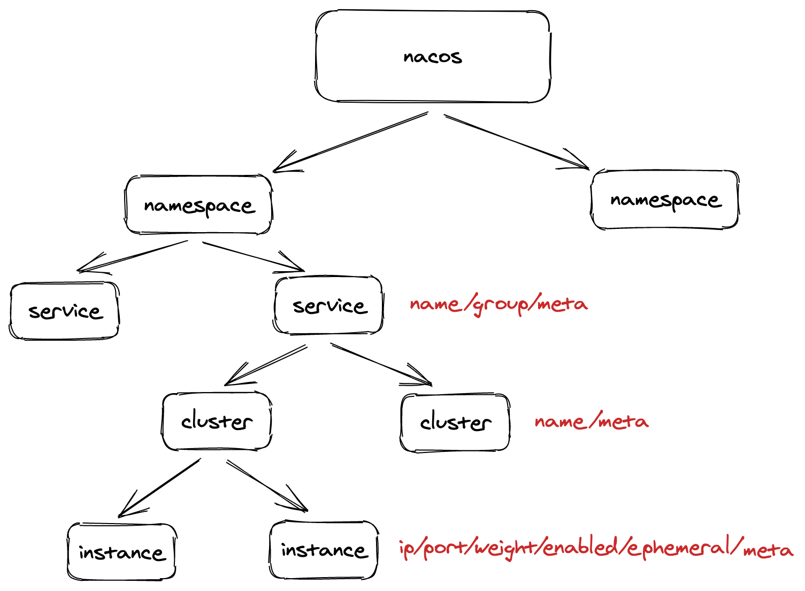
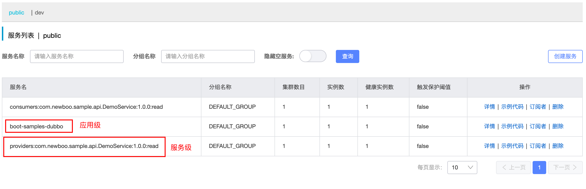
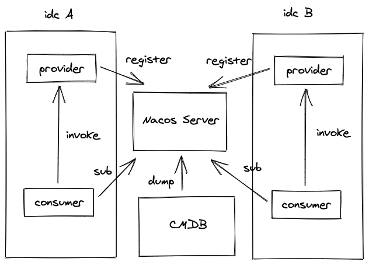
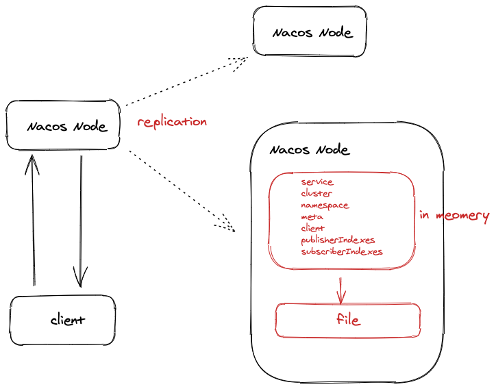
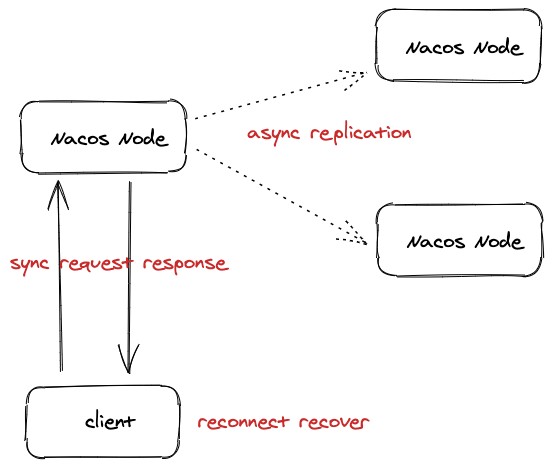
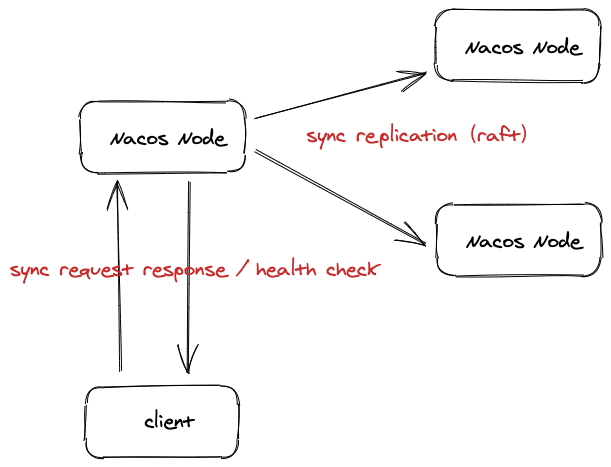
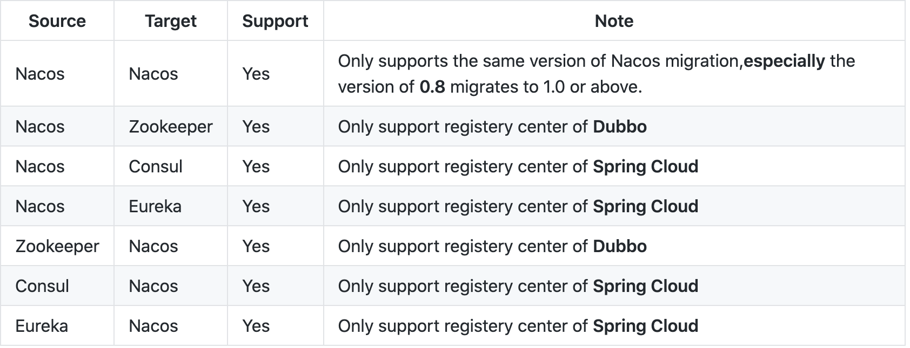
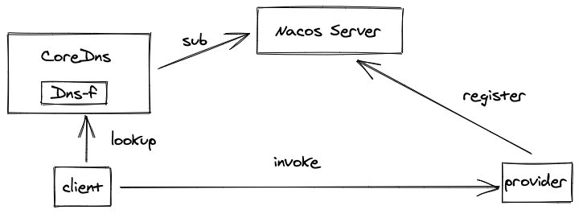
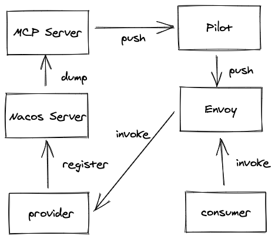

> 本文已收录 https://github.com/lkxiaolou/lkxiaolou 欢迎star。

# Nacos简介

**Nacos** : Naming and Configuration Service，**可打包部署配置中心和注册中心，也可独立部署其中之一，配置中心、控制台依赖mysql**，由阿里巴巴2018年8月开源，github **19.1k** star（截止2021.08.24）

本文只讲解服务发现部分。

# 服务注册发现模型

- namespace：环境隔离、租户隔离；不同namespace服务无法相互发现
- group：业务隔离；解决不同业务下serviceName相同的问题；可获取默认或指定group实例
- cluster：集群隔离；可定制化路由偏好；可获取全部或指定集群实例

## 临时实例

- 临时实例：靠client的心跳或连接保活，当不存活时，直接下线实例；适用于主动注册的服务，特别适合K8S下ip漂移的场景

- 永久实例：注册后不用保活，靠服务端健康检查来判断实例是否健康，不健康实例也不用下线；适用于ip不常变化的场景

在Nacos中他们的主要区别如下：

|   emphemral    | true      | false                          |
| :------------: | --------- | ------------------------------ |
|      名称      | 临时实例  | 永久实例                       |
|      CAP       | AP        | CP                             |
|   一致性协议   | distro    | raft                           |
|   是否持久化   | 否        | 是                             |
|  健康检查方式  | 心跳/连接 | 服务端检查（TCP、HTTP、MYSQL） |

## Dubbo适配

- 使用临时实例
- 应用级：serviceName为应用名即可
- 服务级（Dubbo）：以`provider/consumer:$[service_name]:${version}:${group}`为服务名

## 路由模式

### 客户端路由模式

客户端（SDK）根据service，指定部分或全部group、cluster获取相应的实例，客户端根据权重或其他策略进行路由

### 服务端路由模式

插件式selector实现自定义路由模式，可对接第三方CMDB

1. 与CMDB对接，根据service、ip等信息获取元数据（如机房位置）

2. 自定义实现选择器selector，根据手动配置规则表达式选取相应实例

# 架构设计

## 存储模型

全量数据位于内存中，每个节点数据保持一致，节点间采取同步协议进行复制

### 数据结构

一个客户端连接为一个client，打包客户端的信息与注册、订阅数据

- 注册
  - publisherIndexes => 哪些客户端注册了哪些服务
    - serviceName
      - clientid
      - clientid
    - serviceName
      - ...
- 订阅
  - subscriberIndexes => 哪些客户端订阅了哪些服务
    - serviceName
      - clientid
      - clientid
    - serviceName
      - ...

### 同步协议

#### distro
- 客户端心跳/连接保活，重连时有恢复（注册、订阅）机制
- 数据同步为异步

#### raft
- 半数以上节点同步成功才返回给客户端

## 通信协议

|      功能/版本      | 1.x distro |1.x raft| 2.x distro                     | 2.x raft |
| :------------: | ------------ |--| ---------------------- |-----|
| 注册/注销 | http         |http| grpc |http|
| 订阅 | http |http| grpc |grpc|
|     心跳/健康检查     | http    | TCP/http/mysql | TCP                      |TCP/http/mysql|
|   推送   | udp    | udp |grpc                       |grpc|
|   集群间数据同步   |http/distro| http/自研raft | grpc/distro          |jraft|

# 生态建设

- 客户端
  - Java
  - golang
  - Python
  - C#
  - Nodejs
  - C++
- 插件
  - Dubbo-registry-nacos
  - Rpc-java-registry-nacos
  - Nacos-spring-starter
  - Nacos-sync
  - Nacos-k8s-sync
  - Nacos-client-mse-extension
  - Nacos-coredns-plugin
  - Nacos-istio

## Nacos-sync

主要用于注册中心迁移以及多数据中心数据同步

## Nacos-coredns-plugin
consumer侧可使用域名方式发现服务，无需使用Nacos客户端

## Nacos-istio
支持Nacos数据同步至MCP Server

# 优缺点分析

- 优点：
  - AP模式，扩展性、多数据中心支持友好
  - 服务发现模型设计支持逻辑上namespace、group、cluster等的隔离
  - 健康检查模式支持较多
  - 支持临时实例与持久化实例，满足不同场景
  - 功能多，生态丰富，支持多语言SDK
  - 2.x版本grpc长连接性能强
  - 单一进程，部署简单，且附带开箱即用的控制台
  - 基本无依赖（除控制台依赖mysql，注册中心部分实际不依赖任何第三方组件）
- 缺点：
  - 1.x http心跳消耗大，2.x刚发布不久，可能存在一些bug
  - 没有分层设计，没办法针对性扩容，如连接数太多时，扩容能解决，但也会增加数据同步压力
  
---
> 搜索关注微信公众号"捉虫大师"，后端技术分享，架构设计、性能优化、源码阅读、问题排查、踩坑实践。

