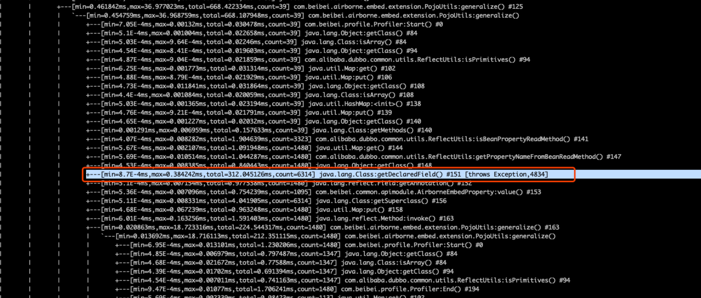

### 前言

最近翻看以前写的 PPT， 发现了在2019年做的一次技术分享，关于 Java 问题排查，由于没什么公司机密可言，整理下分享给大家~

### 线上问题处理流程

直接放PPT截图吧，现在看来依然不过时

### 问题排查

可从三个方面入手

- 知识：有些问题，思考一下就有答案，就像传说中多隆那样，回忆下就知道第83行代码有问题~
- 工具：当然不是每个人都能做到过目不忘，也有可能这代码完全不是你写的，这时就需要靠工具来定位问题
- 数据：程序运行时产生的数据，也能提供很多线索

#### 知识

知识有很多方面，这里简单列举一下：

- 语言（本文特指 Java）：如 JVM 知识、多线程知识等
- 框架：如 Dubbo、Spring 等
- 组件：如 Mysql、RocketMq 等
- 其他：如网络、操作系统等

举个例子，我们需要理解 Java 对象从申请到被回收整个过程，这个图非常清晰，建议烂熟于心：

然后也要了解常见的垃圾收集器：

> 吞吐量=单位时间内处理的请求数量=运行代码时间 / (运行代码时间 + 垃圾回收时间)

以 ParNew + CMS 为例 ，尝试回答如下几个问题：

- 为什么要分代收集？— 关键字：效率
- 对象什么时候进入老年代？— 关键字：年龄、大小
- Young GC 与 Full GC 什么时候发生？— 关键字：Eden 不足、Old 不足、Meta 不足、map/System.gc

如果我们了解上述的这些知识后，举个实际例子，当我们发现 Young GC 频繁触发，耗时高，该如何优化？

首先思考，Young GC 什么时候触发？答案是 Eden 区不足。

接着，Young GC 耗时主要是哪里耗时？答案是扫描 + 复制，扫描通常很快，复制比较慢。

那我们对症下药，增加新生代大小试试，结果真的解决问题了，为什么？我们也分析一下

新生代大小为 M 时，假设对象存活  750ms，young GC间隔 500ms，扫描时间为 T1，复制时间为 T2

- 新生代大小为 M 时：频率 2次/s，每次耗时 T1 + T2
- 新生代扩大为 2M 时：频率 1次/s，每次耗时 2T1

由于T2远远大于T1，所以2T1 < T1 + T2

这就是知识的力量~

#### 工具

Java 栈中的工具，也分为这几类：

- JDK 自带：如 jstat、jstack、jmap、jconsole、jvisualvm
- 第三方：MAT（eclipse插件）、GCHisto、GCeasy（在线GC日志分析工具，https://gceasy.io/）
- 开源：大名鼎鼎的Arthas、bistoury（去哪网开源）、Async-profiler

这些工具的原理，我们也需要稍微了解下，比如 Cpu profiler大概有两类：

- 基于采样：优点是性能开销低，缺点是采样有频率限制，存在SafePoint Bias问题
- 插桩：所有方法添加  AOP 逻辑，优点是精准采集，缺点是性能开销高

比如 uber 开源的 uber-common/jvm-profiler，它就是基于采样的 Cpu profiler，缺点就是存在 SafePoint Bias 问题，比如有一次排查一个 Cpu 占用问题，就采集到了这样的火焰图，可以看到几乎没啥用

> SafePoint（安全点） 可以简单理解为 JVM 可以停顿下来的特定位置的点，如果采样的位置是特定的点，那么采样就不具有代表性，因为可能在非 SafePoint 时可能消耗了更多的 Cpu，这种现象就被称为 SafePoint Bias 问题。

但我用另一个 jvm-profiling-tools/async-profiler 来采集，就能看到性能瓶颈：

虽然 Async-profiler 也是基于采样做，但它能避免 SafePoint Bias 问题，原因是它采用了 AsyncGetCallTrace 的黑科技。于是依据 Async-profiler 给出的火焰图进行优化，Qps 从 58k 涨到 81k，Cpu 反而从72%下降到了41%

#### 数据

数据包括：

- 监控数据，如APM、metric、JVM监控、分布式链路追踪等等数据
- 程序运行数据：如业务数据、AccessLog、GC log、系统日志等

这部分就按实际来分析，没有统一模板可言。

#### 经验

说了这么多，从经验角度总结了如下常见问题该从哪些方面入手：

- 执行异常：查看日志、debug、请求重放
- 应用僵死：jstack
- 耗时高：trace跟踪、Benchmark
- Cpu利用率高：Cpu profile分析
- GC频繁、耗时高：GC log分析
- OOM、内存占用高、泄漏：dump内存分析

### 案例分享

#### Cobar僵死，进程端口在，但不能处理请求

先踢掉故障机器，保留现场再排查问题，根据日志，定位为内存泄漏

> 小思考：能通过日志直接确定是哪里内存泄露吗？— 答案：不能

具体定位可dump内存下载到本地分析，文件如果太大，可以先压缩下

`  jmap -dump:format=b,file=/cobar.bin ${pid}`

使用 eclipse 的插件 MAT 分析，过程就不放了，结果是发现了一个我们对 Cobar 自定义修改导致的 Bug，如果对内存分析感兴趣，可以直接看我这几篇实战文章：

- [《一次漫长的dubbo网关内存泄露排查经历》](https://mp.weixin.qq.com/s/_hon_kgQfV-xwBR8Hfa9dA)
- [《skywalking内存泄露排查》](https://mp.weixin.qq.com/s/GIC9TjWZUkOX7In91Tyqdg)

#### 网关耗时高

使用 Arthas trace 跟踪调用

> trace com.beibei.airborne.embed.extension.PojoUtils generalize

#### 接入 Sentinel 导致应用僵死

接入限流降级利器 Sentinel 后，配置一条规则，触发后导致应用僵死，可使用 jstack 进行排查，一眼就看出问题所在

> jstack ${pid} > jstack.txt

### 最后

本文最早分享于2019年12月，刚好过去2年，由于是 PPT 整理而来，行文没有那么丝滑，但问题排查的思路、手段依然是这些，大家学废了吗？