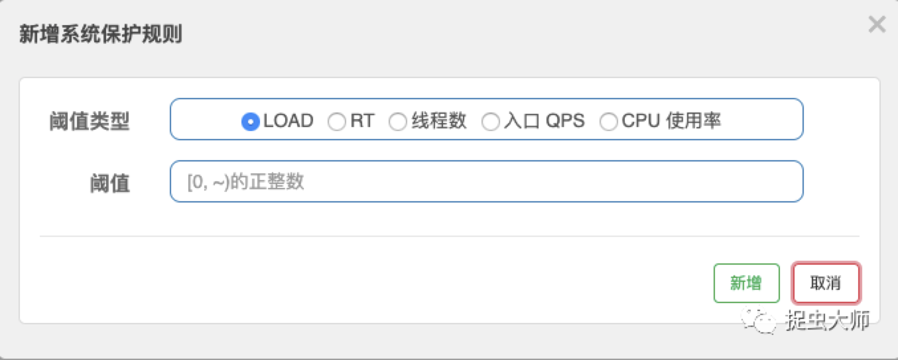
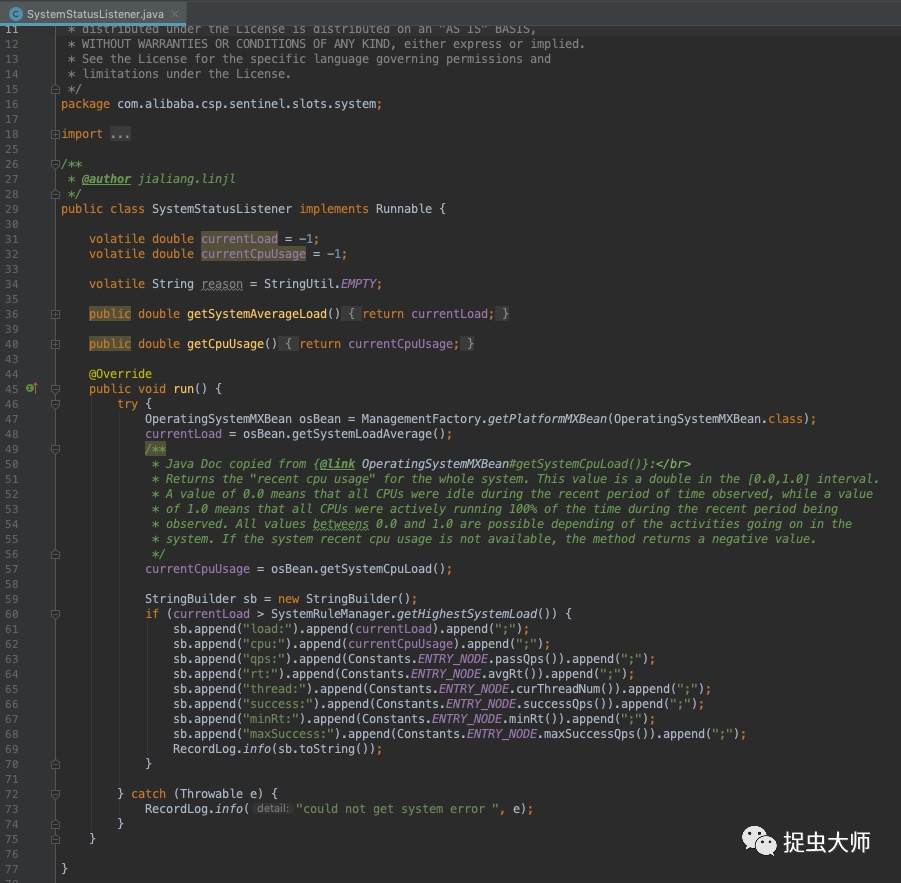
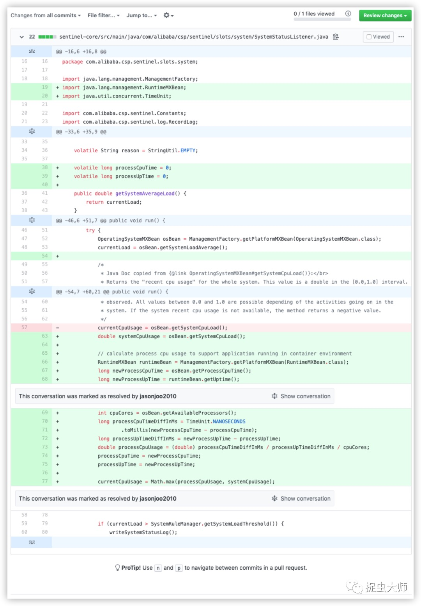

# Sentinel简介

微服务治理中限流、熔断、降级是一块非常重要的内容。目前市面上开源的组件也不是很多，简单场景可以使用Guava，复杂场景可以选用Hystrix、Sentinel。今天要说的就是Sentinel，Sentinel是一款阿里开源的产品，只需要做较少的定制开发即可大规模线上使用。从使用感受上来说，它有以下几个优点：
- 轻量级，对性能损耗几乎可以忽略不计，只有在单机上万QPS才稍有体现；
- 开箱即用的控制台，可以动态灵活地配置各种限流降级规则，持久化规则需要定制插件；
- 支持单机、集群限流，支持无侵入接入多种框架，如dubbo、grpc、springMVC，几种reactive的网关框架、甚至最新版本支持的Envoy限流等；
- 丰富的限流规则，可按qps、线程数、热点参数限流、系统自适应限流；熔断规则同样丰富，可按响应时间，异常数，异常比例等。

# docker中获取cpu利用率的BUG

经典的使用场景是服务消费方在调用提供方时，如果提供方是弱依赖，则可设置一个异常比例的降级规则；对于服务提供方提供的接口可设置一个qps或者线程数的限流规则，并再设置一个“保命”的系统自适应限流。系统自适应限流是系统根据自身的情况，如入口qps，总线程数，cpu load，cpu利用率等系统级指标来限制访问量，可谓是最后的保命神器。

Sentinel在docker中获取cpu利用率是有问题的。先看一下获取cpu利用率的代码：

这里获取cpu load和cpu利用率是通过MXBean的方式获取，从[Java文档](https://docs.oracle.com/javase/8/docs/jre/api/management/extension/com/sun/management/OperatingSystemMXBean.html
)上能看出getSystemLoadAverage和getSystemCpuLoad方法获取的分别是系统的平均load和“归一化”后的cpu利用率。

如果是在物理机或者虚拟机上运行，这些代码可以获取到我们想要的数据，但是在docker里面就不一定了，docker中获取到的是宿主机的cpu load与cpu利用率。于是去Sentinel下提了个[issue](https://github.com/alibaba/Sentinel/issues/1146)（这也是使用开源产品的好处）。没多久回复说用JDK10，但是生产环境中想升级个JDK也并不是那么简单。

过了很久之后终于有人通过代码解决了这个问题。

# 理解系统负荷

初次看到这段代码是蒙圈的，主要是对cpu利用率与cpu load的定义不熟悉，查阅了一些资料得知cpu利用率是指程序的cpu占用时间除以程序的运行时间，比如单核情况下，一个java程序运行了10秒，其中占用了cpu 1秒，那么cpu利用率为10%，注意这个百分比并不一定小于100%，因为有多核的并行能力存在，比如一个4核的机器运行了一个java程序10秒，占用了每个核5秒的cpu时间，那么总的cpu占用时间是20秒，cpu利用率就是200%。但是在OperatingSystemMXBean的文档中指出将其归一化了，也就是cpu利用率再除以cpu核数。cpu load在阮一峰的文章[《理解linux系统负荷》](https://www.ruanyifeng.com/blog/2011/07/linux_load_average_explained.html) 中能很好地解释清楚了，概括一下cpu load就是运行中的进程数加上等待运行的进程数。

为什么有了cpu利用率还需要cpu load这个指标呢？因为在系统满负荷的情况下，同样是100%的cpu利用率，谁的负荷更高？就需要cpu load来比较了，cpu load不仅表示了当前的cpu利用率，也预示了未来的利用率。

理解了cpu利用率与cpu load再结合Java文档就能明白这段代码的意思了，计算出每次JVM的运行时间差值与占用cpu的时间差值，利用cpu占用时间差值除以JVM运行时间差值，再除以cpu的核数，计算出归一化后的cpu利用率，每次都计算差值是Sentinel为了取到比较精确的“瞬时”cpu利用率，而不是一个历史平均值。

这段代码有三个缺陷，一是准确获取docker分配的cpu核数是从JDK8u191版本开始，之前版本调用OperatingSystemMXBean.getAvailableProcessors 和 Runtime.getRuntime().availableProcessors() 都会返回宿主机的核数，幸好目前使用的版本都大于此版本；二是这段代码只能统计单一进程的cpu占用率，如果容器中运行了两个java程序，那么每个进程只能统计自己占用的cpu而不知道整个系统处于何种状态，从生产环境来看这种情况出现的概率不大，docker容器中运行的一般是单一进程；三是最终算出的cpu利用率取了宿主机cpu利用率和当前进程算出的cpu利用率的较大值，在docker的cpu被限制或者被绑定时，即cpu资源被隔离时，这两个值可能会相差很大，这时也并不太需要关注宿主机的cpu利用率。

---

> 关于作者：专注后端的中间件开发，公众号"捉虫大师"作者，关注我，给你最纯粹的技术干货

