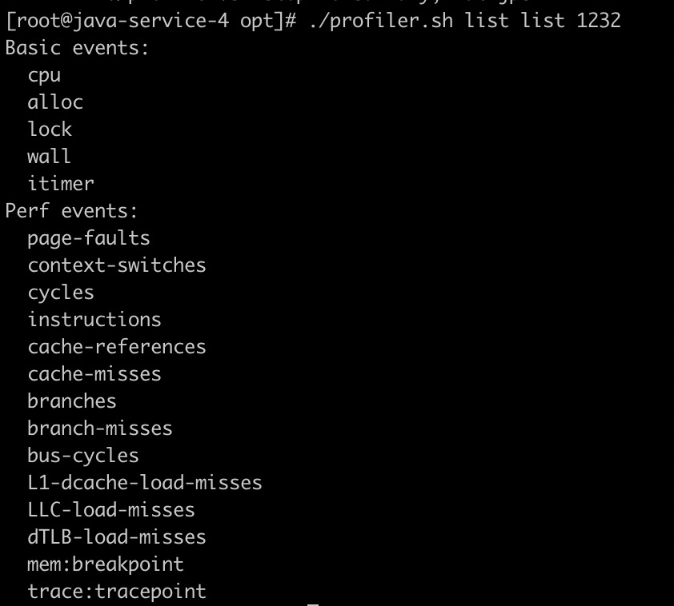

# 简介
async-profiler是一款采集分析java性能的工具，翻译一下github上的项目介绍：

>async-profiler是一款没有`Safepoint bias problem`的低开销java采集分析器，它利用`HotSpot`特殊的api来收集栈信息以及内存分配信息，可以在`OpenJDK`,`Oracle JDK`以及一些其他的基于`HotSpot`的java虚拟机。async-profiler可以追踪以下几种事件：
> - cpu周期
> - 硬件和软件性能计数器，例如高速缓存未命中，分支未命中，页面错误，上下文切换等
> - Java堆中内存的分配
> - 锁尝试，包括Java对象监视器和ReentrantLock

# 使用方法
首先下载async-profiler，github主页（https://github.com/jvm-profiling-tools/async-profiler）上有已经编译好的文件，找到对应的平台下载即可


## 基本用法
下载好的文件解压后，有一个`profiler.sh`脚本，运行脚本即可对java进程进行cpu分析，例如java进程id为1232

```
./profiler.sh start 1232
./profiler.sh stop 1232
```
或者可以用`-d`指定剖析的时间（秒）
```
./profiler.sh -d 30 1232 
```
执行完成后会输出采集的信息：


通常我们会用更加直观的`火焰图`来绘制输出的信息，使用参数`-f {$file_name}.svg`

```
./profiler.sh -d 30 -f ./nacos.svg 1232
```

命令执行完成后会生成一个svg格式的文件，用浏览器打开


火焰图怎么看？可以参考阮一峰的文章

> 《如何读懂火焰图》 http://www.ruanyifeng.com/blog/2017/09/flame-graph.html

简单来说：x轴是抽样数，x轴越长说明被这个方法被抽样的次数越多，消耗cpu时间也越长 y轴是栈的深度，通常越往上越细，如果发现往上有一个`平顶`，且平顶很宽，则说明它可能有问题，消耗cpu时间较多。

## 其他参数介绍

- -e event

event 可选参数用这个命令来查看

```
./profiler.sh list list 1232
```

输出样例：



event 默认为cpu，也可以用alloc来查看内存分配

```
./profiler.sh -e alloc -d 30 -f ./nacos-alloc.svg 1232
```


lock查看锁情况：


其他的模式这里就不一一尝试，用的最多的还是cpu模式。

- -i N 设置采样频率，默认是10ms，可使用ms，us，s作为单位，无单位默认为纳秒，如

```
./profiler.sh -i 500us -d 30
```

- -j N 设置栈采样深度

- -o fmt 设置输出格式：可选的有 summary、traces、flat、jfr、collapsed、svg、tree，最常用的是`svg`

更多命令可参考async-profiler github主页

# 一次网关性能压测实例

笔者有一次在压测全链路异步网关时，RPS在2000左右，始终上不去，cpu消耗比较高，于是使用async-profiler进行cpu剖析，生成的火焰图如下


可以看到这里有个宽又深的栈，它消耗了很多cpu，限于图像大小，再往上拉，看下这块到底是什么


从类名就能看出是`log4j`，猜测是代码某处打日志过于频繁导致，找到打日志的地方后先去掉日志，压测了一下，果然RPS提升到了5000，一处小小的日志竟有如此大的影响。

# 原理介绍
看到这里相信你应该会用async-profiler来进行cpu剖析了，如果感兴趣可以了解下async-profiler实现的原理，这块有一篇文章介绍的很详细，可以参考

> 《JVM CPU Profiler技术原理及源码深度解析》 https://mp.weixin.qq.com/s/RKqmy8dw7B7WtQc6Xy2CLA

简单总结一下：

- cpu profiler实现一般有两种方案：（1）Sampling，采样（2）Instrumentation，埋点；采样对性能损耗较小但没那么准确，埋点（类似AOP）精准但性能影响大
- Sampling采样只能在`Safe Point`处采样，会导致统计结果偏差，也就是开头说的`Safepoint bias problem`，例如某些方法执行时间短，但执行频率高，正真占用了cpu，这部分如果Sampling的采样频率不能足够小，可能就采样不到，但采样频率过高又会影响性能，这就是一般的基于采样的cpu profiler的缺点
- async-profiler是基于采样实现的，但它又没有Safepoint bias problem，它是通过一种叫做`AsyncGetCallTrace`的方式来采样，这种采样不需要在安全点处采样，但这个函数不是那么容易就调用到的，需要使用一些技巧（黑科技）的方式来获取

正是第三点原因我才写了这篇文章来推荐这款cpu分析利器，比如我用了一款其他的分析器（uber-common/jvm-profiler）来分析上面网关的cpu，得出了如下的火焰图


如果是这样，完全没法找到问题。而且阿里开源的Arthas中的cpu分析也是使用的async-profiler。所以你不试试吗？

---

欢迎关注我的公众号


- 原文链接: https://mp.weixin.qq.com/s/8mEBjVsptz9O_vU-TxOTxg
- 发布时间: 2020.05.31