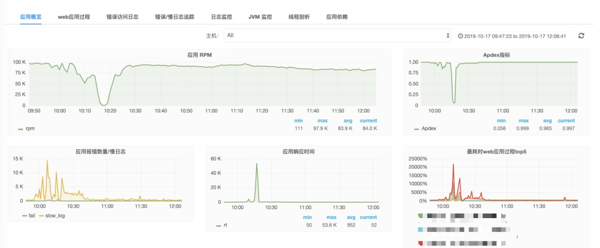
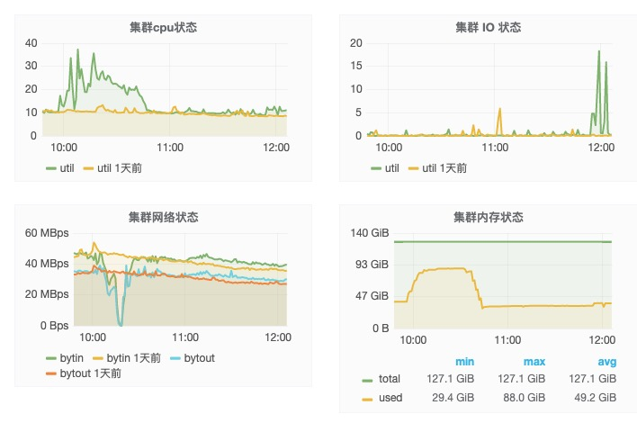
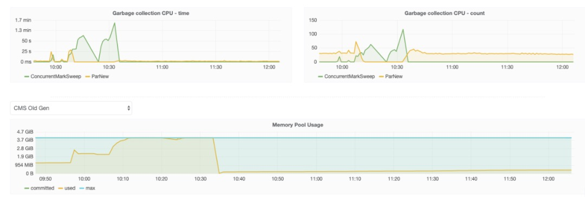
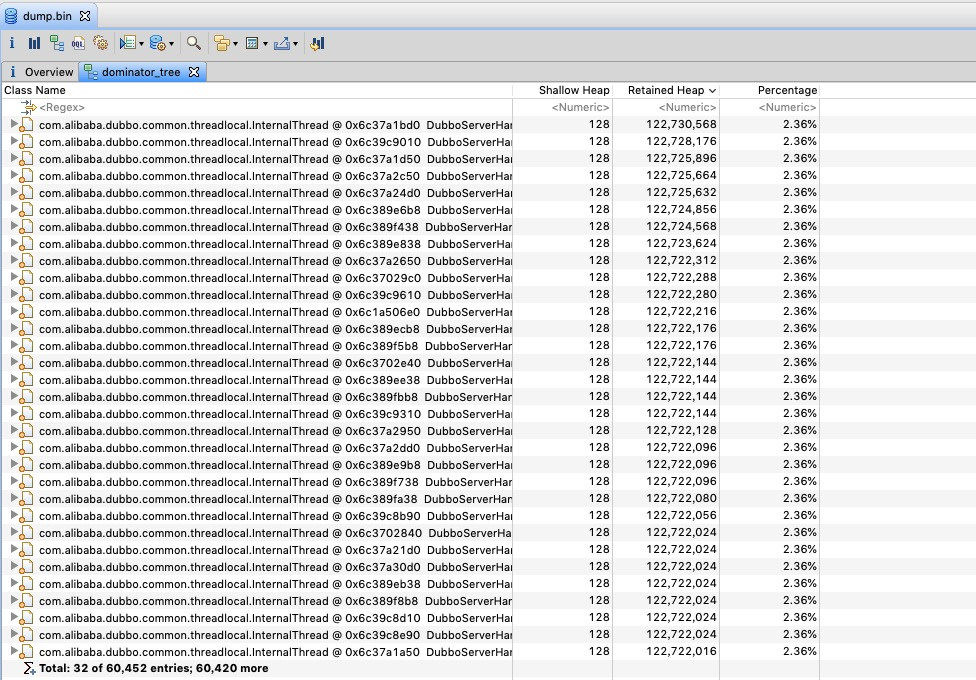
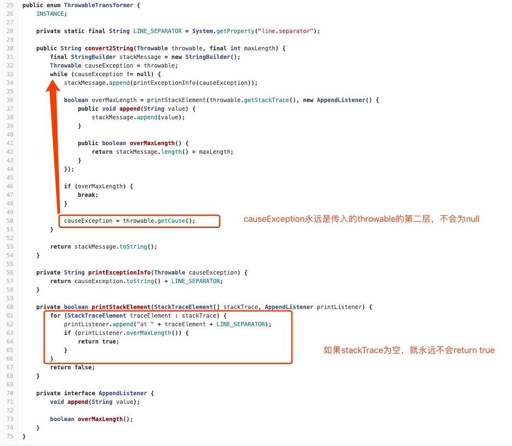

# 背景介绍
  
最近写的关于dubbo内存泄露稍微复杂了一点，很多人表示看不明白，想到之前遇到的比较简单的内存泄露问题，更容易入门，于是拿出来分享一下。

为了做微服务的熔断降级限流，引入了sentinel组件，对于sentinel引入到公司内部使用只是做了一些简单的定制化，如持久化配置规则，监控数据收集展示，后台登录权限整合等等。

在功能验证通过的情况下，也做了压测，性能符合要求，于是就推上了生产做线上灰度。刚开始没问题，直到有一天线上配置了一条降级规则，并且触发了，监控告警就炸了锅。



开始是服务出现大量慢请求，后来服务完全僵死。查看监控，慢请求很多，cpu飙升，full GC频繁，内存占满，日志中也出现了java.lang.OutOfMemoryError，可以断定是内存问题了。





# 问题排查

由于当时对系统的操作只有开启了降级规则，于是立马删除规则并重启，系统恢复，但并没有保存一份内存的dump文件。想着如果问题能复现就好查了，在当初的预发机器上试了一下，并没有复现。思前想去，难道跟机器有关？于是线上摘下一台机器来，配置规则，稍微压测一下，果然出现了问题。

能复现就好办，赶紧dump内存，很多人不知道怎么dump java的内存文件，可以使用jdk自带的jmap命令来dump，使用jmap dump内存时会触发一次full GC，所以线上使用要谨慎，full GC保证了dump出来内存里的对象都是存活的（无法释放）。

```
jmap -dump:format=b,file=dump.bin ${pid}
```

dump出来后的内存如果太大，可以使用tar命令压缩一下再下载到本地分析。分析工具使用eclipse的插件mat，它的官方地址如下

> https://www.eclipse.org/mat/



从dump文件可以看到dubbo的线程每个都占用了2%的内存，该应用设置了200个线程，理论上已经把内存撑爆了。展开一个线程看看


该dubbo线程中存在一个很大的StringBuilder对象，将其值复制出来，发现这个字符串竟然有200MB，其中只有第一行不一样，后面都是重复的字符串。

```
com.alibaba.csp.sentinel.slots.block.SentinelRpcException: com.alibaba.csp.sentinel.slots.block.flow.FlowException
com.alibaba.csp.sentinel.slots.block.flow.FlowException
com.alibaba.csp.sentinel.slots.block.flow.FlowException
com.alibaba.csp.sentinel.slots.block.flow.FlowException
com.alibaba.csp.sentinel.slots.block.flow.FlowException
com.alibaba.csp.sentinel.slots.block.flow.FlowException
com.alibaba.csp.sentinel.slots.block.flow.FlowException
com.alibaba.csp.sentinel.slots.block.flow.FlowException
com.alibaba.csp.sentinel.slots.block.flow.FlowException
com.alibaba.csp.sentinel.slots.block.flow.FlowException
com.alibaba.csp.sentinel.slots.block.flow.FlowException
com.alibaba.csp.sentinel.slots.block.flow.FlowException
com.alibaba.csp.sentinel.slots.block.flow.FlowException
...
```

查看dubbo的源码也没有发现有这个属性，只知道跟sentinel有关。

线索难以查出真相，很多时候就是这样，内存泄露问题从内存本身只能分析出一点线索，不足以找出真相，除非它是个非常简单的问题。

以经验来看，内存泄露问题都会伴随着cpu升高，因为内存不够使用触发full GC，但full GC又无法释放内存，恶性循环，所以一开始并没有去看cpu的问题。抱着试一试的态度再次复现了现场，并用jstack命令打印出线程栈，想看看除了GC线程外还有没有线程占用了cpu

```
jstack ${pid} > jstack.txt
```

果然发现了问题

```
"DubboServerHandler-127.0.0.1:20880-thread-200" #532 daemon prio=5 os_prio=0 tid=0x00007f264c1f8000 nid=0x581a waiting for monitor entry [0x00007f25bae09000]
   java.lang.Thread.State: BLOCKED (on object monitor)
    at java.util.Arrays.copyOf(Arrays.java:3332)
    at java.lang.AbstractStringBuilder.ensureCapacityInternal(AbstractStringBuilder.java:124)
    at java.lang.AbstractStringBuilder.append(AbstractStringBuilder.java:448)
    at java.lang.StringBuilder.append(StringBuilder.java:136)
    at org.apache.skywalking.apm.agent.core.context.util.ThrowableTransformer.printExceptionInfo(ThrowableTransformer.java:57)
    at org.apache.skywalking.apm.agent.core.context.util.ThrowableTransformer.convert2String(ThrowableTransformer.java:34)
    at org.apache.skywalking.apm.agent.core.context.trace.AbstractTracingSpan.log(AbstractTracingSpan.java:152)
    at org.apache.skywalking.apm.agent.core.context.trace.ExitSpan.log(ExitSpan.java:112)
    at org.apache.skywalking.apm.agent.core.context.trace.ExitSpan.log(ExitSpan.java:38)
    at org.apache.skywalking.apm.plugin.dubbo.DubboInterceptor.dealException(DubboInterceptor.java:124)
    at org.apache.skywalking.apm.plugin.dubbo.DubboInterceptor.handleMethodException(DubboInterceptor.java:115)
    at org.apache.skywalking.apm.agent.core.plugin.interceptor.enhance.InstMethodsInter.intercept(InstMethodsInter.java:97)
    at ...
```

从堆栈发现是skywalking一直在执行Arrays.copy，skywalking简单来说是一款采集分布式调用链的组件，它的原理是针对java代码中的“调用“处进行字节码增强，达到对业务零侵入获取调用信息，github地址如下

> https://github.com/apache/skywalking

这就解释了为什么压测时发现不了这个问题，因为压测机没有部署skywalking。

找到这个堆栈基本就算问题解决了，接着去看代码就行。

在skywalking上报exception时会把栈都放到StringBuilder中，但是这里出现了bug，在stackTrace为空的时候，就会出现循环append，直到内存耗尽



同时，也在github上找到了对这个bug的修复，这里是使用的skywalking版本太老导致

> https://github.com/apache/skywalking/pull/2931

这个bug，对于stackTrace不为空的trace时，只能记录两层exception，对于stackTrace为空的trace直接OOM，也就是说sentinel因为限流降级抛出的异常stackTrace为空。这里给出sentinel的BlockException部分代码，它重写了fillInStackTrace方法，直接返回this。

```java
public abstract class BlockException extends Exception {
  @Override
  public Throwable fillInStackTrace() {
      return this;
  }
  ...
}
```

这个方法默认实现是借助native方法，这里重写后直接返回this，则是不记录栈信息

```java
/**
 * Fills in the execution stack trace. This method records within this
 * {@code Throwable} object information about the current state of
 * the stack frames for the current thread.
 *
 * <p>If the stack trace of this {@code Throwable} {@linkplain
 * Throwable#Throwable(String, Throwable, boolean, boolean) is not
 * writable}, calling this method has no effect.
 *
 * @return  a reference to this {@code Throwable} instance.
 * @see     java.lang.Throwable#printStackTrace()
 */
public synchronized Throwable fillInStackTrace() {
    if (stackTrace != null ||
        backtrace != null /* Out of protocol state */ ) {
        fillInStackTrace(0);
        stackTrace = UNASSIGNED_STACK;
    }
    return this;
}

private native Throwable fillInStackTrace(int dummy);
```

我们也知道如果异常栈太深会影响性能，对于sentinel这种需要非常高性能的组件直接去掉异常栈信息不失为一种优化性能的“黑科技”。这也给我们一个提醒，压测系统性能时不光要考虑正常情况，也需要考虑异常情况。如果压测一个系统能抗住5000qps的正常请求，抛出异常只能承受2000qps，那么正常压测出的5000在实际生产中可能是达不到的。

# 总结
  
- 内存泄露问题伴随着cpu，错误率，GC频繁等问题

- 内存泄露最重要的是拿到现场内存dump文件，并用工具结合源码分析

- 如果第二条解决不了问题，则需要寻找新的突破口，比如jstack等

---

> 关于作者：专注后端的中间件开发，公众号"捉虫大师"作者，关注我，给你最纯粹的技术干货

