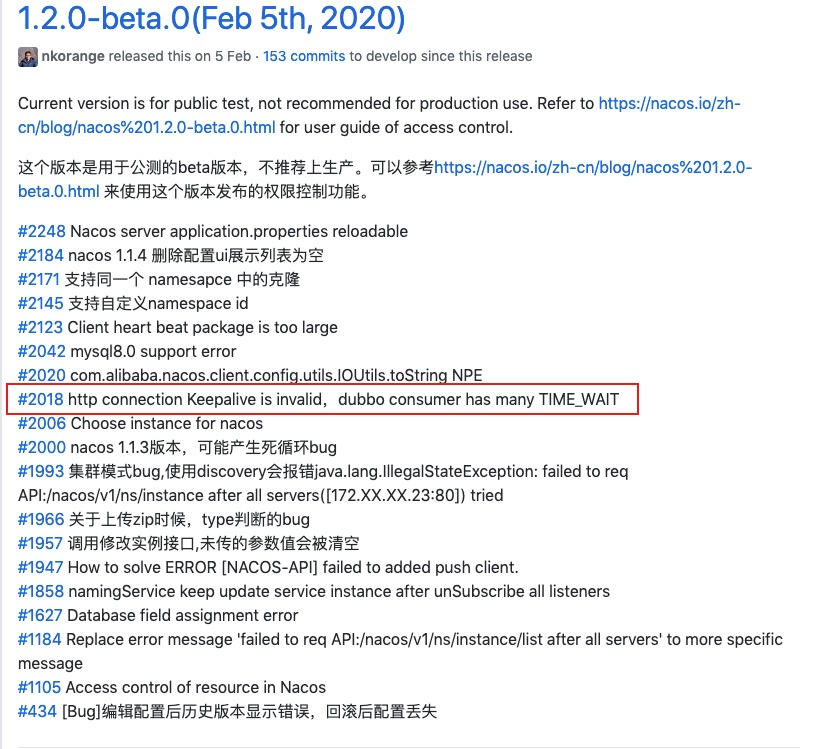

# 问题起因
前段时间调研nacos，用来代替zookeeper当作dubbo的注册中心，使用的是nacos的1.1.4版本。还用了nacosSync，一款nacos提供的迁移工具，可将常见的注册中心上的服务同步到nacos上。这玩意很不好用，至少不是生产级别的工具。但这与本文无关，后面会专门写一篇文章来介绍这个同步工具的优缺点，以及生产级别还需要做哪些改造。开始测试时，总有服务莫名奇妙的下线了，一直找不到原因。后来在调研的过程中，nacos发布了1.2.0-beta.0版本，于是去github上看了1.2.0-beat.0的release note。把修复的bug一个一个去review，重要的都merge到调研版本上，其中有一个bugfix引起了我的注意。

nacos的Java客户端使用rest的http接口来请求。这个bugfix中说道

> dubbo 在使用nacos注册中心的时候，dubbo的消费端出现大量的TIME_WAIT状态的连接，占用大量的端口，每次请求/心跳都是新建连接，没有共享连接。从javadoc看，问题可能出在HttpURLConnection的使用上，每次请求都调用了disconnect，关闭了连接。

去nacosSync服务器（本质上是一个nacos客户端）上查看一下连接状态（现场没有保留，这是后来模拟的）

然后看了错误日志

`java.net.ConnectException: Can't assign requested address (connect failed)`

差不多确定这个bug导致了很严重的问题，很可能是服务经常掉线的罪魁祸首。

# 问题处理&分析
将这个issue的代码合并到调研版本，重新打包重启nacosSync，果然TIME_WAIT数量下去了，经过几天测试，nacos服务也不会再无故下线了。问题解决很简单，但是为什么会产生这种情况？看下修复代码

Java Doc上这样说

> Each HttpURLConnection instance is used to make a single request but the underlying network connection to the HTTP server may be transparently shared by other instances. Calling the close() methods on the InputStream or OutputStream of an HttpURLConnection after a request may free network resources associated with this instance but has no effect on any shared persistent connection. Calling the disconnect() method may close the underlying socket if a persistent connection is otherwise idle at that time.

调用 disconnect() 会关闭连接，关闭连接会导致 TIME_WAIT 状态的连接增多。看来需要复习一下tcp的基础知识，接下来介绍 tcp 建立连接的三次握手与断开连接的四次挥手，以下内容主要来自对谢希仁著的《计算机网络》（第7版）与网络上文章的理解。

## tcp三次握手

如图，tcp建立连接的三次握手过程如下：

- （1）开始时A处于关闭，B处于LISTEN状态，A发起建立连接的请求，发送SYN=1的报文段，初始序列号seq=x，A进入SYN-SENT状态
- （2）B收到请求报文后，同意建立连接，发送SYN=1，ACK=1的报文段，确认序列号为ack=x+1，同时B的初始序列号为seq=y，B进入SYN-RCVD状态
- （3）当A收到B的确认后，也需要向B给出确认，ACK=1，seq=x+1，ack=y+1，此后A、B进入ESTABLISHED状态

然而tcp协议更需要考虑的是异常情况

- （异常A）如果（1）中A发送报文时发生丢包导致B未收到，则A会重试，重试超时后，会进入CLOSED状态；
- （异常B）如果（2）收到A的请求，但未回复或者或者回复报文丢失，对A来说就是（异常A），如果B回复的报文丢失，即A收不到确认报文，也不会发生（3），此时B也会重试，超时后关闭这个连接；
- （异常C）A最后一个确认包丢失了，此时A已经进入ESTABLISHED状态，可以发送数据，B还是SYN-RCVD状态，此时如果B先收到A的数据包，则也会进入ESTABLISHED状态；如果A不发送最后一个确认包，也不发送数据，此时B处于“半连接”状态，会在重试几次（2）之后关闭连接，这就是“SYN FLOOD 攻击”。

## tcp四次挥手

- （1）开始A、B都处于ESTABLISHED状态，A主动关闭，发送FIN=1报文，seq=u，A进入FIN-WAIT-1状态；
- （2）B收到关闭信号后，回复ACK=1，seq=v，ack=u+1，B进入CLOSE-WAIT状态，此时B还可以向A发送数据，A收到B的回复后进入FIN-WAIT-2状态；
- （3）等B数据发送完毕后，向A发送可以关闭信号，FIN=1，ACK=1，seq=w，ack=u+1，B进入LAST-ACK状态；
- （4）A收到B的关闭信号后回复确认，ACK=1，seq=u+1，ack=w+1，A进入TIME-WAIT状态，等待2MSL（即120秒）后进入CLOSED状态，B收到A的确认后进入CLOSED状态。

异常情况：

- （异常A）A发起关闭信号进入FIN-WAIT-1，若B未回复，则会一直重试直到超时，超时后A直接关闭连接；
- （异常B）B回复A后进入CLOSE-WAIT状态，但没有发送下一个FIN报文，则B一直处于CLOSE-WAIT状态；
- （异常C）A收到B的ACK后进入FIN-WAIT-2状态，等待B的关闭，此时仍然可接收B的数据；理论上FIN-WAIT-2在未收到B的关闭请求前都是保持这个状态，但实际的实现却是有一个超时时间，linux默认是180秒，超时后直接关闭这个连接；
- （异常D）B发送关闭连接报文FIN后进入LAST-ACK状态，但未收到回复，B会重复发送关闭请求，直到超时，超时后关闭该连接。

由tcp的三次握手与四次挥手能得出如下结论：

- tcp之所以需要四次挥手是因为tcp连接是全双工，前两次挥手保证了A到B的关闭，后两次保证了B到A的关闭;
- 在客户端设置 TIME_WAIT 是为了保证最后一个ACK能大概率送达B，如果不等待2MSL直接关闭连接，同时ACK也丢失，那么B再重发的关闭请求就无法处理，B大概率会停留在LAST-ACK状态;
- 在没有攻击的情况下，容易出问题的是CLOSE-WAIT与TIME-WAIT状态；CLOSE-WAIT是服务端没有关闭连接，通常是代码中忘了关闭连接；TIME-WAIT出现则通常在客户端，客户端在短时间内发起了太多的连接，可以复用连接来解决该问题。
- 如果出现其他中间状态较多的情况，可按上面的图进行分析，考虑是否存在攻击。

# 总结

- 在处理请求的客户端时需要注意使用短链接会可能会造成TIME_WAIT过多的情况；
- 在写代码的时候要注意可能会导致的异常情况，不使用的资源（包括但不限于连接）需要及时释放；
- 对于开源产品的使用需要多看github上的issue，尽量提前预知可能的问题，在下一个版本发布时，需要关注修复的bug以及推出的新功能。

---

> 关于作者：专注后端的中间件开发，公众号"捉虫大师"作者，关注我，给你最纯粹的技术干货

