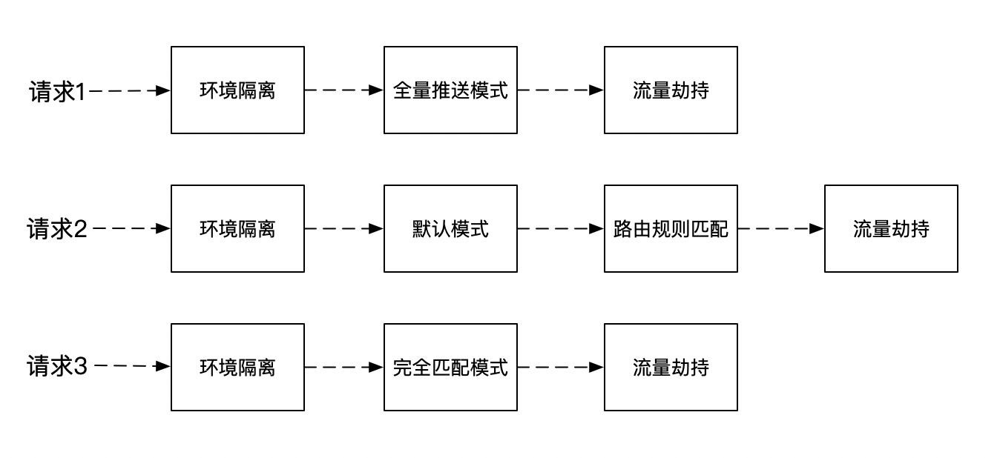
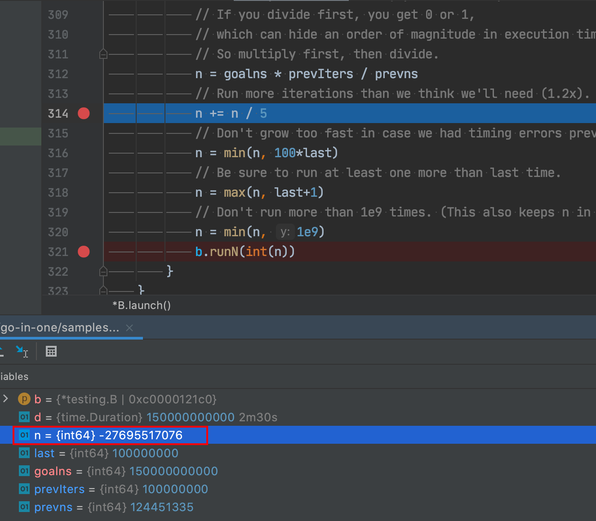

### 从一次重构说起

这事儿还得从一次重构优化说起。

最近在重构一个路由功能，由于路由比较复杂，需求变化也多，于是想通过`责任链模式`来重构，刚好这段时间也在 `Sentinel-Go` 中看到相关源码。

用责任链模式，最大的好处是可以针对每次请求灵活地插拔路由能力，如：



这样实现会在每次请求到来时去` new` 出整个责任链，可以预见对象会频繁的创建、销毁。

对 Java 来说，对象池并不推荐，除非对象的创建特别费力，像一个`连接对象`，否则线程之间的锁竞争绝对比直接分配内存的消耗要多的多~

但 Go 不一样，它内置的 `sync.Pool` 配合调度模型（GMP）能够刚好规避这种锁竞争。

大家知道 Go 的对象池很牛逼就行了，具体原理不是本文重点，也不是一两句话能解释的清楚，有机会再写一篇文章详细说道~

但理论归理论，是骡子是马，得拉出来遛遛才知道是不是真的牛逼~


### Benchmark 超时！
测试这种性能，Benchmark 肯定是首选，于是我写了个两个例子来对比，直接 New 对象和使用 sync.Pool 池化对象。

```go
func BenchmarkPooledObject(b *testing.B) {
	b.RunParallel(func(pb *testing.PB) {
		for pb.Next() {
			object := pool.Get().(*MyObject)
			Consume(object)
			// 用完了放回对象池
			object.Reset()
			pool.Put(object)
		}
	})
}

func BenchmarkNewObject(b *testing.B) {
	b.RunParallel(func(pb *testing.PB) {
		for pb.Next() {
			object := &MyObject{
				Name: "hello",
				Age:  2,
			}
			Consume(object)
		}
	})
}
```

当时是这些测试参数

```
go test -bench=. -cpu=4 -count=2 -benchtime=10s
```

跑出了如下结果，似乎还是直接 New 对象更快，这和理论不符合啊！

```
BenchmarkPooledObject-4         1000000000               6.25 ns/op
BenchmarkNewObject-4            1000000000               0.374 ns/op
```

于是就想，是不是我测试的方法哪里不太对？

池化技术能减少对象的创建、销毁的消耗，有很大一部分得益于减少 GC 次数，是不是我这只跑了10s，还没开始 GC ？

于是我查了下，什么时候 Go 会触发 GC，得到了如下的答案：

1. 主动调用 `runtime.GC` 来触发
2. 被动触发，分为两种：
   - 超过2分钟没有触发，则强制触发 GC
   - 内存增长达到一定比例，触发 GC，比如初始化堆大小为4MB，当增长 25%时，即5MB 时触发一次GC

显然主动触发不合适，被动触发没法确认增长比例，那只能依靠2分钟强制触发 GC 来达到目的了，于是我把基础测试的时间加长，改成了  `-benchtime=150s`。

执行后，就去泡了杯茶，上了个厕所...过了很久，终于执行完了，结果却是这样的结局：

```
*** Test killed with quit: ran too long (11m0s).
```

执行失败了，而且还执行了11分钟~

我搜索了下这个报错，网上说的是，Go 的单元测试和 Benchmark 都有超时时间，默认是10分钟，可以通过 `-timeout` 来修改。

但这不是重点，重点是为啥我设置了150s，却执行了11分钟？


### 源码之下没有秘密
直觉告诉我这事不简单，要么是我错了，要么是 Go 错了~ 幸好 Go 是开源的，源码之下没有秘密。

通过 Debug 和代码查阅后，先是找到了这段代码

```go
func (b *B) runN(n int) {
	benchmarkLock.Lock()
	defer benchmarkLock.Unlock()
	defer b.runCleanup(normalPanic)
	// 注意看这里，帮我们GC了
	runtime.GC()
	b.raceErrors = -race.Errors()
	b.N = n
	b.parallelism = 1
	// 重置计时器
	b.ResetTimer()
	// 开始计时
	b.StartTimer()
	// 执行 benchmark 方法 
	b.benchFunc(b)
	// 停止计时
	b.StopTimer()
	b.previousN = n
	b.previousDuration = b.duration
	b.raceErrors += race.Errors()
	if b.raceErrors > 0 {
		b.Errorf("race detected during execution of benchmark")
	}
}
```

这段代码是在执行一次我们定义的 Benchmark 方法，n 就是传入到我们定义方法参数的 `*testing.B` 结构中的一个属性。
而且它计算的时间也非常合理，只计算了执行我们定义方法的时间，也就是 `-benchtime` 的时间只是函数执行的时间，Benchmark 框架的耗时不计算在内。

更合理的是，框架在执行方法前，还帮我们触发了一次 GC，也就是说，只有我们的函数在执行的时候产生的内存垃圾才算到我们的 Benchmark 时间中，非常严谨。

但这跟我们的执行失败毫无关系~

但从一个侧面来说，Benchmark 执行的总时间一定是大于 `-benchtime` 设置的时间的。

真的是这样吗？我做了两组实验，就打破了这个规律：

```shell
go test -bench=. -cpu=4 -count=1 -benchtime=5s
 
BenchmarkPooledObject-4         793896368                7.65 ns/op
BenchmarkNewObject-4            1000000000               0.378 ns/op
PASS
ok      all-in-one/go-in-one/samples/object_pool        7.890s
```

```shell
go test -bench=. -cpu=4 -count=1 -benchtime=10s

BenchmarkPooledObject-4         1000000000               7.16 ns/op
BenchmarkNewObject-4            1000000000               0.376 ns/op
PASS
ok      all-in-one/go-in-one/samples/object_pool        8.508s
```

第二组设置了执行 10s，但总的测试时间只有8.508s，很奇怪，更奇怪的是测试结果的第二列执行次数，他们居然都是 1000000000，这么巧吗？

带着疑问，找到了 Benchmark 的这段核心代码：

```go
func (b *B) launch() {
   ...
	// 标注①
	if b.benchTime.n > 0 {
		// We already ran a single iteration in run1.
		// If -benchtime=1x was requested, use that result.
		if b.benchTime.n > 1 {
			b.runN(b.benchTime.n)
		}
	} else {
		d := b.benchTime.d
			// 标注②
		for n := int64(1); !b.failed && b.duration < d && n < 1e9; {
			last := n
			goalns := d.Nanoseconds()
			prevIters := int64(b.N)
			prevns := b.duration.Nanoseconds()
			if prevns <= 0 {
				prevns = 1
			}
				// 标注③
			n = goalns * prevIters / prevns
			// Run more iterations than we think we'll need (1.2x).
			// 标注④
			n += n / 5
			// Don't grow too fast in case we had timing errors previously.
			// 标注⑤
			n = min(n, 100*last)
			// Be sure to run at least one more than last time.
			// 标注⑥
			n = max(n, last+1)
			// Don't run more than 1e9 times. (This also keeps n in int range on 32 bit platforms.)
			// 标注⑦
			n = min(n, 1e9)
			// 标注⑧
			b.runN(int(n))
		}
	}
	b.result = BenchmarkResult{b.N, b.duration, b.bytes, b.netAllocs, b.netBytes, b.extra}
}
```

核心都标了序号，这里来解释下：

**标注①**：Go 的 Benchmark 执行两种传参，执行次数和执行时间限制，我用的是执行时间，也可以用 `-benchtime=1000x`来表示需要测试1000次。

**标注②**：这里是当设置了执行时间限制时，判断时间是否足够的条件，可以看到除了时间的判断外，还有 `n < 1e9` 的限制，也就是最多执行次数是 `1e9`，也就是 1000000000，这解释了上面的一个困惑，为啥执行时间还比设置的 benchtime 小。因为 Go 限制了最大执行次数为 1e9，并不是设置多少就是多少，还有个上限。

**标注③到⑧**:
Go 是如何知道 n 取多少时，时间刚好符合我们设置的 `benchtime`？答案是试探！

n 从1 开始试探，执行1次后，根据执行时间来估算 n。`n = goalns * prevIters / prevns`，这就是估算公式，goalns 是设置的执行时间（单位纳秒），prevIters 是上次执行次数，prevns 是上一次执行时间（纳秒）

根据上次执行的时间和目标设定的执行总时间，计算出需要执行的次数，大概是这样吧：

`目标执行次数 = 执行目标时间 / (上次执行时间 / 上次执行次数)`

化简下得到：

`目标执行次数 = 执行目标时间 * 上次执行次数 / 上次执行时间`，这不就是上面那个公式~

目标执行次数 n 的计算，源码中还做了一些其他处理：

- 标注④：让实际执行次数大概是目标执行次数的`1.2`倍，万一达不到目标时间不是有点尴尬？索性多跑一会
- 标注⑤：也不能让 n 增长的太快了，设置个最大增长幅度为100倍，当 n 增长太快时，被测试方法一定是执行时间很短，误差可能较大，缓慢增长好测出真实的水平
- 标注⑥：n 不能原地踏步，怎么也得+1
- 标注⑦：n 得设置个 1e9 的上限，这是为了在32位系统上不要溢出

Go Benchmark 的执行原理大致摸清了，但我们要的答案还未浮出水面。

接着我对 Benchmark 进行了断点调试。

首先是 `-benchtime=10s`

发现 n 的试探增长是 1，100，10000，1000000，100000000，1000000000，最终 n 是 1000000000

这说明我们的执行方法耗时很短，执行次数达到了上限。

再看`-benchtime=150s`，开始还挺正常：

n 增长是 1，100，10000，1000000，100000000，但后一个出现了问题：


n 居然变成了负数！显然这是溢出了。

n = goalns * prevIters / prevns 这个公式，在目标执行时间（goalns）很大，测试方法执行时间（prevns）很短时，会导致 n 溢出！

溢出有什么后果呢？

后面的 `n = min(n, 100*last)` 就是负数了，但还有 `n = max(n, last+1)` 保证，所以 n 还是在增加，不过很慢，每次都只 +1，所以后续试探的 n 序列为 100000001，100000002，100000003....

这就导致了 n 很难达到 1e9 的上限，而且总的执行耗时也很难达到设定的预期时间，所以测试程序会一直跑~直到超时！

### 这大概是一个Bug吧？
写这段 Benchamrk 逻辑的作者加入了这个 1e9 的执行次数上限，考虑了溢出，但没有考虑 n 在计算过程中的溢出情况。

我觉得这应该是一个 Bug，但不能完全确定。

网上没有找到相关的 Bug 报告，于是去给 Go 官方提了 issue 和相应的修复代码，由于 Go 的开发流程比较复杂和漫长，所以在本文发表时，官方并没有明确表明这是 Bug 还是其他。

如果后续官方有回复或其他变故，我再来告诉大家~