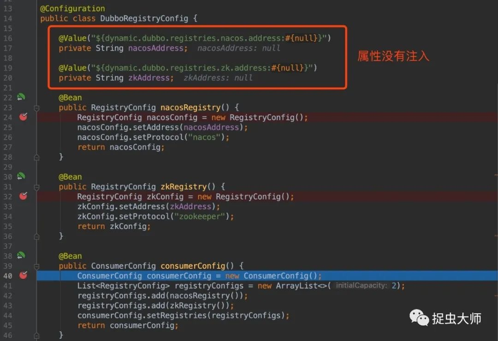
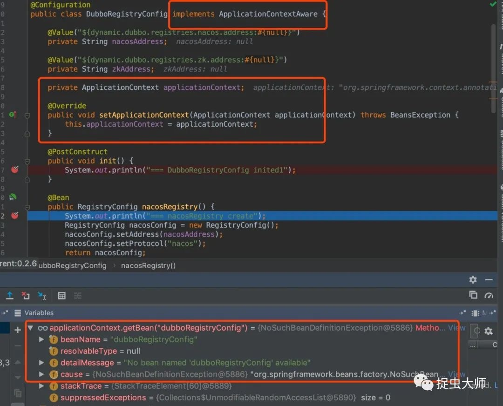
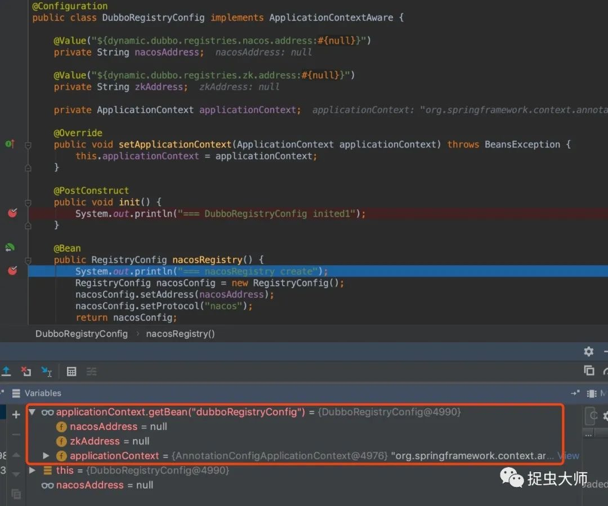
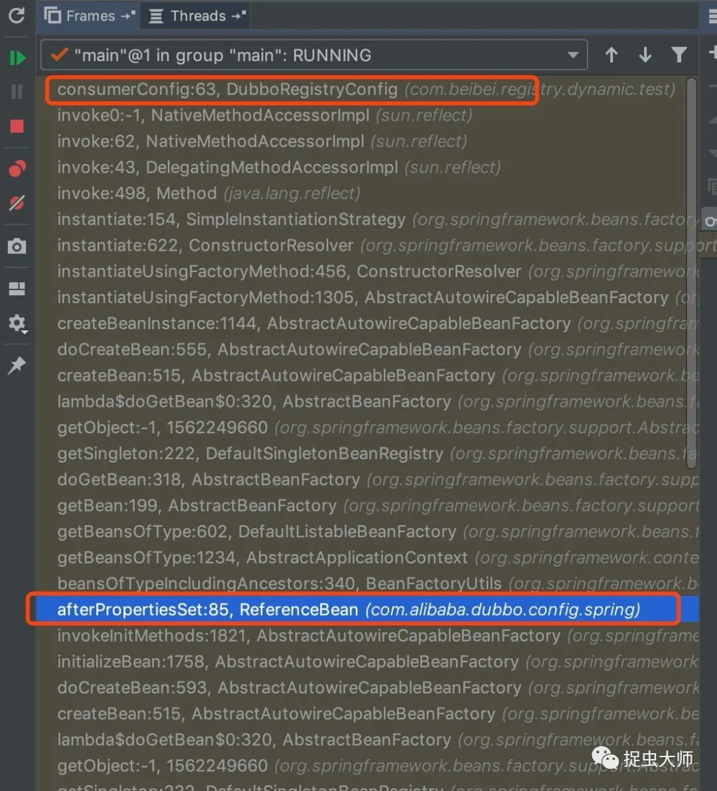
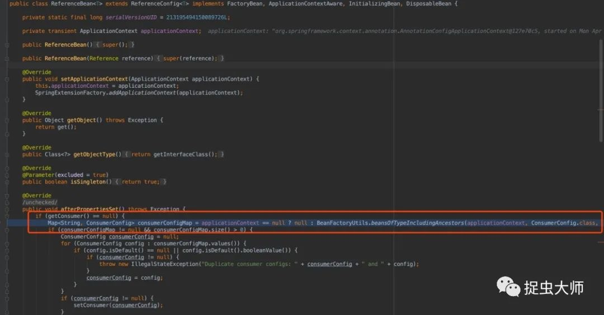
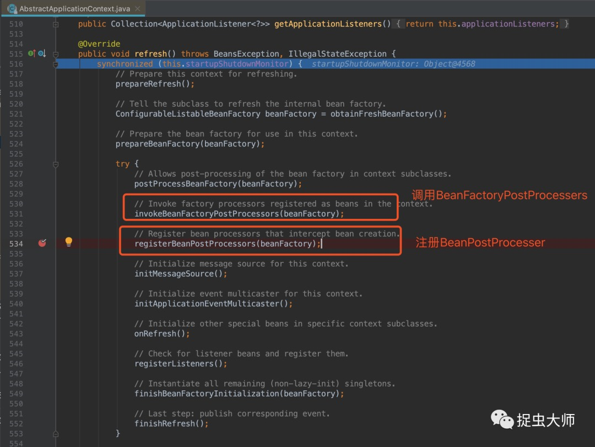
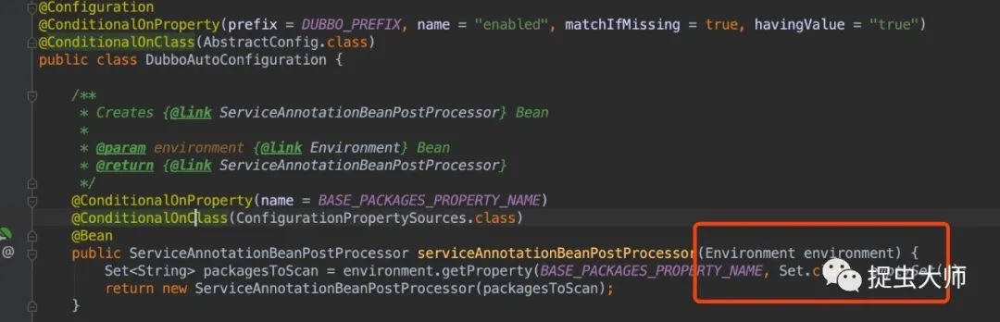
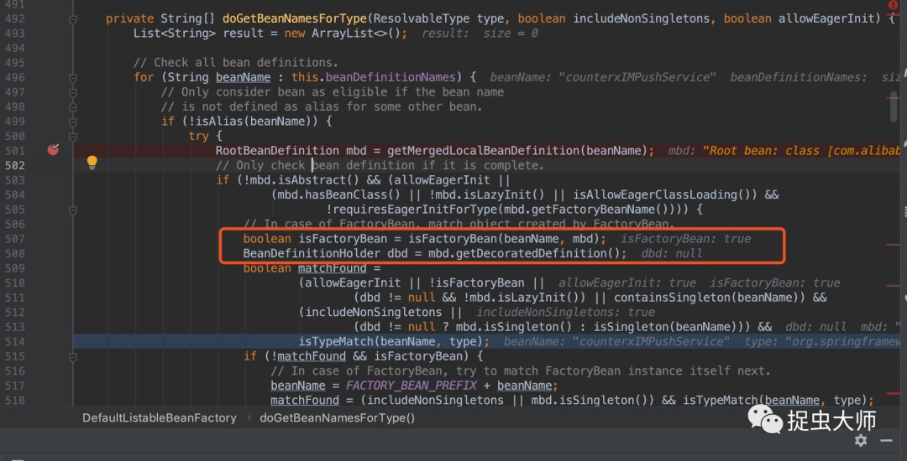
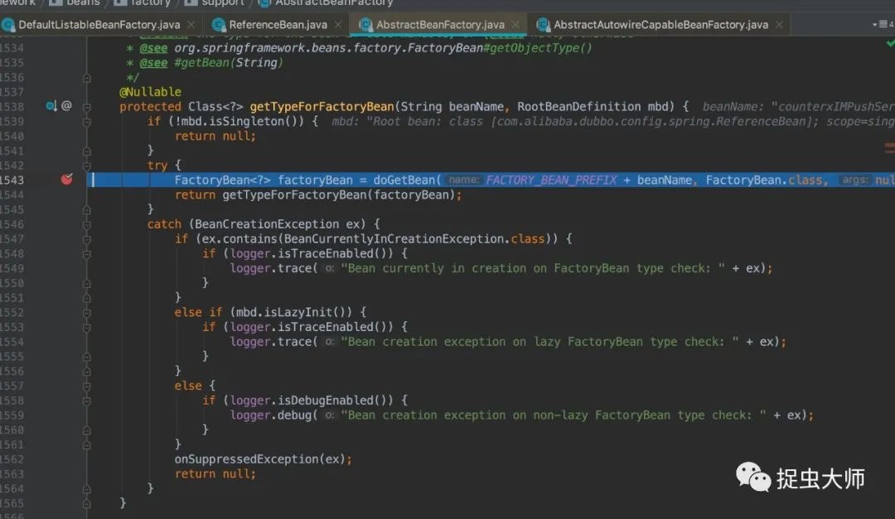

上周遇到一个有意思的问题，拿出来分享一下。
问题可以简单地描述如下：在springboot中以starter的方式引入dubbo，但注册中心的配置使用javaConfig的方式，先贴出配置代码

```java
@Configuration
public class DubboRegistryConfig {

    @Value("${dynamic.dubbo.registries.nacos.address:#{null}}")
    private String nacosAddress;

    @Value("${dynamic.dubbo.registries.zk.address:#{null}}")
    private String zkAddress;

    @Bean
    public RegistryConfig nacosRegistry() {
        RegistryConfig nacosConfig = new RegistryConfig();
        nacosConfig.setAddress(nacosAddress);
        nacosConfig.setProtocol("nacos");
        return nacosConfig;
    }

    @Bean
    public RegistryConfig zkRegistry() {
        RegistryConfig zkConfig = new RegistryConfig();
        zkConfig.setAddress(zkAddress);
        zkConfig.setProtocol("zookeeper");
        return zkConfig;
    }

    @Bean
    public ConsumerConfig consumerConfig() {
        ConsumerConfig consumerConfig = new ConsumerConfig();
        List<RegistryConfig> registryConfigs = new ArrayList<>(2);
        registryConfigs.add(nacosRegistry());
        registryConfigs.add(zkRegistry());
        consumerConfig.setRegistries(registryConfigs);
        return consumerConfig;
    }

    @Bean
    public ProviderConfig providerConfig() {
        ProviderConfig providerConfig = new ProviderConfig();
        providerConfig.setRegistry(zkRegistry());
        return providerConfig;
    }

}
```

将这段代码打成jar包，在主工程中引入，启动类上使用@Import引入
```java
@SpringBootApplication
@Import(DubboRegistryConfig.class)
public class Application {
    public static void main(String[] args) {
        SpringApplication application = new SpringApplication(Application.class);
        application.run(args);
    }
}
```
当然，注册中心地址写在application.properties文件中。

运行一下，奇怪的事情发生了，方便起见，我把调试截图贴出来



当运行到consumerConfig代码时，两个注册中心的地址并没有注入进来，这是怎么回事？下意识地看了下程序运行日志，发现了一条可疑日志

`ConfigurationClassPostProcessor.enhanceConfigurationClasses()|Cannot enhance @Configuration bean definition 'com.lkxiaolou.registry.dynamic.config.DubboRegistryConfig' since its singleton instance has been created too early. The typical cause is a non-static @Bean method with a BeanDefinitionRegistryPostProcessor return type: Consider declaring such methods as 'static'. `

大概意思是，由于DubboRegistryConfig bean实例化太早，导致没有被ConfigurationClassPostProcessor增强。好像跟bean的生命周期有关，这个配置类中定义了三个bean，加上配置类自身也是一个bean，想办法看一下这四个bean的加载顺序是不是有助于问题的解决？于是，我在配置代码中输出一些调试信息

```java
@Configuration
public class DubboRegistryConfig {

    @Value("${dynamic.dubbo.registries.nacos.address:#{null}}")
    private String nacosAddress;

    @Value("${dynamic.dubbo.registries.zk.address:#{null}}")
    private String zkAddress;

    @PostConstruct
    public void init() {
        System.out.println("=== DubboRegistryConfig inited");
    }

    @Bean
    @DependsOn("dubboRegistryConfig")
    public RegistryConfig nacosRegistry() {
        System.out.println("=== nacosRegistry create");
        RegistryConfig nacosConfig = new RegistryConfig();
        nacosConfig.setAddress(nacosAddress);
        nacosConfig.setProtocol("nacos");
        return nacosConfig;
    }

    @Bean
    public RegistryConfig zkRegistry() {
        System.out.println("=== zkRegistry create");
        RegistryConfig zkConfig = new RegistryConfig();
        zkConfig.setAddress(zkAddress);
        zkConfig.setProtocol("zookeeper");
        return zkConfig;
    }

    @Bean
    public ConsumerConfig consumerConfig() {
        System.out.println("=== consumerConfig create");
        ConsumerConfig consumerConfig = new ConsumerConfig();
        List<RegistryConfig> registryConfigs = new ArrayList<>(2);
        registryConfigs.add(nacosRegistry());
        registryConfigs.add(zkRegistry());
        consumerConfig.setRegistries(registryConfigs);
        return consumerConfig;
    }

    @Bean
    public ProviderConfig providerConfig() {
        System.out.println("=== providerConfig create");
        ProviderConfig providerConfig = new ProviderConfig();
        providerConfig.setRegistry(zkRegistry());
        return providerConfig;
    }
}
```
最后只有三个bean正常输出了调试信息

```
=== consumerConfig create
=== nacosRegistry create
=== zkRegistry create
```

providerConfig没有输出可以理解，因为程序挂掉了，但是为什么DubboRegistryConfig没有执行@PostConstruct？它的bean是存在的吗？还是没来得及初始化？试着给它注入个ApplicationContext，调试一把



发现在nacosRegistry创建的时候，居然找不到DubboRegistryConfig的bean定义，难道是@Import使用姿势不对？
于是把@Import改成包扫描，再调试发现可以找到DubboRegistryConfig的bean了，但是@PostConstruct依然不执行，属性依旧没有注入。



先捋一捋，我们最初的问题是@Configuration无法注入@Value，通过@Import导入@Configuration，@Configuration本身不是一个bean，自然@Value就无法装配属性，但当我们改成包扫描后，能获取到@Configuration本身的bean，但是属性依然没有注入，@PostConstruct依然没有执行。
bean生成了，但@Value与@PostConstruct注解没有生效，我们把焦点放到这两个注解上，这两个注解是怎么实现的？查询了一下资料，@PostConstruct是依靠InitDestroyAnnotationBeanPostProcessor实现，@Value是依靠AutowiredAnnotationBeanPostProcessor实现，从名字上就能看出这两个类实现了BeanPostProcesser，BeanPostProcesser提供了在bean执行初始化(init-method)前后插入hock的能力。也就是说，DubboRegistryConfig的bean没有执行BeanPostProcesser，为了验证猜想，断点找出堆栈，顺藤摸瓜



从堆栈中发现了是dubbo的ReferenceBean触发了DubboRegistry的bean的初始化



那么为什么ReferenceBean初始化DubboRegistryConfig中的bean不会触发BeanPostProcesser呢？又是谁初始化ReferenceBean的？

接着调试，发现Spring容器初始化的时候初始化了ServiceAnnotationBeanPostProcessor，这是dubbo-spring-boot-starter提供的一个类，它实现了BeanFactoryPostProcessor接口的方法postProcessBeanDefinitionRegistry，可以在bean定义加载完成后，bean尚未初始化时对bean的定义进行修改。它和BeanPostProcesser的执行顺序是先调用BeanFactoryPostProcessor，再注册BeanPostProcesser，如果BeanFactoryPostProcessor中创建了bean，那么它就不会执行BeanPostProcesser，也就是@Value和@PostConstruct无法生效。



那么问题归结于，为什么在BeanFactoryPostProcessor中会创建bean呢？

接着调试，ServiceAnnotationBeanPostProcessor定义在DubboAutoConfiguration，并且需要注入一个Environment



通过调试发现问题就出在注入Environment这个过程。
注入Environment需要先找到Environment这个类型的bean，调用DefaultListableBeanFactory.doGetBeanNamesForType



doGetBeanNamesForType需要遍历所有bean定义，判断出需要的bean（并不需要初始化bean），但是在循环到dubbo的ReferenceBean时，发现它的isFactoryBean为true，此时会调用AbstractBeanFactory.getTypeForFactoryBean方法



这个方法就会初始化bean了，这是为什么？

原来ReferenceBean实现了FactoryBean接口，FactoryBean可以理解为生产bean的bean，可以根据复杂的情况生产不同的bean，再来看ReferenceBean其实很好理解，因为dubbo的reference是不同的调用代理，也就是不同的bean，用ReferenceBean来实现很好理解。

那为什么判断类型时FactoryBean产生的bean需要实例化呢？也好理解，如果不实例化是不知道FactoryBean产生的是什么bean，所以只有这种类型的bean会被提前初始化。

差不多到这里已经水落石出了，我们简单总结一下：

1. @Configuration中无法注入@Value与@PostConstruct无法执行，我们查到是Configuration的bean已经初始化，但是注解失效；
2. 调研了一下@Value与@PostConstruct的原理是BeanPostProcesser；
3. 根据堆栈找到dubbo-spring-starter中ServiceAnnotationBeanPostProcessor的实现是BeanFactoryPostProcesser，它的执行要在BeanPostProcesser注入之前；
4. 实例化ServiceAnnotationBeanPostProcessor时注入Environment，需要扫描所有bean的定义；
5. dubbo的ReferenceBean是基于FactoryBean实现，而4中的扫描对于普通bean不会触发实例化，但FactoryBean产生的bean会被实例化；
6. 于是ReferenceBean实例化时触发DubboRegistryConfig中bean的实例化，进而触发DubboRegistryConfig实例化，而这一切发生在BeanPostProcesser生效之前。

问题找到了，解决就很简单，这种情况下不要使用这两种注解，可以实现InitializingBean的afterPropertiesSet来代替@Postconstruct，实现EnvironmentAware的setEnvironment接口来代替@Value获取配置。

最后，文章中还有几处没有详细写出来，大家伙可以试着分析分析，一是为什么@Import导入的jar包中的@Configuration不是一个bean？另一个是文章中第一次执行程序输出日志有什么意义？

---

> 关于作者：专注后端的中间件开发，公众号"捉虫大师"作者，关注我，给你朴实无华的技术干货


- 原文链接: https://mp.weixin.qq.com/s/CLPDX06vW3nTsrRjhHKj2w
- 发布时间: 2020.04.06